# Texture Documentation

Generated documentation of textures and their sprite rectangles.

## Index

- [TEX1](#tex1)
- [TEX2](#tex2)
- [TEX3](#tex3)
- [TEX4](#tex4)
- [TEX5](#tex5)
- [TEX6](#tex6)
- [TEX7](#tex7)
- [TEX8](#tex8)
- [TEX9](#tex9)
- [TEX10](#tex10)
- [TEX11](#tex11)
- [TEX12](#tex12)
- [TEX13](#tex13)
- [TEX14](#tex14)
- [TEX15](#tex15)
- [TEX16](#tex16)
- [TEX17](#tex17)
- [TEX18](#tex18)
- [TEX19](#tex19)
- [TEX20](#tex20)
- [TEX21](#tex21)
- [TEX22](#tex22)
- [TEX23](#tex23)
- [TEX24](#tex24)
- [TEX26](#tex26)
- [TEX27](#tex27)
- [TEX28](#tex28)
- [TEX29](#tex29)
- [TEX30](#tex30)
- [TEX31](#tex31)
- [TEX32](#tex32)
- [TEX33](#tex33)
- [TEX34](#tex34)
- [TEX35](#tex35)
- [TEX36](#tex36)
- [TEX37](#tex37)
- [TEX100](#tex100)
- [TEX15000](#tex15000)
- [TEX15001](#tex15001)
- [TEX16001](#tex16001)
- [TEX16002](#tex16002)
- [TEX16003](#tex16003)
- [TEX16004](#tex16004)
- [TEX16010](#tex16010)
- [TEX16011](#tex16011)
- [TEX16012](#tex16012)
- [TEX16013](#tex16013)
- [TEX16014](#tex16014)
- [TEX16015](#tex16015)
- [TEX16016](#tex16016)
- [TEX16017](#tex16017)
- [TEX16018](#tex16018)
- [TEX16019](#tex16019)
- [TEX16020](#tex16020)
- [TEX16021](#tex16021)
- [TEX16022](#tex16022)
- [TEX16023](#tex16023)
- [TEX16024](#tex16024)
- [TEX16025](#tex16025)
- [TEX16029](#tex16029)
- [TEX16030](#tex16030)
- [TEX16031](#tex16031)
- [TEX16032](#tex16032)
- [TEX16033](#tex16033)
- [TEX16034](#tex16034)
- [TEX16035](#tex16035)
- [TEX16036](#tex16036)
- [TEX16037](#tex16037)
- [TEX16038](#tex16038)
- [TEX16039](#tex16039)
- [TEX16040](#tex16040)
- [TEX16041](#tex16041)
- [TEX16042](#tex16042)
- [TEX16043](#tex16043)
- [TEX16044](#tex16044)
- [TEX16045](#tex16045)
- [TEX16046](#tex16046)
- [TEX16047](#tex16047)
- [TEX16048](#tex16048)
- [TEX16050](#tex16050)
- [TEX16051](#tex16051)
- [TEX16052](#tex16052)
- [TEX16053](#tex16053)
- [TEX16054](#tex16054)
- [TEX16055](#tex16055)
- [TEX16056](#tex16056)
- [TEX16057](#tex16057)
- [TEX16058](#tex16058)
- [TEX16059](#tex16059)
- [TEX16060](#tex16060)
- [TEX16061](#tex16061)
- [TEX16062](#tex16062)
- [TEX16063](#tex16063)
- [TEX16100](#tex16100)
- [TEX16200](#tex16200)
- [TEX16201](#tex16201)
- [TEX16202](#tex16202)
- [TEX16203](#tex16203)
- [TEX16204](#tex16204)
- [TEX16205](#tex16205)
- [TEX16206](#tex16206)
- [TEX16207](#tex16207)
- [TEX16208](#tex16208)
- [TEX16209](#tex16209)
- [TEX16210](#tex16210)
- [TEX16211](#tex16211)
- [TEX16212](#tex16212)
- [TEX16213](#tex16213)
- [TEX16214](#tex16214)
- [TEX16215](#tex16215)
- [TEX16216](#tex16216)
- [TEX16217](#tex16217)
- [TEX16218](#tex16218)
- [TEX16219](#tex16219)
- [TEX16220](#tex16220)
- [TEX16221](#tex16221)
- [TEX16222](#tex16222)
- [TEX16223](#tex16223)
- [TEX16224](#tex16224)
- [TEX16225](#tex16225)
- [TEX16226](#tex16226)
- [TEX16227](#tex16227)
- [TEX16228](#tex16228)
- [TEX16229](#tex16229)
- [TEX16230](#tex16230)
- [TEX16231](#tex16231)
- [TEX16232](#tex16232)
- [TEX16233](#tex16233)
- [TEX16234](#tex16234)
- [TEX16235](#tex16235)
- [TEX16236](#tex16236)
- [TEX16237](#tex16237)
- [TEX16238](#tex16238)
- [TEX16239](#tex16239)
- [TEX20001](#tex20001)
- [TEX20002](#tex20002)
- [TEX20003](#tex20003)
- [TEX20004](#tex20004)
- [TEX20005](#tex20005)
- [TEX20006](#tex20006)
- [TEX20007](#tex20007)
- [TEX20008](#tex20008)
- [TEX20009](#tex20009)
- [TEX20010](#tex20010)
- [TEX20011](#tex20011)
- [TEX20013](#tex20013)
- [TEX20014](#tex20014)
- [TEX20015](#tex20015)
- [TEX20016](#tex20016)
- [TEX20017](#tex20017)
- [TEX20018](#tex20018)
- [TEX20019](#tex20019)
- [TEX20020](#tex20020)
- [TEX20021](#tex20021)
- [TEX20022](#tex20022)
- [TEX20023](#tex20023)
- [TEX20024](#tex20024)
- [TEX20025](#tex20025)
- [TEX20026](#tex20026)
- [TEX20027](#tex20027)
- [TEX20028](#tex20028)
- [TEX20029](#tex20029)
- [TEX20030](#tex20030)
- [TEX20031](#tex20031)
- [TEX20032](#tex20032)
- [TEX20033](#tex20033)
- [TEX20034](#tex20034)
- [TEX20035](#tex20035)
- [TEX20037](#tex20037)
- [TEX20038](#tex20038)
- [TEX21000](#tex21000)
- [TEX21001](#tex21001)
- [TEX21002](#tex21002)
- [TEX21003](#tex21003)
- [TEX21004](#tex21004)
- [TEX30000](#tex30000)
- [TEX30001](#tex30001)
- [TEX30002](#tex30002)
- [TEX30003](#tex30003)
- [TEX30004](#tex30004)
- [TEX30005](#tex30005)
- [TEX30006](#tex30006)
- [TEX30007](#tex30007)
- [TEX30008](#tex30008)
- [TEX30009](#tex30009)
- [TEX30010](#tex30010)
- [TEX30021](#tex30021)
- [TEX30022](#tex30022)
- [TEX30023](#tex30023)
- [TEX30024](#tex30024)
- [TEX30025](#tex30025)
- [TEX30026](#tex30026)
- [TEX30027](#tex30027)
- [TEX30028](#tex30028)
- [TEX30029](#tex30029)
- [TEX30030](#tex30030)
- [TEX30031](#tex30031)
- [TEX30032](#tex30032)
- [TEX30033](#tex30033)
- [TEX30034](#tex30034)
- [TEX30035](#tex30035)
- [TEX30036](#tex30036)
- [TEX30037](#tex30037)
- [TEX30038](#tex30038)
- [TEX30039](#tex30039)
- [TEX30040](#tex30040)
- [TEX31000](#tex31000)
- [TEX31002](#tex31002)
- [TEX31003](#tex31003)
- [TEX31004](#tex31004)
- [TEX31005](#tex31005)
- [TEX31006](#tex31006)
- [TEX31007](#tex31007)
- [TEX31008](#tex31008)
- [TEX31009](#tex31009)
- [TEX31010](#tex31010)
- [TEX31011](#tex31011)
- [TEX31012](#tex31012)
- [TEX31013](#tex31013)
- [TEX31014](#tex31014)
- [TEX31015](#tex31015)
- [TEX31016](#tex31016)
- [TEX31017](#tex31017)
- [TEX31018](#tex31018)
- [TEX31019](#tex31019)
- [TEX31020](#tex31020)
- [TEX31021](#tex31021)
- [TEX31022](#tex31022)
- [TEX31023](#tex31023)
- [TEX31024](#tex31024)
- [TEX31025](#tex31025)
- [TEX31026](#tex31026)
- [TEX31027](#tex31027)
- [TEX31028](#tex31028)
- [TEX31029](#tex31029)
- [TEX31030](#tex31030)
- [TEX31033](#tex31033)
- [TEX31034](#tex31034)
- [TEX31035](#tex31035)
- [TEX31036](#tex31036)
- [TEX31037](#tex31037)
- [TEX31038](#tex31038)
- [TEX31039](#tex31039)
- [TEX31040](#tex31040)
- [TEX31041](#tex31041)
- [TEX31042](#tex31042)
- [TEX31043](#tex31043)
- [TEX31044](#tex31044)
- [TEX31045](#tex31045)
- [TEX31046](#tex31046)
- [TEX31047](#tex31047)
- [TEX31048](#tex31048)
- [TEX31049](#tex31049)
- [TEX31050](#tex31050)
- [TEX31051](#tex31051)
- [TEX31052](#tex31052)
- [TEX31053](#tex31053)
- [TEX31054](#tex31054)
- [TEX31055](#tex31055)
- [TEX31056](#tex31056)
- [TEX31057](#tex31057)
- [TEX31058](#tex31058)
- [TEX31059](#tex31059)
- [TEX31060](#tex31060)
- [TEX31061](#tex31061)
- [TEX31062](#tex31062)
- [TEX31063](#tex31063)
- [TEX31064](#tex31064)
- [TEX31065](#tex31065)
- [TEX31066](#tex31066)
- [TEX31067](#tex31067)
- [TEX31068](#tex31068)
- [TEX31069](#tex31069)
- [TEX31070](#tex31070)
- [TEX31071](#tex31071)
- [TEX31072](#tex31072)
- [TEX31073](#tex31073)
- [TEX31074](#tex31074)
- [TEX31075](#tex31075)
- [TEX31076](#tex31076)
- [TEX31077](#tex31077)
- [TEX31078](#tex31078)
- [TEX31079](#tex31079)
- [TEX31080](#tex31080)
- [TEX31081](#tex31081)
- [TEX31082](#tex31082)
- [TEX31083](#tex31083)
- [TEX31084](#tex31084)
- [TEX31085](#tex31085)
- [TEX31086](#tex31086)
- [TEX31087](#tex31087)
- [TEX31088](#tex31088)
- [TEX31089](#tex31089)
- [TEX31090](#tex31090)
- [TEX31091](#tex31091)
- [TEX31092](#tex31092)
- [TEX31093](#tex31093)
- [TEX31094](#tex31094)
- [TEX31095](#tex31095)
- [TEX31096](#tex31096)
- [TEX31097](#tex31097)
- [TEX31098](#tex31098)
- [TEX31099](#tex31099)
- [TEX31100](#tex31100)
- [TEX31101](#tex31101)
- [TEX31102](#tex31102)
- [TEX31103](#tex31103)
- [TEX31104](#tex31104)
- [TEX31105](#tex31105)
- [TEX31106](#tex31106)
- [TEX31107](#tex31107)
- [TEX31108](#tex31108)
- [TEX31109](#tex31109)
- [TEX31110](#tex31110)
- [TEX31111](#tex31111)
- [TEX31112](#tex31112)
- [TEX31113](#tex31113)
- [TEX31114](#tex31114)
- [TEX31115](#tex31115)
- [TEX31116](#tex31116)
- [TEX31117](#tex31117)
- [TEX31118](#tex31118)
- [TEX31119](#tex31119)
- [TEX31120](#tex31120)
- [TEX31121](#tex31121)
- [TEX31122](#tex31122)
- [TEX31123](#tex31123)
- [TEX31124](#tex31124)
- [TEX32000](#tex32000)
- [TEX32001](#tex32001)
- [TEX32003](#tex32003)
- [TEX32004](#tex32004)
- [TEX32005](#tex32005)
- [TEX32006](#tex32006)
- [TEX32007](#tex32007)
- [TEX32008](#tex32008)
- [TEX32009](#tex32009)
- [TEX32010](#tex32010)
- [TEX32011](#tex32011)
- [TEX35000](#tex35000)
- [TEX35001](#tex35001)
- [TEX35002](#tex35002)
- [TEX35003](#tex35003)
- [TEX35004](#tex35004)
- [TEX35005](#tex35005)
- [TEX35006](#tex35006)
- [TEX35007](#tex35007)
- [TEX35008](#tex35008)
- [TEX35009](#tex35009)
- [TEX35010](#tex35010)
- [TEX35011](#tex35011)
- [TEX35012](#tex35012)
- [TEX35013](#tex35013)
- [TEX35014](#tex35014)
- [TEX35015](#tex35015)
- [TEX35016](#tex35016)
- [TEX35017](#tex35017)
- [TEX35018](#tex35018)
- [TEX35019](#tex35019)
- [TEX35020](#tex35020)
- [TEX35021](#tex35021)
- [TEX35022](#tex35022)
- [TEX35023](#tex35023)
- [TEX35024](#tex35024)
- [TEX35025](#tex35025)
- [TEX35026](#tex35026)
- [TEX35027](#tex35027)
- [TEX35028](#tex35028)
- [TEX35029](#tex35029)
- [TEX40000](#tex40000)
- [TEX40001](#tex40001)
- [TEX40002](#tex40002)
- [TEX40003](#tex40003)
- [TEX40004](#tex40004)
- [TEX40005](#tex40005)
- [TEX40006](#tex40006)
- [TEX40007](#tex40007)
- [TEX40008](#tex40008)
- [TEX40009](#tex40009)
- [TEX40010](#tex40010)
- [TEX40011](#tex40011)
- [TEX40012](#tex40012)
- [TEX40013](#tex40013)
- [TEX40014](#tex40014)
- [TEX40015](#tex40015)
- [TEX40016](#tex40016)
- [TEX40017](#tex40017)
- [TEX40018](#tex40018)
- [TEX41000](#tex41000)
- [TEX41001](#tex41001)
- [TEX41002](#tex41002)
- [TEX41003](#tex41003)
- [TEX41004](#tex41004)
- [TEX41100](#tex41100)
- [TEX41101](#tex41101)

---

## TEX1

**Properties**
- `TextureFile`: `images/HauptscreenA800.bmp`
- `Count`: `1`
- `UseAlpha`: `false`

**Source image**

- Folder: `exports/TEX1/`

  - exports/TEX1/source.png
  - exports/TEX1/source.tga
  - exports/TEX1/source.bmp
  - exports/TEX1/source.jpg
  - exports/TEX1/source.jpeg
  - exports/TEX1/source.webp

> Preview: open the folder above to see `source.*` and exported sprites.

**Sprites**

| # | Rect (x,y,w,h) | Image |
|---:|---|---|
| 0 | `0 0 516 42` |  |

---

## TEX2

**Properties**
- `TextureFile`: `images/HauptscreenB800.bmp`
- `Count`: `1`
- `UseAlpha`: `false`

**Source image**

- Folder: `exports/TEX2/`

  - exports/TEX2/source.png
  - exports/TEX2/source.tga
  - exports/TEX2/source.bmp
  - exports/TEX2/source.jpg
  - exports/TEX2/source.jpeg
  - exports/TEX2/source.webp

> Preview: open the folder above to see `source.*` and exported sprites.

**Sprites**

| # | Rect (x,y,w,h) | Image |
|---:|---|---|
| 0 | `0 0 284 42` |  |

---

## TEX3

**Properties**
- `TextureFile`: `images/HauptscreenC800.bmp`
- `Count`: `1`
- `UseAlpha`: `false`

**Source image**

- Folder: `exports/TEX3/`

  - exports/TEX3/source.png
  - exports/TEX3/source.tga
  - exports/TEX3/source.bmp
  - exports/TEX3/source.jpg
  - exports/TEX3/source.jpeg
  - exports/TEX3/source.webp

> Preview: open the folder above to see `source.*` and exported sprites.

**Sprites**

| # | Rect (x,y,w,h) | Image |
|---:|---|---|
| 0 | `0 0 24 558` |  |

---

## TEX4

**Properties**
- `TextureFile`: `images/HauptscreenD800.bmp`
- `Count`: `1`
- `UseAlpha`: `false`

**Source image**

- Folder: `exports/TEX4/`

  - exports/TEX4/source.png
  - exports/TEX4/source.tga
  - exports/TEX4/source.bmp
  - exports/TEX4/source.jpg
  - exports/TEX4/source.jpeg
  - exports/TEX4/source.webp

> Preview: open the folder above to see `source.*` and exported sprites.

**Sprites**

| # | Rect (x,y,w,h) | Image |
|---:|---|---|
| 0 | `0 0 260 69` |  |

---

## TEX5

**Properties**
- `TextureFile`: `images/Vollansichtskarte800.bmp`
- `Count`: `1`
- `UseAlpha`: `false`

**Source image**

- Folder: `exports/TEX5/`

  - exports/TEX5/source.png
  - exports/TEX5/source.tga
  - exports/TEX5/source.bmp
  - exports/TEX5/source.jpg
  - exports/TEX5/source.jpeg
  - exports/TEX5/source.webp

> Preview: open the folder above to see `source.*` and exported sprites.

**Sprites**

| # | Rect (x,y,w,h) | Image |
|---:|---|---|
| 0 | `0 0 800 600` |  |

---

## TEX6

**Properties**
- `TextureFile`: `images/options/Hauptmenu.jpg`
- `Count`: `1`
- `UseAlpha`: `false`

**Source image**

- Folder: `exports/TEX6/`

  - exports/TEX6/source.png
  - exports/TEX6/source.tga
  - exports/TEX6/source.bmp
  - exports/TEX6/source.jpg
  - exports/TEX6/source.jpeg
  - exports/TEX6/source.webp

> Preview: open the folder above to see `source.*` and exported sprites.

**Sprites**

| # | Rect (x,y,w,h) | Image |
|---:|---|---|
| 0 | `0 0 800 600` |  |

---

## TEX7

**Properties**
- `TextureFile`: `images/options/hauptbttn_komplett.tga`
- `Count`: `9`
- `UseAlpha`: `true`

**Source image**

- Folder: `exports/TEX7/`

  - exports/TEX7/source.png
  - exports/TEX7/source.tga
  - exports/TEX7/source.bmp
  - exports/TEX7/source.jpg
  - exports/TEX7/source.jpeg
  - exports/TEX7/source.webp

> Preview: open the folder above to see `source.*` and exported sprites.

**Sprites**

| # | Rect (x,y,w,h) | Image |
|---:|---|---|
| 0 | `0 0 338 44` |  |
| 1 | `0 44 338 44` |  |
| 2 | `0 88 313 36` |  |
| 3 | `0 124 313 36` |  |
| 4 | `0 159 233 36` |  |
| 5 | `233 159 233 36` |  |
| 6 | `0 195 149 36` |  |
| 7 | `149 195 149 36` |  |
| 8 | `0 231 233 24` |  |

---

## TEX8

**Properties**
- `TextureFile`: `images/HauptscreenE1024.bmp`
- `Count`: `1`
- `UseAlpha`: `false`

**Source image**

- Folder: `exports/TEX8/`

  - exports/TEX8/source.png
  - exports/TEX8/source.tga
  - exports/TEX8/source.bmp
  - exports/TEX8/source.jpg
  - exports/TEX8/source.jpeg
  - exports/TEX8/source.webp

> Preview: open the folder above to see `source.*` and exported sprites.

**Sprites**

| # | Rect (x,y,w,h) | Image |
|---:|---|---|
| 0 | `0 0 284 168` |  |

---

## TEX9

**Properties**
- `TextureFile`: `images/HauptscreenE1280.bmp`
- `Count`: `1`
- `UseAlpha`: `false`

**Source image**

- Folder: `exports/TEX9/`

  - exports/TEX9/source.png
  - exports/TEX9/source.tga
  - exports/TEX9/source.bmp
  - exports/TEX9/source.jpg
  - exports/TEX9/source.jpeg
  - exports/TEX9/source.webp

> Preview: open the folder above to see `source.*` and exported sprites.

**Sprites**

| # | Rect (x,y,w,h) | Image |
|---:|---|---|
| 0 | `0 0 284 424` |  |

---

## TEX10

**Properties**
- `TextureFile`: `images/HauptscreenA1024.bmp`
- `Count`: `1`
- `UseAlpha`: `false`

**Source image**

- Folder: `exports/TEX10/`

  - exports/TEX10/source.png
  - exports/TEX10/source.tga
  - exports/TEX10/source.bmp
  - exports/TEX10/source.jpg
  - exports/TEX10/source.jpeg
  - exports/TEX10/source.webp

> Preview: open the folder above to see `source.*` and exported sprites.

**Sprites**

| # | Rect (x,y,w,h) | Image |
|---:|---|---|
| 0 | `0 0 740 42` |  |

---

## TEX11

**Properties**
- `TextureFile`: `images/HauptscreenA1280.bmp`
- `Count`: `1`
- `UseAlpha`: `false`

**Source image**

- Folder: `exports/TEX11/`

  - exports/TEX11/source.png
  - exports/TEX11/source.tga
  - exports/TEX11/source.bmp
  - exports/TEX11/source.jpg
  - exports/TEX11/source.jpeg
  - exports/TEX11/source.webp

> Preview: open the folder above to see `source.*` and exported sprites.

**Sprites**

| # | Rect (x,y,w,h) | Image |
|---:|---|---|
| 0 | `0 0 996 42` |  |

---

## TEX12

**Properties**
- `TextureFile`: `images/options/hmenu_colormap.bmp`
- `Count`: `1`
- `UseAlpha`: `false`

**Source image**

- Folder: `exports/TEX12/`

  - exports/TEX12/source.png
  - exports/TEX12/source.tga
  - exports/TEX12/source.bmp
  - exports/TEX12/source.jpg
  - exports/TEX12/source.jpeg
  - exports/TEX12/source.webp

> Preview: open the folder above to see `source.*` and exported sprites.

**Sprites**

| # | Rect (x,y,w,h) | Image |
|---:|---|---|
| 0 | `0 0 800 600` |  |

---

## TEX13

**Properties**
- `TextureFile`: `images/bttn_schiffskarte.bmp`
- `Count`: `4`
- `UseAlpha`: `false`

**Source image**

- Folder: `exports/TEX13/`

  - exports/TEX13/source.png
  - exports/TEX13/source.tga
  - exports/TEX13/source.bmp
  - exports/TEX13/source.jpg
  - exports/TEX13/source.jpeg
  - exports/TEX13/source.webp

> Preview: open the folder above to see `source.*` and exported sprites.

**Sprites**

| # | Rect (x,y,w,h) | Image |
|---:|---|---|
| 0 | `0 0 19 70` | 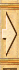 |
| 1 | `0 70 19 70` |  |
| 2 | `0 140 19 70` |  |
| 3 | `0 210 19 70` | 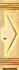 |

---

## TEX14

**Properties**
- `TextureFile`: `images/options/p_hmenu01.bmp`
- `Count`: `8`
- `UseAlpha`: `false`
- `UseColorKey`: `true`
- `ColorKey`: `0xffff00ff`

**Source image**

- Folder: `exports/TEX14/`

  - exports/TEX14/source.png
  - exports/TEX14/source.tga
  - exports/TEX14/source.bmp
  - exports/TEX14/source.jpg
  - exports/TEX14/source.jpeg
  - exports/TEX14/source.webp

> Preview: open the folder above to see `source.*` and exported sprites.

**Sprites**

| # | Rect (x,y,w,h) | Image |
|---:|---|---|
| 0 | `0 0 157 55` |  |
| 1 | `0 55 191 68` |  |
| 2 | `0 123 246 88` |  |
| 3 | `0 211 235 87` |  |
| 4 | `0 298 238 94` |  |
| 5 | `0 393 169 77` |  |
| 6 | `0 470 165 81` |  |
| 7 | `0 551 112 68` |  |

---

## TEX15

**Properties**
- `TextureFile`: `images/options/Kugel_komplett.tga`
- `Count`: `22`
- `UseAlpha`: `true`

**Source image**

- Folder: `exports/TEX15/`

  - exports/TEX15/source.png
  - exports/TEX15/source.tga
  - exports/TEX15/source.bmp
  - exports/TEX15/source.jpg
  - exports/TEX15/source.jpeg
  - exports/TEX15/source.webp

> Preview: open the folder above to see `source.*` and exported sprites.

**Sprites**

| # | Rect (x,y,w,h) | Image |
|---:|---|---|
| 0 | `0 0 29 28` |  |
| 1 | `29 0 29 28` |  |
| 2 | `58 0 29 28` |  |
| 3 | `0 28 29 28` |  |
| 4 | `29 28 29 28` |  |
| 5 | `58 28 29 28` |  |
| 6 | `87 28 29 28` |  |
| 7 | `0 56 29 28` |  |
| 8 | `29 56 29 28` |  |
| 9 | `58 56 29 28` |  |
| 10 | `87 56 29 28` |  |
| 11 | `0 84 29 28` |  |
| 12 | `29 84 29 28` |  |
| 13 | `58 84 29 28` |  |
| 14 | `87 84 29 28` |  |
| 15 | `0 112 29 28` |  |
| 16 | `29 112 29 28` |  |
| 17 | `58 112 29 28` |  |
| 18 | `87 112 29 28` |  |
| 19 | `0 140 29 28` |  |
| 20 | `29 140 29 28` |  |
| 21 | `58 140 29 28` |  |

---

## TEX16

**Properties**
- `TextureFile`: `images/background/optionen.jpg`
- `Count`: `1`
- `UseAlpha`: `false`

**Source image**

- Folder: `exports/TEX16/`

  - exports/TEX16/source.png
  - exports/TEX16/source.tga
  - exports/TEX16/source.bmp
  - exports/TEX16/source.jpg
  - exports/TEX16/source.jpeg
  - exports/TEX16/source.webp

> Preview: open the folder above to see `source.*` and exported sprites.

**Sprites**

| # | Rect (x,y,w,h) | Image |
|---:|---|---|
| 0 | `0 0 800 600` |  |

---

## TEX17

**Properties**
- `TextureFile`: `images/options/Slider_lang.tga`
- `Count`: `1`
- `UseAlpha`: `true`

**Source image**

- Folder: `exports/TEX17/`

  - exports/TEX17/source.png
  - exports/TEX17/source.tga
  - exports/TEX17/source.bmp
  - exports/TEX17/source.jpg
  - exports/TEX17/source.jpeg
  - exports/TEX17/source.webp

> Preview: open the folder above to see `source.*` and exported sprites.

**Sprites**

| # | Rect (x,y,w,h) | Image |
|---:|---|---|
| 0 | `19 0 196 23` |  |

---

## TEX18

**Properties**
- `TextureFile`: `images/options/Slider_mit_Schieber.tga`
- `Count`: `5`
- `UseAlpha`: `true`

**Source image**

- Folder: `exports/TEX18/`

  - exports/TEX18/source.png
  - exports/TEX18/source.tga
  - exports/TEX18/source.bmp
  - exports/TEX18/source.jpg
  - exports/TEX18/source.jpeg
  - exports/TEX18/source.webp

> Preview: open the folder above to see `source.*` and exported sprites.

**Sprites**

| # | Rect (x,y,w,h) | Image |
|---:|---|---|
| 0 | `19 0 76 23` |  |
| 1 | `112 0 27 25` |  |
| 2 | `0 0 19 23` |  |
| 3 | `95 0 17 23` |  |
| 4 | `140 0 27 25` |  |

---

## TEX19

**Properties**
- `TextureFile`: `images/background/mehrspielerhaupt.jpg`
- `Count`: `1`
- `UseAlpha`: `false`

**Source image**

- Folder: `exports/TEX19/`

  - exports/TEX19/source.png
  - exports/TEX19/source.tga
  - exports/TEX19/source.bmp
  - exports/TEX19/source.jpg
  - exports/TEX19/source.jpeg
  - exports/TEX19/source.webp

> Preview: open the folder above to see `source.*` and exported sprites.

**Sprites**

| # | Rect (x,y,w,h) | Image |
|---:|---|---|
| 0 | `0 0 800 600` |  |

---

## TEX20

**Properties**
- `TextureFile`: `images/Hauptscreen_RahmenHoch.tga`
- `Count`: `2`
- `UseAlpha`: `true`

**Source image**

- Folder: `exports/TEX20/`

  - exports/TEX20/source.png
  - exports/TEX20/source.tga
  - exports/TEX20/source.bmp
  - exports/TEX20/source.jpg
  - exports/TEX20/source.jpeg
  - exports/TEX20/source.webp

> Preview: open the folder above to see `source.*` and exported sprites.

**Sprites**

| # | Rect (x,y,w,h) | Image |
|---:|---|---|
| 0 | `0 0 9 204` |  |
| 1 | `9 0 10 204` |  |

---

## TEX21

**Properties**
- `TextureFile`: `images/Hauptscreen_RahmenQuer.tga`
- `Count`: `2`
- `UseAlpha`: `true`

**Source image**

- Folder: `exports/TEX21/`

  - exports/TEX21/source.png
  - exports/TEX21/source.tga
  - exports/TEX21/source.bmp
  - exports/TEX21/source.jpg
  - exports/TEX21/source.jpeg
  - exports/TEX21/source.webp

> Preview: open the folder above to see `source.*` and exported sprites.

**Sprites**

| # | Rect (x,y,w,h) | Image |
|---:|---|---|
| 0 | `0 0 260 11` |  |
| 1 | `0 11 260 12` |  |

---

## TEX22

**Properties**
- `TextureFile`: `images/background/spieleinstellungen.jpg`
- `Count`: `1`
- `UseAlpha`: `false`

**Source image**

- Folder: `exports/TEX22/`

  - exports/TEX22/source.png
  - exports/TEX22/source.tga
  - exports/TEX22/source.bmp
  - exports/TEX22/source.jpg
  - exports/TEX22/source.jpeg
  - exports/TEX22/source.webp

> Preview: open the folder above to see `source.*` and exported sprites.

**Sprites**

| # | Rect (x,y,w,h) | Image |
|---:|---|---|
| 0 | `0 0 800 600` |  |

---

## TEX23

**Properties**
- `TextureFile`: `images/background/spielladen.jpg`
- `Count`: `1`
- `UseAlpha`: `false`

**Source image**

- Folder: `exports/TEX23/`

  - exports/TEX23/source.png
  - exports/TEX23/source.tga
  - exports/TEX23/source.bmp
  - exports/TEX23/source.jpg
  - exports/TEX23/source.jpeg
  - exports/TEX23/source.webp

> Preview: open the folder above to see `source.*` and exported sprites.

**Sprites**

| # | Rect (x,y,w,h) | Image |
|---:|---|---|
| 0 | `0 0 800 600` |  |

---

## TEX24

**Properties**
- `TextureFile`: `images/background/spielspeichern.jpg`
- `Count`: `1`
- `UseAlpha`: `false`

**Source image**

- Folder: `exports/TEX24/`

  - exports/TEX24/source.png
  - exports/TEX24/source.tga
  - exports/TEX24/source.bmp
  - exports/TEX24/source.jpg
  - exports/TEX24/source.jpeg
  - exports/TEX24/source.webp

> Preview: open the folder above to see `source.*` and exported sprites.

**Sprites**

| # | Rect (x,y,w,h) | Image |
|---:|---|---|
| 0 | `0 0 800 600` |  |

---

## TEX26

**Properties**
- `TextureFile`: `images/background/mehrspielerspielsuchen.jpg`
- `Count`: `1`
- `UseAlpha`: `false`

**Source image**

- Folder: `exports/TEX26/`

  - exports/TEX26/source.png
  - exports/TEX26/source.tga
  - exports/TEX26/source.bmp
  - exports/TEX26/source.jpg
  - exports/TEX26/source.jpeg
  - exports/TEX26/source.webp

> Preview: open the folder above to see `source.*` and exported sprites.

**Sprites**

| # | Rect (x,y,w,h) | Image |
|---:|---|---|
| 0 | `0 0 800 600` | 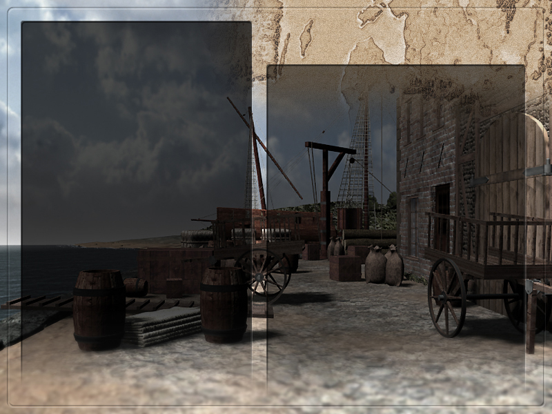 |

---

## TEX27

**Properties**
- `TextureFile`: `images/background/mehrspielersammeln.jpg`
- `Count`: `1`
- `UseAlpha`: `false`

**Source image**

- Folder: `exports/TEX27/`

  - exports/TEX27/source.png
  - exports/TEX27/source.tga
  - exports/TEX27/source.bmp
  - exports/TEX27/source.jpg
  - exports/TEX27/source.jpeg
  - exports/TEX27/source.webp

> Preview: open the folder above to see `source.*` and exported sprites.

**Sprites**

| # | Rect (x,y,w,h) | Image |
|---:|---|---|
| 0 | `0 0 800 600` |  |

---

## TEX28

**Properties**
- `TextureFile`: `images/background/credits.jpg`
- `Count`: `1`
- `UseAlpha`: `false`

**Source image**

- Folder: `exports/TEX28/`

  - exports/TEX28/source.png
  - exports/TEX28/source.tga
  - exports/TEX28/source.bmp
  - exports/TEX28/source.jpg
  - exports/TEX28/source.jpeg
  - exports/TEX28/source.webp

> Preview: open the folder above to see `source.*` and exported sprites.

**Sprites**

| # | Rect (x,y,w,h) | Image |
|---:|---|---|
| 0 | `0 0 800 600` |  |

---

## TEX29

**Properties**
- `TextureFile`: `images/background/tutorial.jpg`
- `Count`: `1`
- `UseAlpha`: `false`

**Source image**

- Folder: `exports/TEX29/`

  - exports/TEX29/source.png
  - exports/TEX29/source.tga
  - exports/TEX29/source.bmp
  - exports/TEX29/source.jpg
  - exports/TEX29/source.jpeg
  - exports/TEX29/source.webp

> Preview: open the folder above to see `source.*` and exported sprites.

**Sprites**

| # | Rect (x,y,w,h) | Image |
|---:|---|---|
| 0 | `0 0 800 600` | 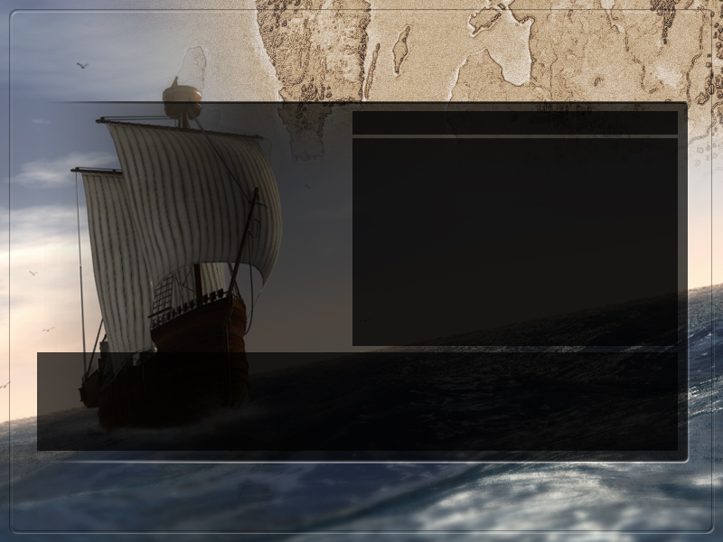 |

---

## TEX30

**Properties**
- `TextureFile`: `images/background/spielende.jpg`
- `Count`: `1`
- `UseAlpha`: `false`

**Source image**

- Folder: `exports/TEX30/`

  - exports/TEX30/source.png
  - exports/TEX30/source.tga
  - exports/TEX30/source.bmp
  - exports/TEX30/source.jpg
  - exports/TEX30/source.jpeg
  - exports/TEX30/source.webp

> Preview: open the folder above to see `source.*` and exported sprites.

**Sprites**

| # | Rect (x,y,w,h) | Image |
|---:|---|---|
| 0 | `0 0 800 600` |  |

---

## TEX31

**Properties**
- `TextureFile`: `images/options/window.tga`
- `Count`: `1`
- `UseAlpha`: `true`

**Source image**

- Folder: `exports/TEX31/`

  - exports/TEX31/source.png
  - exports/TEX31/source.tga
  - exports/TEX31/source.bmp
  - exports/TEX31/source.jpg
  - exports/TEX31/source.jpeg
  - exports/TEX31/source.webp

> Preview: open the folder above to see `source.*` and exported sprites.

**Sprites**

| # | Rect (x,y,w,h) | Image |
|---:|---|---|
| 0 | `0 0 395 179` |  |

---

## TEX32

**Properties**
- `TextureFile`: `images/options/window02.aim`
- `Count`: `1`
- `UseAlpha`: `true`

**Source image**

- Folder: `exports/TEX32/`

  - exports/TEX32/source.png
  - exports/TEX32/source.tga
  - exports/TEX32/source.bmp
  - exports/TEX32/source.jpg
  - exports/TEX32/source.jpeg
  - exports/TEX32/source.webp

> Preview: open the folder above to see `source.*` and exported sprites.

**Sprites**

| # | Rect (x,y,w,h) | Image |
|---:|---|---|
| 0 | `0 0 587 403` |  |

---

## TEX33

**Properties**
- `TextureFile`: `images/module_stadtkarte/detect.aim`
- `Count`: `1`
- `UseColorKey`: `true`
- `ColorKey`: `0x00ff00ff`

**Source image**

- Folder: `exports/TEX33/`

  - exports/TEX33/source.png
  - exports/TEX33/source.tga
  - exports/TEX33/source.bmp
  - exports/TEX33/source.jpg
  - exports/TEX33/source.jpeg
  - exports/TEX33/source.webp

> Preview: open the folder above to see `source.*` and exported sprites.

**Sprites**

| # | Rect (x,y,w,h) | Image |
|---:|---|---|
| 0 | `0 0 36 23` |  |

---

## TEX34

**Properties**
- `TextureFile`: `images/background/ladescreen.jpg`
- `Count`: `1`
- `UseAlpha`: `false`

**Source image**

- Folder: `exports/TEX34/`

  - exports/TEX34/source.png
  - exports/TEX34/source.tga
  - exports/TEX34/source.bmp
  - exports/TEX34/source.jpg
  - exports/TEX34/source.jpeg
  - exports/TEX34/source.webp

> Preview: open the folder above to see `source.*` and exported sprites.

**Sprites**

| # | Rect (x,y,w,h) | Image |
|---:|---|---|
| 0 | `0 0 800 600` |  |

---

## TEX35

**Properties**
- `TextureFile`: `images/background/features1.aim`
- `Count`: `1`
- `UseAlpha`: `false`

**Source image**

- Folder: `exports/TEX35/`

  - exports/TEX35/source.png
  - exports/TEX35/source.tga
  - exports/TEX35/source.bmp
  - exports/TEX35/source.jpg
  - exports/TEX35/source.jpeg
  - exports/TEX35/source.webp

> Preview: open the folder above to see `source.*` and exported sprites.

**Sprites**

| # | Rect (x,y,w,h) | Image |
|---:|---|---|
| 0 | `0 0 800 600` |  |

---

## TEX36

**Properties**
- `TextureFile`: `images/logo.jpg`
- `Count`: `1`
- `UseAlpha`: `false`

**Source image**

- Folder: `exports/TEX36/`

  - exports/TEX36/source.png
  - exports/TEX36/source.tga
  - exports/TEX36/source.bmp
  - exports/TEX36/source.jpg
  - exports/TEX36/source.jpeg
  - exports/TEX36/source.webp

> Preview: open the folder above to see `source.*` and exported sprites.

**Sprites**

| # | Rect (x,y,w,h) | Image |
|---:|---|---|
| 0 | `0 0 800 600` |  |

---

## TEX37

**Properties**
- `TextureFile`: `images/text.aim`
- `Count`: `5`
- `UseAlpha`: `false`
- `UseColorKey`: `true`
- `ColorKey`: `0xffff00ff`

**Source image**

- Folder: `exports/TEX37/`

  - exports/TEX37/source.png
  - exports/TEX37/source.tga
  - exports/TEX37/source.bmp
  - exports/TEX37/source.jpg
  - exports/TEX37/source.jpeg
  - exports/TEX37/source.webp

> Preview: open the folder above to see `source.*` and exported sprites.

**Sprites**

| # | Rect (x,y,w,h) | Image |
|---:|---|---|
| 0 | `0 7 10 25` |  |
| 1 | `10 0 10 32` |  |
| 2 | `20 7 344 25` |  |
| 3 | `364 0 10 32` |  |
| 4 | `374 7 10 25` |  |

---

## TEX100

**Properties**
- `TextureFile`: `images/fog.bmp`
- `Count`: `1`
- `UseAlpha`: `true`

**Source image**

- Folder: `exports/TEX100/`

  - exports/TEX100/source.png
  - exports/TEX100/source.tga
  - exports/TEX100/source.bmp
  - exports/TEX100/source.jpg
  - exports/TEX100/source.jpeg
  - exports/TEX100/source.webp

> Preview: open the folder above to see `source.*` and exported sprites.

**Sprites**

| # | Rect (x,y,w,h) | Image |
|---:|---|---|
| 0 | `0 0 256 256` | 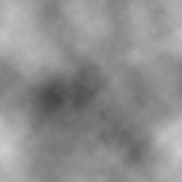 |

---

## TEX15000

**Properties**
- `TextureFile`: `images/feder0003.tga`
- `Count`: `1`

**Source image**

- Folder: `exports/TEX15000/`

  - exports/TEX15000/source.png
  - exports/TEX15000/source.tga
  - exports/TEX15000/source.bmp
  - exports/TEX15000/source.jpg
  - exports/TEX15000/source.jpeg
  - exports/TEX15000/source.webp

> Preview: open the folder above to see `source.*` and exported sprites.

**Sprites**

| # | Rect (x,y,w,h) | Image |
|---:|---|---|
| 0 | `0 0 40 40` |  |

---

## TEX15001

**Properties**
- `TextureFile`: `images/edit_cursor.tga`
- `Count`: `1`

**Source image**

- Folder: `exports/TEX15001/`

  - exports/TEX15001/source.png
  - exports/TEX15001/source.tga
  - exports/TEX15001/source.bmp
  - exports/TEX15001/source.jpg
  - exports/TEX15001/source.jpeg
  - exports/TEX15001/source.webp

> Preview: open the folder above to see `source.*` and exported sprites.

**Sprites**

| # | Rect (x,y,w,h) | Image |
|---:|---|---|
| 0 | `0 0 18 12` |  |

---

## TEX16001

**Properties**
- `TextureFile`: `images/dialogparchment/Papier.tga`
- `Count`: `39`

**Source image**

- Folder: `exports/TEX16001/`

  - exports/TEX16001/source.png
  - exports/TEX16001/source.tga
  - exports/TEX16001/source.bmp
  - exports/TEX16001/source.jpg
  - exports/TEX16001/source.jpeg
  - exports/TEX16001/source.webp

> Preview: open the folder above to see `source.*` and exported sprites.

**Sprites**

| # | Rect (x,y,w,h) | Image |
|---:|---|---|
| 0 | `0 0 6 32` |  |
| 1 | `166 0 6 32` |  |
| 2 | `0 192 6 32` |  |
| 3 | `166 192 6 32` |  |
| 4 | `6 0 32 32` |  |
| 5 | `38 0 32 32` |  |
| 6 | `70 0 32 32` |  |
| 7 | `102 0 32 32` |  |
| 8 | `134 0 32 32` |  |
| 9 | `6 32 32 32` |  |
| 10 | `38 32 32 32` |  |
| 11 | `70 32 32 32` |  |
| 12 | `102 32 32 32` |  |
| 13 | `134 32 32 32` |  |
| 14 | `6 64 32 32` |  |
| 15 | `6 96 32 32` |  |
| 16 | `6 128 32 32` |  |
| 17 | `134 64 32 32` |  |
| 18 | `134 96 32 32` |  |
| 19 | `134 128 32 32` |  |
| 20 | `6 160 32 32` |  |
| 21 | `38 160 32 32` |  |
| 22 | `70 160 32 32` |  |
| 23 | `102 160 32 32` |  |
| 24 | `134 160 32 32` |  |
| 25 | `6 192 32 32` |  |
| 26 | `38 192 32 32` |  |
| 27 | `70 192 32 32` |  |
| 28 | `102 192 32 32` |  |
| 29 | `134 192 32 32` |  |
| 30 | `38 64 32 32` |  |
| 31 | `70 64 32 32` |  |
| 32 | `102 64 32 32` |  |
| 33 | `38 96 32 32` |  |
| 34 | `70 96 32 32` |  |
| 35 | `102 96 32 32` |  |
| 36 | `38 128 32 32` |  |
| 37 | `70 128 32 32` |  |
| 38 | `102 128 32 32` |  |

---

## TEX16002

**Properties**
- `TextureFile`: `images/frames_listen/orlogg0001.tga`
- `Count`: `1`

**Source image**

- Folder: `exports/TEX16002/`

  - exports/TEX16002/source.png
  - exports/TEX16002/source.tga
  - exports/TEX16002/source.bmp
  - exports/TEX16002/source.jpg
  - exports/TEX16002/source.jpeg
  - exports/TEX16002/source.webp

> Preview: open the folder above to see `source.*` and exported sprites.

**Sprites**

| # | Rect (x,y,w,h) | Image |
|---:|---|---|
| 0 | `0 0 26 18` |  |

---

## TEX16003

**Properties**
- `TextureFile`: `images/frames_listen/pirat0001.tga`
- `Count`: `1`

**Source image**

- Folder: `exports/TEX16003/`

  - exports/TEX16003/source.png
  - exports/TEX16003/source.tga
  - exports/TEX16003/source.bmp
  - exports/TEX16003/source.jpg
  - exports/TEX16003/source.jpeg
  - exports/TEX16003/source.webp

> Preview: open the folder above to see `source.*` and exported sprites.

**Sprites**

| # | Rect (x,y,w,h) | Image |
|---:|---|---|
| 0 | `0 0 26 18` |  |

---

## TEX16004

**Properties**
- `TextureFile`: `images/frames_listen/orlogg0002.tga`
- `Count`: `1`

**Source image**

- Folder: `exports/TEX16004/`

  - exports/TEX16004/source.png
  - exports/TEX16004/source.tga
  - exports/TEX16004/source.bmp
  - exports/TEX16004/source.jpg
  - exports/TEX16004/source.jpeg
  - exports/TEX16004/source.webp

> Preview: open the folder above to see `source.*` and exported sprites.

**Sprites**

| # | Rect (x,y,w,h) | Image |
|---:|---|---|
| 0 | `0 0 26 18` |  |

---

## TEX16010

**Properties**
- `TextureFile`: `images/p_ScrollbalkenOben.tga`
- `Count`: `3`

**Source image**

- Folder: `exports/TEX16010/`

  - exports/TEX16010/source.png
  - exports/TEX16010/source.tga
  - exports/TEX16010/source.bmp
  - exports/TEX16010/source.jpg
  - exports/TEX16010/source.jpeg
  - exports/TEX16010/source.webp

> Preview: open the folder above to see `source.*` and exported sprites.

**Sprites**

| # | Rect (x,y,w,h) | Image |
|---:|---|---|
| 0 | `0 0 19 28` |  |
| 1 | `19 0 19 28` |  |
| 2 | `38 0 19 28` |  |

---

## TEX16011

**Properties**
- `TextureFile`: `images/p_ScrollbalkenUnten.tga`
- `Count`: `3`

**Source image**

- Folder: `exports/TEX16011/`

  - exports/TEX16011/source.png
  - exports/TEX16011/source.tga
  - exports/TEX16011/source.bmp
  - exports/TEX16011/source.jpg
  - exports/TEX16011/source.jpeg
  - exports/TEX16011/source.webp

> Preview: open the folder above to see `source.*` and exported sprites.

**Sprites**

| # | Rect (x,y,w,h) | Image |
|---:|---|---|
| 0 | `0 0 19 30` |  |
| 1 | `19 0 19 30` |  |
| 2 | `38 0 19 30` |  |

---

## TEX16012

**Properties**
- `TextureFile`: `images/ScrollbalkenMitte.tga`
- `Count`: `1`

**Source image**

- Folder: `exports/TEX16012/`

  - exports/TEX16012/source.png
  - exports/TEX16012/source.tga
  - exports/TEX16012/source.bmp
  - exports/TEX16012/source.jpg
  - exports/TEX16012/source.jpeg
  - exports/TEX16012/source.webp

> Preview: open the folder above to see `source.*` and exported sprites.

**Sprites**

| # | Rect (x,y,w,h) | Image |
|---:|---|---|
| 0 | `0 0 19 32` |  |

---

## TEX16013

**Properties**
- `TextureFile`: `images/p_brief_schnalle01.tga`
- `Count`: `2`

**Source image**

- Folder: `exports/TEX16013/`

  - exports/TEX16013/source.png
  - exports/TEX16013/source.tga
  - exports/TEX16013/source.bmp
  - exports/TEX16013/source.jpg
  - exports/TEX16013/source.jpeg
  - exports/TEX16013/source.webp

> Preview: open the folder above to see `source.*` and exported sprites.

**Sprites**

| # | Rect (x,y,w,h) | Image |
|---:|---|---|
| 0 | `0 0 27 22` |  |
| 1 | `27 0 27 22` |  |

---

## TEX16014

**Properties**
- `TextureFile`: `images/frames_listen/warenwert0002.tga`
- `Count`: `1`

**Source image**

- Folder: `exports/TEX16014/`

  - exports/TEX16014/source.png
  - exports/TEX16014/source.tga
  - exports/TEX16014/source.bmp
  - exports/TEX16014/source.jpg
  - exports/TEX16014/source.jpeg
  - exports/TEX16014/source.webp

> Preview: open the folder above to see `source.*` and exported sprites.

**Sprites**

| # | Rect (x,y,w,h) | Image |
|---:|---|---|
| 0 | `0 0 17 16` |  |

---

## TEX16015

**Properties**
- `TextureFile`: `images/frames_listen/reparatur.tga`
- `Count`: `1`

**Source image**

- Folder: `exports/TEX16015/`

  - exports/TEX16015/source.png
  - exports/TEX16015/source.tga
  - exports/TEX16015/source.bmp
  - exports/TEX16015/source.jpg
  - exports/TEX16015/source.jpeg
  - exports/TEX16015/source.webp

> Preview: open the folder above to see `source.*` and exported sprites.

**Sprites**

| # | Rect (x,y,w,h) | Image |
|---:|---|---|
| 0 | `0 0 26 18` |  |

---

## TEX16016

**Properties**
- `TextureFile`: `images/frames_listen/neubau.tga`
- `Count`: `1`

**Source image**

- Folder: `exports/TEX16016/`

  - exports/TEX16016/source.png
  - exports/TEX16016/source.tga
  - exports/TEX16016/source.bmp
  - exports/TEX16016/source.jpg
  - exports/TEX16016/source.jpeg
  - exports/TEX16016/source.webp

> Preview: open the folder above to see `source.*` and exported sprites.

**Sprites**

| # | Rect (x,y,w,h) | Image |
|---:|---|---|
| 0 | `0 0 26 18` |  |

---

## TEX16017

**Properties**
- `TextureFile`: `images/frames_listen/ausbau.tga`
- `Count`: `1`

**Source image**

- Folder: `exports/TEX16017/`

  - exports/TEX16017/source.png
  - exports/TEX16017/source.tga
  - exports/TEX16017/source.bmp
  - exports/TEX16017/source.jpg
  - exports/TEX16017/source.jpeg
  - exports/TEX16017/source.webp

> Preview: open the folder above to see `source.*` and exported sprites.

**Sprites**

| # | Rect (x,y,w,h) | Image |
|---:|---|---|
| 0 | `0 0 26 18` |  |

---

## TEX16018

**Properties**
- `TextureFile`: `images/siegel.tga`
- `Count`: `1`

**Source image**

- Folder: `exports/TEX16018/`

  - exports/TEX16018/source.png
  - exports/TEX16018/source.tga
  - exports/TEX16018/source.bmp
  - exports/TEX16018/source.jpg
  - exports/TEX16018/source.jpeg
  - exports/TEX16018/source.webp

> Preview: open the folder above to see `source.*` and exported sprites.

**Sprites**

| # | Rect (x,y,w,h) | Image |
|---:|---|---|
| 0 | `0 0 64 64` |  |

---

## TEX16019

**Properties**
- `TextureFile`: `images/b_konvoi_anker.tga`
- `Count`: `3`

**Source image**

- Folder: `exports/TEX16019/`

  - exports/TEX16019/source.png
  - exports/TEX16019/source.tga
  - exports/TEX16019/source.bmp
  - exports/TEX16019/source.jpg
  - exports/TEX16019/source.jpeg
  - exports/TEX16019/source.webp

> Preview: open the folder above to see `source.*` and exported sprites.

**Sprites**

| # | Rect (x,y,w,h) | Image |
|---:|---|---|
| 0 | `0 0 50 27` |  |
| 1 | `50 0 50 27` |  |
| 2 | `100 0 50 27` |  |

---

## TEX16020

**Properties**
- `TextureFile`: `images/b_konvoi_see.tga`
- `Count`: `3`

**Source image**

- Folder: `exports/TEX16020/`

  - exports/TEX16020/source.png
  - exports/TEX16020/source.tga
  - exports/TEX16020/source.bmp
  - exports/TEX16020/source.jpg
  - exports/TEX16020/source.jpeg
  - exports/TEX16020/source.webp

> Preview: open the folder above to see `source.*` and exported sprites.

**Sprites**

| # | Rect (x,y,w,h) | Image |
|---:|---|---|
| 0 | `0 0 50 27` |  |
| 1 | `50 0 50 27` |  |
| 2 | `100 0 50 27` |  |

---

## TEX16021

**Properties**
- `TextureFile`: `images/b_schiffe_anker.tga`
- `Count`: `3`

**Source image**

- Folder: `exports/TEX16021/`

  - exports/TEX16021/source.png
  - exports/TEX16021/source.tga
  - exports/TEX16021/source.bmp
  - exports/TEX16021/source.jpg
  - exports/TEX16021/source.jpeg
  - exports/TEX16021/source.webp

> Preview: open the folder above to see `source.*` and exported sprites.

**Sprites**

| # | Rect (x,y,w,h) | Image |
|---:|---|---|
| 0 | `0 0 40 27` |  |
| 1 | `40 0 40 27` |  |
| 2 | `80 0 40 27` |  |

---

## TEX16022

**Properties**
- `TextureFile`: `images/b_schiffe_see.tga`
- `Count`: `3`

**Source image**

- Folder: `exports/TEX16022/`

  - exports/TEX16022/source.png
  - exports/TEX16022/source.tga
  - exports/TEX16022/source.bmp
  - exports/TEX16022/source.jpg
  - exports/TEX16022/source.jpeg
  - exports/TEX16022/source.webp

> Preview: open the folder above to see `source.*` and exported sprites.

**Sprites**

| # | Rect (x,y,w,h) | Image |
|---:|---|---|
| 0 | `0 0 40 27` |  |
| 1 | `40 0 40 27` |  |
| 2 | `80 0 40 27` |  |

---

## TEX16023

**Properties**
- `TextureFile`: `images/bttn_schliess.tga`
- `Count`: `3`

**Source image**

- Folder: `exports/TEX16023/`

  - exports/TEX16023/source.png
  - exports/TEX16023/source.tga
  - exports/TEX16023/source.bmp
  - exports/TEX16023/source.jpg
  - exports/TEX16023/source.jpeg
  - exports/TEX16023/source.webp

> Preview: open the folder above to see `source.*` and exported sprites.

**Sprites**

| # | Rect (x,y,w,h) | Image |
|---:|---|---|
| 0 | `0 0 32 18` |  |
| 1 | `0 18 32 18` |  |
| 2 | `0 36 32 18` |  |

---

## TEX16024

**Properties**
- `TextureFile`: `images/frames_listen/angeboten.tga`
- `Count`: `1`

**Source image**

- Folder: `exports/TEX16024/`

  - exports/TEX16024/source.png
  - exports/TEX16024/source.tga
  - exports/TEX16024/source.bmp
  - exports/TEX16024/source.jpg
  - exports/TEX16024/source.jpeg
  - exports/TEX16024/source.webp

> Preview: open the folder above to see `source.*` and exported sprites.

**Sprites**

| # | Rect (x,y,w,h) | Image |
|---:|---|---|
| 0 | `0 0 26 18` |  |

---

## TEX16025

**Properties**
- `TextureFile`: `images/frames_listen/gilde.tga`
- `Count`: `1`

**Source image**

- Folder: `exports/TEX16025/`

  - exports/TEX16025/source.png
  - exports/TEX16025/source.tga
  - exports/TEX16025/source.bmp
  - exports/TEX16025/source.jpg
  - exports/TEX16025/source.jpeg
  - exports/TEX16025/source.webp

> Preview: open the folder above to see `source.*` and exported sprites.

**Sprites**

| # | Rect (x,y,w,h) | Image |
|---:|---|---|
| 0 | `0 0 26 18` |  |

---

## TEX16029

**Properties**
- `TextureFile`: `images/hand_gk0001.tga`
- `Count`: `2`

**Source image**

- Folder: `exports/TEX16029/`

  - exports/TEX16029/source.png
  - exports/TEX16029/source.tga
  - exports/TEX16029/source.bmp
  - exports/TEX16029/source.jpg
  - exports/TEX16029/source.jpeg
  - exports/TEX16029/source.webp

> Preview: open the folder above to see `source.*` and exported sprites.

**Sprites**

| # | Rect (x,y,w,h) | Image |
|---:|---|---|
| 0 | `32 0 32 32` |  |
| 1 | `0 0 32 32` |  |

---

## TEX16030

**Properties**
- `TextureFile`: `images/frames_listen/fass0001.tga`
- `Count`: `1`

**Source image**

- Folder: `exports/TEX16030/`

  - exports/TEX16030/source.png
  - exports/TEX16030/source.tga
  - exports/TEX16030/source.bmp
  - exports/TEX16030/source.jpg
  - exports/TEX16030/source.jpeg
  - exports/TEX16030/source.webp

> Preview: open the folder above to see `source.*` and exported sprites.

**Sprites**

| # | Rect (x,y,w,h) | Image |
|---:|---|---|
| 0 | `0 0 26 18` |  |

---

## TEX16031

**Properties**
- `TextureFile`: `images/frames_listen/ballen0001.tga`
- `Count`: `1`

**Source image**

- Folder: `exports/TEX16031/`

  - exports/TEX16031/source.png
  - exports/TEX16031/source.tga
  - exports/TEX16031/source.bmp
  - exports/TEX16031/source.jpg
  - exports/TEX16031/source.jpeg
  - exports/TEX16031/source.webp

> Preview: open the folder above to see `source.*` and exported sprites.

**Sprites**

| # | Rect (x,y,w,h) | Image |
|---:|---|---|
| 0 | `0 0 26 18` |  |

---

## TEX16032

**Properties**
- `TextureFile`: `images/bttn_standard.tga`
- `Count`: `9`

**Source image**

- Folder: `exports/TEX16032/`

  - exports/TEX16032/source.png
  - exports/TEX16032/source.tga
  - exports/TEX16032/source.bmp
  - exports/TEX16032/source.jpg
  - exports/TEX16032/source.jpeg
  - exports/TEX16032/source.webp

> Preview: open the folder above to see `source.*` and exported sprites.

**Sprites**

| # | Rect (x,y,w,h) | Image |
|---:|---|---|
| 0 | `0 0 8 18` |  |
| 1 | `8 0 240 18` |  |
| 2 | `248 0 8 18` |  |
| 3 | `0 18 8 36` |  |
| 4 | `8 18 240 36` |  |
| 5 | `248 18 8 36` |  |
| 6 | `0 36 8 54` |  |
| 7 | `8 36 240 54` |  |
| 8 | `248 36 8 54` |  |

---

## TEX16033

**Properties**
- `TextureFile`: `images/einwohner_haus_TP.tga`
- `Count`: `6`

**Source image**

- Folder: `exports/TEX16033/`

  - exports/TEX16033/source.png
  - exports/TEX16033/source.tga
  - exports/TEX16033/source.bmp
  - exports/TEX16033/source.jpg
  - exports/TEX16033/source.jpeg
  - exports/TEX16033/source.webp

> Preview: open the folder above to see `source.*` and exported sprites.

**Sprites**

| # | Rect (x,y,w,h) | Image |
|---:|---|---|
| 0 | `0 0 36 28` |  |
| 1 | `0 28 36 28` |  |
| 2 | `0 56 36 28` |  |
| 3 | `36 0 36 28` |  |
| 4 | `36 28 36 28` |  |
| 5 | `36 56 36 28` |  |

---

## TEX16034

**Properties**
- `TextureFile`: `images/frames_listen/autohandel.tga`
- `Count`: `1`

**Source image**

- Folder: `exports/TEX16034/`

  - exports/TEX16034/source.png
  - exports/TEX16034/source.tga
  - exports/TEX16034/source.bmp
  - exports/TEX16034/source.jpg
  - exports/TEX16034/source.jpeg
  - exports/TEX16034/source.webp

> Preview: open the folder above to see `source.*` and exported sprites.

**Sprites**

| # | Rect (x,y,w,h) | Image |
|---:|---|---|
| 0 | `0 0 26 18` |  |

---

## TEX16035

**Properties**
- `TextureFile`: `images/bttn_transfer.tga`
- `Count`: `12`

**Source image**

- Folder: `exports/TEX16035/`

  - exports/TEX16035/source.png
  - exports/TEX16035/source.tga
  - exports/TEX16035/source.bmp
  - exports/TEX16035/source.jpg
  - exports/TEX16035/source.jpeg
  - exports/TEX16035/source.webp

> Preview: open the folder above to see `source.*` and exported sprites.

**Sprites**

| # | Rect (x,y,w,h) | Image |
|---:|---|---|
| 0 | `0 0 48 18` |  |
| 1 | `0 18 48 18` |  |
| 2 | `0 36 48 18` |  |
| 3 | `0 54 48 18` |  |
| 4 | `0 72 48 18` |  |
| 5 | `0 90 48 18` |  |
| 6 | `0 108 48 18` |  |
| 7 | `0 126 48 18` |  |
| 8 | `0 144 48 18` |  |
| 9 | `0 162 48 18` |  |
| 10 | `0 180 48 18` |  |
| 11 | `0 198 48 18` |  |

---

## TEX16036

**Properties**
- `TextureFile`: `images/Vollansichtskarte.bmp`
- `Count`: `1`
- `UseAlpha`: `false`

**Source image**

- Folder: `exports/TEX16036/`

  - exports/TEX16036/source.png
  - exports/TEX16036/source.tga
  - exports/TEX16036/source.bmp
  - exports/TEX16036/source.jpg
  - exports/TEX16036/source.jpeg
  - exports/TEX16036/source.webp

> Preview: open the folder above to see `source.*` and exported sprites.

**Sprites**

| # | Rect (x,y,w,h) | Image |
|---:|---|---|
| 0 | `0 0 2400 1800` | 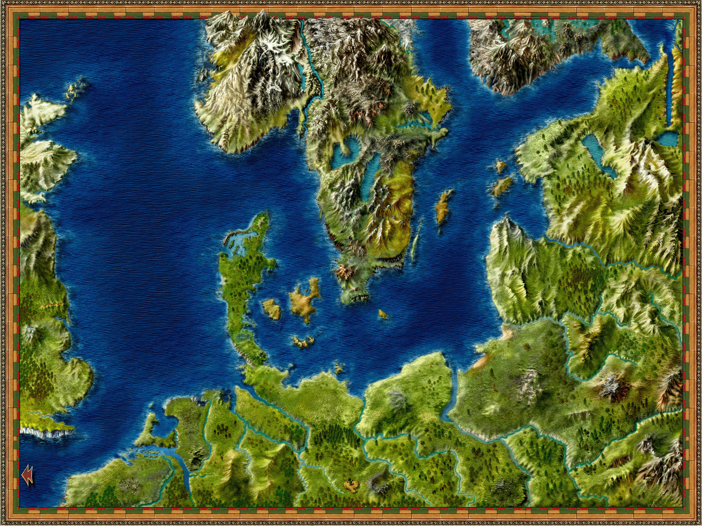 |

---

## TEX16037

**Properties**
- `TextureFile`: `images/menu01.tga`
- `Count`: `32`
- `UseAlpha`: `true`

**Source image**

- Folder: `exports/TEX16037/`

  - exports/TEX16037/source.png
  - exports/TEX16037/source.tga
  - exports/TEX16037/source.bmp
  - exports/TEX16037/source.jpg
  - exports/TEX16037/source.jpeg
  - exports/TEX16037/source.webp

> Preview: open the folder above to see `source.*` and exported sprites.

**Sprites**

| # | Rect (x,y,w,h) | Image |
|---:|---|---|
| 0 | `0 0 32 32` |  |
| 1 | `0 32 32 32` |  |
| 2 | `0 64 32 32` |  |
| 3 | `0 96 32 32` |  |
| 4 | `32 0 32 32` |  |
| 5 | `32 32 32 32` |  |
| 6 | `32 64 32 32` |  |
| 7 | `32 96 32 32` |  |
| 8 | `64 0 32 32` |  |
| 9 | `64 32 32 32` |  |
| 10 | `64 64 32 32` |  |
| 11 | `64 96 32 32` |  |
| 12 | `96 0 32 32` |  |
| 13 | `96 32 32 32` |  |
| 14 | `96 64 32 32` |  |
| 15 | `96 96 32 32` |  |
| 16 | `128 0 32 32` |  |
| 17 | `128 32 32 32` |  |
| 18 | `128 64 32 32` |  |
| 19 | `128 96 32 32` |  |
| 20 | `160 0 32 32` |  |
| 21 | `160 32 32 32` |  |
| 22 | `160 64 32 32` |  |
| 23 | `160 96 32 32` |  |
| 24 | `192 0 32 32` |  |
| 25 | `192 32 32 32` |  |
| 26 | `192 64 32 32` |  |
| 27 | `192 96 32 32` |  |
| 28 | `224 0 32 32` |  |
| 29 | `224 32 32 32` |  |
| 30 | `224 64 32 32` |  |
| 31 | `224 96 32 32` |  |

---

## TEX16038

**Properties**
- `TextureFile`: `images/frames_listen/waffen.tga`
- `Count`: `1`

**Source image**

- Folder: `exports/TEX16038/`

  - exports/TEX16038/source.png
  - exports/TEX16038/source.tga
  - exports/TEX16038/source.bmp
  - exports/TEX16038/source.jpg
  - exports/TEX16038/source.jpeg
  - exports/TEX16038/source.webp

> Preview: open the folder above to see `source.*` and exported sprites.

**Sprites**

| # | Rect (x,y,w,h) | Image |
|---:|---|---|
| 0 | `0 0 26 18` |  |

---

## TEX16039

**Properties**
- `TextureFile`: `images/schiff.tga`
- `Count`: `1`

**Source image**

- Folder: `exports/TEX16039/`

  - exports/TEX16039/source.png
  - exports/TEX16039/source.tga
  - exports/TEX16039/source.bmp
  - exports/TEX16039/source.jpg
  - exports/TEX16039/source.jpeg
  - exports/TEX16039/source.webp

> Preview: open the folder above to see `source.*` and exported sprites.

**Sprites**

| # | Rect (x,y,w,h) | Image |
|---:|---|---|
| 0 | `0 0 69 61` |  |

---

## TEX16040

**Properties**
- `TextureFile`: `images/stadtkontor.tga`
- `Count`: `1`

**Source image**

- Folder: `exports/TEX16040/`

  - exports/TEX16040/source.png
  - exports/TEX16040/source.tga
  - exports/TEX16040/source.bmp
  - exports/TEX16040/source.jpg
  - exports/TEX16040/source.jpeg
  - exports/TEX16040/source.webp

> Preview: open the folder above to see `source.*` and exported sprites.

**Sprites**

| # | Rect (x,y,w,h) | Image |
|---:|---|---|
| 0 | `0 0 69 61` |  |

---

## TEX16041

**Properties**
- `TextureFile`: `images/eigenerkontor.tga`
- `Count`: `1`

**Source image**

- Folder: `exports/TEX16041/`

  - exports/TEX16041/source.png
  - exports/TEX16041/source.tga
  - exports/TEX16041/source.bmp
  - exports/TEX16041/source.jpg
  - exports/TEX16041/source.jpeg
  - exports/TEX16041/source.webp

> Preview: open the folder above to see `source.*` and exported sprites.

**Sprites**

| # | Rect (x,y,w,h) | Image |
|---:|---|---|
| 0 | `0 0 69 61` |  |

---

## TEX16042

**Properties**
- `TextureFile`: `images/frames_listen/anker0001.tga`
- `Count`: `1`

**Source image**

- Folder: `exports/TEX16042/`

  - exports/TEX16042/source.png
  - exports/TEX16042/source.tga
  - exports/TEX16042/source.bmp
  - exports/TEX16042/source.jpg
  - exports/TEX16042/source.jpeg
  - exports/TEX16042/source.webp

> Preview: open the folder above to see `source.*` and exported sprites.

**Sprites**

| # | Rect (x,y,w,h) | Image |
|---:|---|---|
| 0 | `0 0 26 18` |  |

---

## TEX16043

**Properties**
- `TextureFile`: `images/frames_listen/aufsee0001.tga`
- `Count`: `1`

**Source image**

- Folder: `exports/TEX16043/`

  - exports/TEX16043/source.png
  - exports/TEX16043/source.tga
  - exports/TEX16043/source.bmp
  - exports/TEX16043/source.jpg
  - exports/TEX16043/source.jpeg
  - exports/TEX16043/source.webp

> Preview: open the folder above to see `source.*` and exported sprites.

**Sprites**

| # | Rect (x,y,w,h) | Image |
|---:|---|---|
| 0 | `0 0 26 18` |  |

---

## TEX16044

**Properties**
- `TextureFile`: `images/bttn_schiffsliste001.tga`
- `Count`: `12`

**Source image**

- Folder: `exports/TEX16044/`

  - exports/TEX16044/source.png
  - exports/TEX16044/source.tga
  - exports/TEX16044/source.bmp
  - exports/TEX16044/source.jpg
  - exports/TEX16044/source.jpeg
  - exports/TEX16044/source.webp

> Preview: open the folder above to see `source.*` and exported sprites.

**Sprites**

| # | Rect (x,y,w,h) | Image |
|---:|---|---|
| 0 | `0 0 72 18` |  |
| 1 | `0 18 72 18` |  |
| 2 | `0 36 72 18` |  |
| 3 | `72 0 72 18` |  |
| 4 | `72 18 72 18` |  |
| 5 | `72 36 72 18` |  |
| 6 | `144 0 32 18` |  |
| 7 | `144 18 32 18` |  |
| 8 | `144 36 32 18` |  |
| 9 | `176 0 32 18` |  |
| 10 | `176 18 32 18` |  |
| 11 | `176 36 32 18` |  |

---

## TEX16045

**Properties**
- `TextureFile`: `images/menu_seeschlacht.tga`
- `Count`: `24`
- `UseAlpha`: `true`

**Source image**

- Folder: `exports/TEX16045/`

  - exports/TEX16045/source.png
  - exports/TEX16045/source.tga
  - exports/TEX16045/source.bmp
  - exports/TEX16045/source.jpg
  - exports/TEX16045/source.jpeg
  - exports/TEX16045/source.webp

> Preview: open the folder above to see `source.*` and exported sprites.

**Sprites**

| # | Rect (x,y,w,h) | Image |
|---:|---|---|
| 0 | `128 0 32 32` |  |
| 1 | `128 32 32 32` |  |
| 2 | `128 64 32 32` |  |
| 3 | `128 96 32 32` |  |
| 4 | `64 0 32 32` |  |
| 5 | `64 32 32 32` |  |
| 6 | `64 64 32 32` |  |
| 7 | `64 96 32 32` |  |
| 8 | `160 0 32 32` |  |
| 9 | `160 32 32 32` |  |
| 10 | `160 64 32 32` |  |
| 11 | `160 96 32 32` |  |
| 12 | `96 0 32 32` |  |
| 13 | `96 32 32 32` |  |
| 14 | `96 64 32 32` |  |
| 15 | `96 96 32 32` |  |
| 16 | `0 0 32 32` |  |
| 17 | `0 32 32 32` |  |
| 18 | `0 64 32 32` |  |
| 19 | `0 96 32 32` |  |
| 20 | `32 0 32 32` |  |
| 21 | `32 32 32 32` |  |
| 22 | `32 64 32 32` |  |
| 23 | `32 96 32 32` |  |

---

## TEX16046

**Properties**
- `TextureFile`: `images/frames_listen/waren0001.tga`
- `Count`: `1`

**Source image**

- Folder: `exports/TEX16046/`

  - exports/TEX16046/source.png
  - exports/TEX16046/source.tga
  - exports/TEX16046/source.bmp
  - exports/TEX16046/source.jpg
  - exports/TEX16046/source.jpeg
  - exports/TEX16046/source.webp

> Preview: open the folder above to see `source.*` and exported sprites.

**Sprites**

| # | Rect (x,y,w,h) | Image |
|---:|---|---|
| 0 | `0 0 26 18` |  |

---

## TEX16047

**Properties**
- `TextureFile`: `images/frames_listen/warenwert0001.tga`
- `Count`: `1`

**Source image**

- Folder: `exports/TEX16047/`

  - exports/TEX16047/source.png
  - exports/TEX16047/source.tga
  - exports/TEX16047/source.bmp
  - exports/TEX16047/source.jpg
  - exports/TEX16047/source.jpeg
  - exports/TEX16047/source.webp

> Preview: open the folder above to see `source.*` and exported sprites.

**Sprites**

| # | Rect (x,y,w,h) | Image |
|---:|---|---|
| 0 | `0 0 26 18` |  |

---

## TEX16048

**Properties**
- `TextureFile`: `images/frames_listen/crew0001.tga`
- `Count`: `1`

**Source image**

- Folder: `exports/TEX16048/`

  - exports/TEX16048/source.png
  - exports/TEX16048/source.tga
  - exports/TEX16048/source.bmp
  - exports/TEX16048/source.jpg
  - exports/TEX16048/source.jpeg
  - exports/TEX16048/source.webp

> Preview: open the folder above to see `source.*` and exported sprites.

**Sprites**

| # | Rect (x,y,w,h) | Image |
|---:|---|---|
| 0 | `0 0 40 18` |  |

---

## TEX16050

**Properties**
- `TextureFile`: `images/frames_listen/schiff_weg0001.tga`
- `Count`: `1`

**Source image**

- Folder: `exports/TEX16050/`

  - exports/TEX16050/source.png
  - exports/TEX16050/source.tga
  - exports/TEX16050/source.bmp
  - exports/TEX16050/source.jpg
  - exports/TEX16050/source.jpeg
  - exports/TEX16050/source.webp

> Preview: open the folder above to see `source.*` and exported sprites.

**Sprites**

| # | Rect (x,y,w,h) | Image |
|---:|---|---|
| 0 | `0 0 26 18` |  |

---

## TEX16051

**Properties**
- `TextureFile`: `images/schattenrechts.tga`
- `Count`: `1`

**Source image**

- Folder: `exports/TEX16051/`

  - exports/TEX16051/source.png
  - exports/TEX16051/source.tga
  - exports/TEX16051/source.bmp
  - exports/TEX16051/source.jpg
  - exports/TEX16051/source.jpeg
  - exports/TEX16051/source.webp

> Preview: open the folder above to see `source.*` and exported sprites.

**Sprites**

| # | Rect (x,y,w,h) | Image |
|---:|---|---|
| 0 | `0 0 4 560` |  |

---

## TEX16052

**Properties**
- `TextureFile`: `images/schattenunten.tga`
- `Count`: `1`

**Source image**

- Folder: `exports/TEX16052/`

  - exports/TEX16052/source.png
  - exports/TEX16052/source.tga
  - exports/TEX16052/source.bmp
  - exports/TEX16052/source.jpg
  - exports/TEX16052/source.jpeg
  - exports/TEX16052/source.webp

> Preview: open the folder above to see `source.*` and exported sprites.

**Sprites**

| # | Rect (x,y,w,h) | Image |
|---:|---|---|
| 0 | `0 0 428 4` |  |

---

## TEX16053

**Properties**
- `TextureFile`: `images/frames_listen/kaptain0001.tga`
- `Count`: `1`

**Source image**

- Folder: `exports/TEX16053/`

  - exports/TEX16053/source.png
  - exports/TEX16053/source.tga
  - exports/TEX16053/source.bmp
  - exports/TEX16053/source.jpg
  - exports/TEX16053/source.jpeg
  - exports/TEX16053/source.webp

> Preview: open the folder above to see `source.*` and exported sprites.

**Sprites**

| # | Rect (x,y,w,h) | Image |
|---:|---|---|
| 0 | `0 0 18 18` |  |

---

## TEX16054

**Properties**
- `TextureFile`: `images/frames_listen/bewaffnung0002.tga`
- `Count`: `1`

**Source image**

- Folder: `exports/TEX16054/`

  - exports/TEX16054/source.png
  - exports/TEX16054/source.tga
  - exports/TEX16054/source.bmp
  - exports/TEX16054/source.jpg
  - exports/TEX16054/source.jpeg
  - exports/TEX16054/source.webp

> Preview: open the folder above to see `source.*` and exported sprites.

**Sprites**

| # | Rect (x,y,w,h) | Image |
|---:|---|---|
| 0 | `0 0 40 18` |  |

---

## TEX16055

**Properties**
- `TextureFile`: `images/bttn_Legende.tga`
- `Count`: `2`

**Source image**

- Folder: `exports/TEX16055/`

  - exports/TEX16055/source.png
  - exports/TEX16055/source.tga
  - exports/TEX16055/source.bmp
  - exports/TEX16055/source.jpg
  - exports/TEX16055/source.jpeg
  - exports/TEX16055/source.webp

> Preview: open the folder above to see `source.*` and exported sprites.

**Sprites**

| # | Rect (x,y,w,h) | Image |
|---:|---|---|
| 0 | `0 0 17 12` |  |
| 1 | `0 12 17 12` |  |

---

## TEX16056

**Properties**
- `TextureFile`: `images/frames_listen/bewaffnung0003.tga`
- `Count`: `1`

**Source image**

- Folder: `exports/TEX16056/`

  - exports/TEX16056/source.png
  - exports/TEX16056/source.tga
  - exports/TEX16056/source.bmp
  - exports/TEX16056/source.jpg
  - exports/TEX16056/source.jpeg
  - exports/TEX16056/source.webp

> Preview: open the folder above to see `source.*` and exported sprites.

**Sprites**

| # | Rect (x,y,w,h) | Image |
|---:|---|---|
| 0 | `0 0 40 18` |  |

---

## TEX16057

**Properties**
- `TextureFile`: `images/konvoi_min.tga`
- `Count`: `1`

**Source image**

- Folder: `exports/TEX16057/`

  - exports/TEX16057/source.png
  - exports/TEX16057/source.tga
  - exports/TEX16057/source.bmp
  - exports/TEX16057/source.jpg
  - exports/TEX16057/source.jpeg
  - exports/TEX16057/source.webp

> Preview: open the folder above to see `source.*` and exported sprites.

**Sprites**

| # | Rect (x,y,w,h) | Image |
|---:|---|---|
| 0 | `0 0 118 36` |  |

---

## TEX16058

**Properties**
- `TextureFile`: `images/dialogparchment/gelappte_Breifecken03.tga`
- `Count`: `4`

**Source image**

- Folder: `exports/TEX16058/`

  - exports/TEX16058/source.png
  - exports/TEX16058/source.tga
  - exports/TEX16058/source.bmp
  - exports/TEX16058/source.jpg
  - exports/TEX16058/source.jpeg
  - exports/TEX16058/source.webp

> Preview: open the folder above to see `source.*` and exported sprites.

**Sprites**

| # | Rect (x,y,w,h) | Image |
|---:|---|---|
| 0 | `0 0 32 32` |  |
| 1 | `32 0 32 32` |  |
| 2 | `0 32 32 32` |  |
| 3 | `32 32 32 32` |  |

---

## TEX16059

**Properties**
- `TextureFile`: `images/dialogparchment/Siegel_mit_Kogge.tga`
- `Count`: `1`

**Source image**

- Folder: `exports/TEX16059/`

  - exports/TEX16059/source.png
  - exports/TEX16059/source.tga
  - exports/TEX16059/source.bmp
  - exports/TEX16059/source.jpg
  - exports/TEX16059/source.jpeg
  - exports/TEX16059/source.webp

> Preview: open the folder above to see `source.*` and exported sprites.

**Sprites**

| # | Rect (x,y,w,h) | Image |
|---:|---|---|
| 0 | `0 0 64 64` |  |

---

## TEX16060

**Properties**
- `TextureFile`: `images/pfeil.tga`
- `Count`: `2`

**Source image**

- Folder: `exports/TEX16060/`

  - exports/TEX16060/source.png
  - exports/TEX16060/source.tga
  - exports/TEX16060/source.bmp
  - exports/TEX16060/source.jpg
  - exports/TEX16060/source.jpeg
  - exports/TEX16060/source.webp

> Preview: open the folder above to see `source.*` and exported sprites.

**Sprites**

| # | Rect (x,y,w,h) | Image |
|---:|---|---|
| 0 | `0 0 9 13` |  |
| 1 | `9 0 9 13` |  |

---

## TEX16061

**Properties**
- `TextureFile`: `images/bttn_tutorial.tga`
- `Count`: `8`

**Source image**

- Folder: `exports/TEX16061/`

  - exports/TEX16061/source.png
  - exports/TEX16061/source.tga
  - exports/TEX16061/source.bmp
  - exports/TEX16061/source.jpg
  - exports/TEX16061/source.jpeg
  - exports/TEX16061/source.webp

> Preview: open the folder above to see `source.*` and exported sprites.

**Sprites**

| # | Rect (x,y,w,h) | Image |
|---:|---|---|
| 0 | `0 0 18 27` |  |
| 1 | `18 0 18 27` |  |
| 2 | `36 0 18 27` |  |
| 3 | `54 0 18 27` |  |
| 4 | `0 27 18 27` |  |
| 5 | `18 27 18 27` |  |
| 6 | `36 27 18 27` |  |
| 7 | `54 27 18 27` |  |

---

## TEX16062

**Properties**
- `TextureFile`: `images/frames_listen/block_auslieg.tga`
- `Count`: `1`

**Source image**

- Folder: `exports/TEX16062/`

  - exports/TEX16062/source.png
  - exports/TEX16062/source.tga
  - exports/TEX16062/source.bmp
  - exports/TEX16062/source.jpg
  - exports/TEX16062/source.jpeg
  - exports/TEX16062/source.webp

> Preview: open the folder above to see `source.*` and exported sprites.

**Sprites**

| # | Rect (x,y,w,h) | Image |
|---:|---|---|
| 0 | `0 0 26 18` |  |

---

## TEX16063

**Properties**
- `TextureFile`: `images/chronik.tga`
- `Count`: `1`
- `UseAlpha`: `true`

**Source image**

- Folder: `exports/TEX16063/`

  - exports/TEX16063/source.png
  - exports/TEX16063/source.tga
  - exports/TEX16063/source.bmp
  - exports/TEX16063/source.jpg
  - exports/TEX16063/source.jpeg
  - exports/TEX16063/source.webp

> Preview: open the folder above to see `source.*` and exported sprites.

**Sprites**

| # | Rect (x,y,w,h) | Image |
|---:|---|---|
| 0 | `0 0 131 10` |  |

---

## TEX16100

**Properties**
- `TextureFile`: `images/AutomatischerHandelBackground.bmp`
- `Count`: `1`

**Source image**

- Folder: `exports/TEX16100/`

  - exports/TEX16100/source.png
  - exports/TEX16100/source.tga
  - exports/TEX16100/source.bmp
  - exports/TEX16100/source.jpg
  - exports/TEX16100/source.jpeg
  - exports/TEX16100/source.webp

> Preview: open the folder above to see `source.*` and exported sprites.

**Sprites**

| # | Rect (x,y,w,h) | Image |
|---:|---|---|
| 0 | `0 0 424 560` | 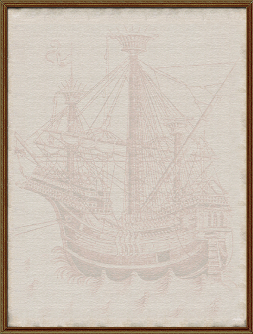 |

---

## TEX16200

**Properties**
- `TextureFile`: `images/Briefsiegel/Siegel_Edinburgh.tga`
- `Count`: `1`

**Source image**

- Folder: `exports/TEX16200/`

  - exports/TEX16200/source.png
  - exports/TEX16200/source.tga
  - exports/TEX16200/source.bmp
  - exports/TEX16200/source.jpg
  - exports/TEX16200/source.jpeg
  - exports/TEX16200/source.webp

> Preview: open the folder above to see `source.*` and exported sprites.

**Sprites**

| # | Rect (x,y,w,h) | Image |
|---:|---|---|
| 0 | `0 0 64 64` |  |

---

## TEX16201

**Properties**
- `TextureFile`: `images/Briefsiegel/Siegel_Thorn.tga`
- `Count`: `1`

**Source image**

- Folder: `exports/TEX16201/`

  - exports/TEX16201/source.png
  - exports/TEX16201/source.tga
  - exports/TEX16201/source.bmp
  - exports/TEX16201/source.jpg
  - exports/TEX16201/source.jpeg
  - exports/TEX16201/source.webp

> Preview: open the folder above to see `source.*` and exported sprites.

**Sprites**

| # | Rect (x,y,w,h) | Image |
|---:|---|---|
| 0 | `0 0 64 64` |  |

---

## TEX16202

**Properties**
- `TextureFile`: `images/Briefsiegel/Siegel_Reval.tga`
- `Count`: `1`

**Source image**

- Folder: `exports/TEX16202/`

  - exports/TEX16202/source.png
  - exports/TEX16202/source.tga
  - exports/TEX16202/source.bmp
  - exports/TEX16202/source.jpg
  - exports/TEX16202/source.jpeg
  - exports/TEX16202/source.webp

> Preview: open the folder above to see `source.*` and exported sprites.

**Sprites**

| # | Rect (x,y,w,h) | Image |
|---:|---|---|
| 0 | `0 0 64 64` |  |

---

## TEX16203

**Properties**
- `TextureFile`: `images/Briefsiegel/Siegel_Edinburgh.tga`
- `Count`: `1`

**Source image**

- Folder: `exports/TEX16203/`

  - exports/TEX16203/source.png
  - exports/TEX16203/source.tga
  - exports/TEX16203/source.bmp
  - exports/TEX16203/source.jpg
  - exports/TEX16203/source.jpeg
  - exports/TEX16203/source.webp

> Preview: open the folder above to see `source.*` and exported sprites.

**Sprites**

| # | Rect (x,y,w,h) | Image |
|---:|---|---|
| 0 | `0 0 64 64` |  |

---

## TEX16204

**Properties**
- `TextureFile`: `images/Briefsiegel/Siegel_London.tga`
- `Count`: `1`

**Source image**

- Folder: `exports/TEX16204/`

  - exports/TEX16204/source.png
  - exports/TEX16204/source.tga
  - exports/TEX16204/source.bmp
  - exports/TEX16204/source.jpg
  - exports/TEX16204/source.jpeg
  - exports/TEX16204/source.webp

> Preview: open the folder above to see `source.*` and exported sprites.

**Sprites**

| # | Rect (x,y,w,h) | Image |
|---:|---|---|
| 0 | `0 0 64 64` |  |

---

## TEX16205

**Properties**
- `TextureFile`: `images/Briefsiegel/Siegel_Bruegge.tga`
- `Count`: `1`

**Source image**

- Folder: `exports/TEX16205/`

  - exports/TEX16205/source.png
  - exports/TEX16205/source.tga
  - exports/TEX16205/source.bmp
  - exports/TEX16205/source.jpg
  - exports/TEX16205/source.jpeg
  - exports/TEX16205/source.webp

> Preview: open the folder above to see `source.*` and exported sprites.

**Sprites**

| # | Rect (x,y,w,h) | Image |
|---:|---|---|
| 0 | `0 0 64 64` |  |

---

## TEX16206

**Properties**
- `TextureFile`: `images/Briefsiegel/Siegel_Bruegge.tga`
- `Count`: `1`

**Source image**

- Folder: `exports/TEX16206/`

  - exports/TEX16206/source.png
  - exports/TEX16206/source.tga
  - exports/TEX16206/source.bmp
  - exports/TEX16206/source.jpg
  - exports/TEX16206/source.jpeg
  - exports/TEX16206/source.webp

> Preview: open the folder above to see `source.*` and exported sprites.

**Sprites**

| # | Rect (x,y,w,h) | Image |
|---:|---|---|
| 0 | `0 0 64 64` |  |

---

## TEX16207

**Properties**
- `TextureFile`: `images/Briefsiegel/Siegel_London.tga`
- `Count`: `1`

**Source image**

- Folder: `exports/TEX16207/`

  - exports/TEX16207/source.png
  - exports/TEX16207/source.tga
  - exports/TEX16207/source.bmp
  - exports/TEX16207/source.jpg
  - exports/TEX16207/source.jpeg
  - exports/TEX16207/source.webp

> Preview: open the folder above to see `source.*` and exported sprites.

**Sprites**

| # | Rect (x,y,w,h) | Image |
|---:|---|---|
| 0 | `0 0 64 64` |  |

---

## TEX16208

**Properties**
- `TextureFile`: `images/Briefsiegel/Siegel_Koeln.tga`
- `Count`: `1`

**Source image**

- Folder: `exports/TEX16208/`

  - exports/TEX16208/source.png
  - exports/TEX16208/source.tga
  - exports/TEX16208/source.bmp
  - exports/TEX16208/source.jpg
  - exports/TEX16208/source.jpeg
  - exports/TEX16208/source.webp

> Preview: open the folder above to see `source.*` and exported sprites.

**Sprites**

| # | Rect (x,y,w,h) | Image |
|---:|---|---|
| 0 | `0 0 64 64` |  |

---

## TEX16209

**Properties**
- `TextureFile`: `images/Briefsiegel/Siegel_Koeln.tga`
- `Count`: `1`

**Source image**

- Folder: `exports/TEX16209/`

  - exports/TEX16209/source.png
  - exports/TEX16209/source.tga
  - exports/TEX16209/source.bmp
  - exports/TEX16209/source.jpg
  - exports/TEX16209/source.jpeg
  - exports/TEX16209/source.webp

> Preview: open the folder above to see `source.*` and exported sprites.

**Sprites**

| # | Rect (x,y,w,h) | Image |
|---:|---|---|
| 0 | `0 0 64 64` |  |

---

## TEX16210

**Properties**
- `TextureFile`: `images/Briefsiegel/Siegel_Bremen.tga`
- `Count`: `1`

**Source image**

- Folder: `exports/TEX16210/`

  - exports/TEX16210/source.png
  - exports/TEX16210/source.tga
  - exports/TEX16210/source.bmp
  - exports/TEX16210/source.jpg
  - exports/TEX16210/source.jpeg
  - exports/TEX16210/source.webp

> Preview: open the folder above to see `source.*` and exported sprites.

**Sprites**

| # | Rect (x,y,w,h) | Image |
|---:|---|---|
| 0 | `0 0 64 64` |  |

---

## TEX16211

**Properties**
- `TextureFile`: `images/Briefsiegel/Siegel_Oslo.tga`
- `Count`: `1`

**Source image**

- Folder: `exports/TEX16211/`

  - exports/TEX16211/source.png
  - exports/TEX16211/source.tga
  - exports/TEX16211/source.bmp
  - exports/TEX16211/source.jpg
  - exports/TEX16211/source.jpeg
  - exports/TEX16211/source.webp

> Preview: open the folder above to see `source.*` and exported sprites.

**Sprites**

| # | Rect (x,y,w,h) | Image |
|---:|---|---|
| 0 | `0 0 64 64` |  |

---

## TEX16212

**Properties**
- `TextureFile`: `images/Briefsiegel/Siegel_Hamburg.tga`
- `Count`: `1`

**Source image**

- Folder: `exports/TEX16212/`

  - exports/TEX16212/source.png
  - exports/TEX16212/source.tga
  - exports/TEX16212/source.bmp
  - exports/TEX16212/source.jpg
  - exports/TEX16212/source.jpeg
  - exports/TEX16212/source.webp

> Preview: open the folder above to see `source.*` and exported sprites.

**Sprites**

| # | Rect (x,y,w,h) | Image |
|---:|---|---|
| 0 | `0 0 64 64` |  |

---

## TEX16213

**Properties**
- `TextureFile`: `images/Briefsiegel/Siegel_Bergen.tga`
- `Count`: `1`

**Source image**

- Folder: `exports/TEX16213/`

  - exports/TEX16213/source.png
  - exports/TEX16213/source.tga
  - exports/TEX16213/source.bmp
  - exports/TEX16213/source.jpg
  - exports/TEX16213/source.jpeg
  - exports/TEX16213/source.webp

> Preview: open the folder above to see `source.*` and exported sprites.

**Sprites**

| # | Rect (x,y,w,h) | Image |
|---:|---|---|
| 0 | `0 0 64 64` |  |

---

## TEX16214

**Properties**
- `TextureFile`: `images/Briefsiegel/Siegel_Luebeck.tga`
- `Count`: `1`

**Source image**

- Folder: `exports/TEX16214/`

  - exports/TEX16214/source.png
  - exports/TEX16214/source.tga
  - exports/TEX16214/source.bmp
  - exports/TEX16214/source.jpg
  - exports/TEX16214/source.jpeg
  - exports/TEX16214/source.webp

> Preview: open the folder above to see `source.*` and exported sprites.

**Sprites**

| # | Rect (x,y,w,h) | Image |
|---:|---|---|
| 0 | `0 0 64 64` |  |

---

## TEX16215

**Properties**
- `TextureFile`: `images/Briefsiegel/Siegel_Rostock.tga`
- `Count`: `1`

**Source image**

- Folder: `exports/TEX16215/`

  - exports/TEX16215/source.png
  - exports/TEX16215/source.tga
  - exports/TEX16215/source.bmp
  - exports/TEX16215/source.jpg
  - exports/TEX16215/source.jpeg
  - exports/TEX16215/source.webp

> Preview: open the folder above to see `source.*` and exported sprites.

**Sprites**

| # | Rect (x,y,w,h) | Image |
|---:|---|---|
| 0 | `0 0 64 64` |  |

---

## TEX16216

**Properties**
- `TextureFile`: `images/Briefsiegel/Siegel_Bergen.tga`
- `Count`: `1`

**Source image**

- Folder: `exports/TEX16216/`

  - exports/TEX16216/source.png
  - exports/TEX16216/source.tga
  - exports/TEX16216/source.bmp
  - exports/TEX16216/source.jpg
  - exports/TEX16216/source.jpeg
  - exports/TEX16216/source.webp

> Preview: open the folder above to see `source.*` and exported sprites.

**Sprites**

| # | Rect (x,y,w,h) | Image |
|---:|---|---|
| 0 | `0 0 64 64` |  |

---

## TEX16217

**Properties**
- `TextureFile`: `images/Briefsiegel/Siegel_Aalborg.tga`
- `Count`: `1`

**Source image**

- Folder: `exports/TEX16217/`

  - exports/TEX16217/source.png
  - exports/TEX16217/source.tga
  - exports/TEX16217/source.bmp
  - exports/TEX16217/source.jpg
  - exports/TEX16217/source.jpeg
  - exports/TEX16217/source.webp

> Preview: open the folder above to see `source.*` and exported sprites.

**Sprites**

| # | Rect (x,y,w,h) | Image |
|---:|---|---|
| 0 | `0 0 64 64` |  |

---

## TEX16218

**Properties**
- `TextureFile`: `images/Briefsiegel/Siegel_Malmoe.tga`
- `Count`: `1`

**Source image**

- Folder: `exports/TEX16218/`

  - exports/TEX16218/source.png
  - exports/TEX16218/source.tga
  - exports/TEX16218/source.bmp
  - exports/TEX16218/source.jpg
  - exports/TEX16218/source.jpeg
  - exports/TEX16218/source.webp

> Preview: open the folder above to see `source.*` and exported sprites.

**Sprites**

| # | Rect (x,y,w,h) | Image |
|---:|---|---|
| 0 | `0 0 64 64` |  |

---

## TEX16219

**Properties**
- `TextureFile`: `images/Briefsiegel/Siegel_Oslo.tga`
- `Count`: `1`

**Source image**

- Folder: `exports/TEX16219/`

  - exports/TEX16219/source.png
  - exports/TEX16219/source.tga
  - exports/TEX16219/source.bmp
  - exports/TEX16219/source.jpg
  - exports/TEX16219/source.jpeg
  - exports/TEX16219/source.webp

> Preview: open the folder above to see `source.*` and exported sprites.

**Sprites**

| # | Rect (x,y,w,h) | Image |
|---:|---|---|
| 0 | `0 0 64 64` |  |

---

## TEX16220

**Properties**
- `TextureFile`: `images/Briefsiegel/Siegel_Aalborg.tga`
- `Count`: `1`

**Source image**

- Folder: `exports/TEX16220/`

  - exports/TEX16220/source.png
  - exports/TEX16220/source.tga
  - exports/TEX16220/source.bmp
  - exports/TEX16220/source.jpg
  - exports/TEX16220/source.jpeg
  - exports/TEX16220/source.webp

> Preview: open the folder above to see `source.*` and exported sprites.

**Sprites**

| # | Rect (x,y,w,h) | Image |
|---:|---|---|
| 0 | `0 0 64 64` |  |

---

## TEX16221

**Properties**
- `TextureFile`: `images/Briefsiegel/Siegel_Nowgorod.tga`
- `Count`: `1`

**Source image**

- Folder: `exports/TEX16221/`

  - exports/TEX16221/source.png
  - exports/TEX16221/source.tga
  - exports/TEX16221/source.bmp
  - exports/TEX16221/source.jpg
  - exports/TEX16221/source.jpeg
  - exports/TEX16221/source.webp

> Preview: open the folder above to see `source.*` and exported sprites.

**Sprites**

| # | Rect (x,y,w,h) | Image |
|---:|---|---|
| 0 | `0 0 64 64` |  |

---

## TEX16222

**Properties**
- `TextureFile`: `images/Briefsiegel/Siegel_Stockholm.tga`
- `Count`: `1`

**Source image**

- Folder: `exports/TEX16222/`

  - exports/TEX16222/source.png
  - exports/TEX16222/source.tga
  - exports/TEX16222/source.bmp
  - exports/TEX16222/source.jpg
  - exports/TEX16222/source.jpeg
  - exports/TEX16222/source.webp

> Preview: open the folder above to see `source.*` and exported sprites.

**Sprites**

| # | Rect (x,y,w,h) | Image |
|---:|---|---|
| 0 | `0 0 64 64` |  |

---

## TEX16223

**Properties**
- `TextureFile`: `images/Briefsiegel/Siegel_Malmoe.tga`
- `Count`: `1`

**Source image**

- Folder: `exports/TEX16223/`

  - exports/TEX16223/source.png
  - exports/TEX16223/source.tga
  - exports/TEX16223/source.bmp
  - exports/TEX16223/source.jpg
  - exports/TEX16223/source.jpeg
  - exports/TEX16223/source.webp

> Preview: open the folder above to see `source.*` and exported sprites.

**Sprites**

| # | Rect (x,y,w,h) | Image |
|---:|---|---|
| 0 | `0 0 64 64` |  |

---

## TEX16224

**Properties**
- `TextureFile`: `images/Briefsiegel/Siegel_Bremen.tga`
- `Count`: `1`

**Source image**

- Folder: `exports/TEX16224/`

  - exports/TEX16224/source.png
  - exports/TEX16224/source.tga
  - exports/TEX16224/source.bmp
  - exports/TEX16224/source.jpg
  - exports/TEX16224/source.jpeg
  - exports/TEX16224/source.webp

> Preview: open the folder above to see `source.*` and exported sprites.

**Sprites**

| # | Rect (x,y,w,h) | Image |
|---:|---|---|
| 0 | `0 0 64 64` |  |

---

## TEX16225

**Properties**
- `TextureFile`: `images/Briefsiegel/Siegel_Stockholm.tga`
- `Count`: `1`

**Source image**

- Folder: `exports/TEX16225/`

  - exports/TEX16225/source.png
  - exports/TEX16225/source.tga
  - exports/TEX16225/source.bmp
  - exports/TEX16225/source.jpg
  - exports/TEX16225/source.jpeg
  - exports/TEX16225/source.webp

> Preview: open the folder above to see `source.*` and exported sprites.

**Sprites**

| # | Rect (x,y,w,h) | Image |
|---:|---|---|
| 0 | `0 0 64 64` |  |

---

## TEX16226

**Properties**
- `TextureFile`: `images/Briefsiegel/Siegel_Visby.tga`
- `Count`: `1`

**Source image**

- Folder: `exports/TEX16226/`

  - exports/TEX16226/source.png
  - exports/TEX16226/source.tga
  - exports/TEX16226/source.bmp
  - exports/TEX16226/source.jpg
  - exports/TEX16226/source.jpeg
  - exports/TEX16226/source.webp

> Preview: open the folder above to see `source.*` and exported sprites.

**Sprites**

| # | Rect (x,y,w,h) | Image |
|---:|---|---|
| 0 | `0 0 64 64` |  |

---

## TEX16227

**Properties**
- `TextureFile`: `images/Briefsiegel/Siegel_Rostock.tga`
- `Count`: `1`

**Source image**

- Folder: `exports/TEX16227/`

  - exports/TEX16227/source.png
  - exports/TEX16227/source.tga
  - exports/TEX16227/source.bmp
  - exports/TEX16227/source.jpg
  - exports/TEX16227/source.jpeg
  - exports/TEX16227/source.webp

> Preview: open the folder above to see `source.*` and exported sprites.

**Sprites**

| # | Rect (x,y,w,h) | Image |
|---:|---|---|
| 0 | `0 0 64 64` |  |

---

## TEX16228

**Properties**
- `TextureFile`: `images/Briefsiegel/Siegel_Stettin.tga`
- `Count`: `1`

**Source image**

- Folder: `exports/TEX16228/`

  - exports/TEX16228/source.png
  - exports/TEX16228/source.tga
  - exports/TEX16228/source.bmp
  - exports/TEX16228/source.jpg
  - exports/TEX16228/source.jpeg
  - exports/TEX16228/source.webp

> Preview: open the folder above to see `source.*` and exported sprites.

**Sprites**

| # | Rect (x,y,w,h) | Image |
|---:|---|---|
| 0 | `0 0 64 64` |  |

---

## TEX16229

**Properties**
- `TextureFile`: `images/Briefsiegel/Siegel_Danzig.tga`
- `Count`: `1`

**Source image**

- Folder: `exports/TEX16229/`

  - exports/TEX16229/source.png
  - exports/TEX16229/source.tga
  - exports/TEX16229/source.bmp
  - exports/TEX16229/source.jpg
  - exports/TEX16229/source.jpeg
  - exports/TEX16229/source.webp

> Preview: open the folder above to see `source.*` and exported sprites.

**Sprites**

| # | Rect (x,y,w,h) | Image |
|---:|---|---|
| 0 | `0 0 64 64` |  |

---

## TEX16230

**Properties**
- `TextureFile`: `images/Briefsiegel/Siegel_Danzig.tga`
- `Count`: `1`

**Source image**

- Folder: `exports/TEX16230/`

  - exports/TEX16230/source.png
  - exports/TEX16230/source.tga
  - exports/TEX16230/source.bmp
  - exports/TEX16230/source.jpg
  - exports/TEX16230/source.jpeg
  - exports/TEX16230/source.webp

> Preview: open the folder above to see `source.*` and exported sprites.

**Sprites**

| # | Rect (x,y,w,h) | Image |
|---:|---|---|
| 0 | `0 0 64 64` |  |

---

## TEX16231

**Properties**
- `TextureFile`: `images/Briefsiegel/Siegel_Thorn.tga`
- `Count`: `1`

**Source image**

- Folder: `exports/TEX16231/`

  - exports/TEX16231/source.png
  - exports/TEX16231/source.tga
  - exports/TEX16231/source.bmp
  - exports/TEX16231/source.jpg
  - exports/TEX16231/source.jpeg
  - exports/TEX16231/source.webp

> Preview: open the folder above to see `source.*` and exported sprites.

**Sprites**

| # | Rect (x,y,w,h) | Image |
|---:|---|---|
| 0 | `0 0 64 64` |  |

---

## TEX16232

**Properties**
- `TextureFile`: `images/Briefsiegel/Siegel_Hamburg.tga`
- `Count`: `1`

**Source image**

- Folder: `exports/TEX16232/`

  - exports/TEX16232/source.png
  - exports/TEX16232/source.tga
  - exports/TEX16232/source.bmp
  - exports/TEX16232/source.jpg
  - exports/TEX16232/source.jpeg
  - exports/TEX16232/source.webp

> Preview: open the folder above to see `source.*` and exported sprites.

**Sprites**

| # | Rect (x,y,w,h) | Image |
|---:|---|---|
| 0 | `0 0 64 64` |  |

---

## TEX16233

**Properties**
- `TextureFile`: `images/Briefsiegel/Siegel_Riga.tga`
- `Count`: `1`

**Source image**

- Folder: `exports/TEX16233/`

  - exports/TEX16233/source.png
  - exports/TEX16233/source.tga
  - exports/TEX16233/source.bmp
  - exports/TEX16233/source.jpg
  - exports/TEX16233/source.jpeg
  - exports/TEX16233/source.webp

> Preview: open the folder above to see `source.*` and exported sprites.

**Sprites**

| # | Rect (x,y,w,h) | Image |
|---:|---|---|
| 0 | `0 0 64 64` |  |

---

## TEX16234

**Properties**
- `TextureFile`: `images/Briefsiegel/Siegel_Visby.tga`
- `Count`: `1`

**Source image**

- Folder: `exports/TEX16234/`

  - exports/TEX16234/source.png
  - exports/TEX16234/source.tga
  - exports/TEX16234/source.bmp
  - exports/TEX16234/source.jpg
  - exports/TEX16234/source.jpeg
  - exports/TEX16234/source.webp

> Preview: open the folder above to see `source.*` and exported sprites.

**Sprites**

| # | Rect (x,y,w,h) | Image |
|---:|---|---|
| 0 | `0 0 64 64` |  |

---

## TEX16235

**Properties**
- `TextureFile`: `images/Briefsiegel/Siegel_Riga.tga`
- `Count`: `1`

**Source image**

- Folder: `exports/TEX16235/`

  - exports/TEX16235/source.png
  - exports/TEX16235/source.tga
  - exports/TEX16235/source.bmp
  - exports/TEX16235/source.jpg
  - exports/TEX16235/source.jpeg
  - exports/TEX16235/source.webp

> Preview: open the folder above to see `source.*` and exported sprites.

**Sprites**

| # | Rect (x,y,w,h) | Image |
|---:|---|---|
| 0 | `0 0 64 64` |  |

---

## TEX16236

**Properties**
- `TextureFile`: `images/Briefsiegel/Siegel_Stettin.tga`
- `Count`: `1`

**Source image**

- Folder: `exports/TEX16236/`

  - exports/TEX16236/source.png
  - exports/TEX16236/source.tga
  - exports/TEX16236/source.bmp
  - exports/TEX16236/source.jpg
  - exports/TEX16236/source.jpeg
  - exports/TEX16236/source.webp

> Preview: open the folder above to see `source.*` and exported sprites.

**Sprites**

| # | Rect (x,y,w,h) | Image |
|---:|---|---|
| 0 | `0 0 64 64` |  |

---

## TEX16237

**Properties**
- `TextureFile`: `images/Briefsiegel/Siegel_Reval.tga`
- `Count`: `1`

**Source image**

- Folder: `exports/TEX16237/`

  - exports/TEX16237/source.png
  - exports/TEX16237/source.tga
  - exports/TEX16237/source.bmp
  - exports/TEX16237/source.jpg
  - exports/TEX16237/source.jpeg
  - exports/TEX16237/source.webp

> Preview: open the folder above to see `source.*` and exported sprites.

**Sprites**

| # | Rect (x,y,w,h) | Image |
|---:|---|---|
| 0 | `0 0 64 64` |  |

---

## TEX16238

**Properties**
- `TextureFile`: `images/Briefsiegel/Siegel_Luebeck.tga`
- `Count`: `1`

**Source image**

- Folder: `exports/TEX16238/`

  - exports/TEX16238/source.png
  - exports/TEX16238/source.tga
  - exports/TEX16238/source.bmp
  - exports/TEX16238/source.jpg
  - exports/TEX16238/source.jpeg
  - exports/TEX16238/source.webp

> Preview: open the folder above to see `source.*` and exported sprites.

**Sprites**

| # | Rect (x,y,w,h) | Image |
|---:|---|---|
| 0 | `0 0 64 64` |  |

---

## TEX16239

**Properties**
- `TextureFile`: `images/Briefsiegel/Siegel_Nowgorod.tga`
- `Count`: `1`

**Source image**

- Folder: `exports/TEX16239/`

  - exports/TEX16239/source.png
  - exports/TEX16239/source.tga
  - exports/TEX16239/source.bmp
  - exports/TEX16239/source.jpg
  - exports/TEX16239/source.jpeg
  - exports/TEX16239/source.webp

> Preview: open the folder above to see `source.*` and exported sprites.

**Sprites**

| # | Rect (x,y,w,h) | Image |
|---:|---|---|
| 0 | `0 0 64 64` |  |

---

## TEX20001

**Properties**
- `TextureFile`: `images/sidemenu/fass0002.tga`
- `Count`: `1`

**Source image**

- Folder: `exports/TEX20001/`

  - exports/TEX20001/source.png
  - exports/TEX20001/source.tga
  - exports/TEX20001/source.bmp
  - exports/TEX20001/source.jpg
  - exports/TEX20001/source.jpeg
  - exports/TEX20001/source.webp

> Preview: open the folder above to see `source.*` and exported sprites.

**Sprites**

| # | Rect (x,y,w,h) | Image |
|---:|---|---|
| 0 | `0 0 74 65` |  |

---

## TEX20002

**Properties**
- `TextureFile`: `images/sidemenu/fass0003.tga`
- `Count`: `1`

**Source image**

- Folder: `exports/TEX20002/`

  - exports/TEX20002/source.png
  - exports/TEX20002/source.tga
  - exports/TEX20002/source.bmp
  - exports/TEX20002/source.jpg
  - exports/TEX20002/source.jpeg
  - exports/TEX20002/source.webp

> Preview: open the folder above to see `source.*` and exported sprites.

**Sprites**

| # | Rect (x,y,w,h) | Image |
|---:|---|---|
| 0 | `0 0 52 65` |  |

---

## TEX20003

**Properties**
- `TextureFile`: `images/sidemenu/Pergamentrolle.bmp`
- `Count`: `1`

**Source image**

- Folder: `exports/TEX20003/`

  - exports/TEX20003/source.png
  - exports/TEX20003/source.tga
  - exports/TEX20003/source.bmp
  - exports/TEX20003/source.jpg
  - exports/TEX20003/source.jpeg
  - exports/TEX20003/source.webp

> Preview: open the folder above to see `source.*` and exported sprites.

**Sprites**

| # | Rect (x,y,w,h) | Image |
|---:|---|---|
| 0 | `0 0 260 247` |  |

---

## TEX20004

**Properties**
- `TextureFile`: `images/sidemenu/HauptscreenE.bmp`
- `Count`: `1`

**Source image**

- Folder: `exports/TEX20004/`

  - exports/TEX20004/source.png
  - exports/TEX20004/source.tga
  - exports/TEX20004/source.bmp
  - exports/TEX20004/source.jpg
  - exports/TEX20004/source.jpeg
  - exports/TEX20004/source.webp

> Preview: open the folder above to see `source.*` and exported sprites.

**Sprites**

| # | Rect (x,y,w,h) | Image |
|---:|---|---|
| 0 | `0 0 260 247` |  |

---

## TEX20005

**Properties**
- `TextureFile`: `images/sidemenu/SchattenPergamentrolle.tga`
- `Count`: `1`

**Source image**

- Folder: `exports/TEX20005/`

  - exports/TEX20005/source.png
  - exports/TEX20005/source.tga
  - exports/TEX20005/source.bmp
  - exports/TEX20005/source.jpg
  - exports/TEX20005/source.jpeg
  - exports/TEX20005/source.webp

> Preview: open the folder above to see `source.*` and exported sprites.

**Sprites**

| # | Rect (x,y,w,h) | Image |
|---:|---|---|
| 0 | `0 0 260 13` |  |

---

## TEX20006

**Properties**
- `TextureFile`: `images/sidemenu/schiffinfo0001.tga`
- `Count`: `28`

**Source image**

- Folder: `exports/TEX20006/`

  - exports/TEX20006/source.png
  - exports/TEX20006/source.tga
  - exports/TEX20006/source.bmp
  - exports/TEX20006/source.jpg
  - exports/TEX20006/source.jpeg
  - exports/TEX20006/source.webp

> Preview: open the folder above to see `source.*` and exported sprites.

**Sprites**

| # | Rect (x,y,w,h) | Image |
|---:|---|---|
| 0 | `0 0 32 32` |  |
| 1 | `0 32 32 32` |  |
| 2 | `0 64 32 32` |  |
| 3 | `0 96 32 32` |  |
| 4 | `32 0 32 32` |  |
| 5 | `32 32 32 32` |  |
| 6 | `32 64 32 32` |  |
| 7 | `32 96 32 32` |  |
| 8 | `64 0 32 32` |  |
| 9 | `64 32 32 32` |  |
| 10 | `64 64 32 32` |  |
| 11 | `64 96 32 32` |  |
| 12 | `96 0 32 32` |  |
| 13 | `96 32 32 32` |  |
| 14 | `96 64 32 32` |  |
| 15 | `96 96 32 32` |  |
| 16 | `128 0 32 32` |  |
| 17 | `128 32 32 32` |  |
| 18 | `128 64 32 32` |  |
| 19 | `128 96 32 32` |  |
| 20 | `192 0 40 32` |  |
| 21 | `192 32 40 32` |  |
| 22 | `192 64 40 32` |  |
| 23 | `192 96 40 32` |  |
| 24 | `160 0 32 32` |  |
| 25 | `160 32 32 32` |  |
| 26 | `160 64 32 32` |  |
| 27 | `160 96 32 32` |  |

---

## TEX20007

**Properties**
- `TextureFile`: `images/sidemenu/Pergamentrolle_overlay.tga`
- `Count`: `1`

**Source image**

- Folder: `exports/TEX20007/`

  - exports/TEX20007/source.png
  - exports/TEX20007/source.tga
  - exports/TEX20007/source.bmp
  - exports/TEX20007/source.jpg
  - exports/TEX20007/source.jpeg
  - exports/TEX20007/source.webp

> Preview: open the folder above to see `source.*` and exported sprites.

**Sprites**

| # | Rect (x,y,w,h) | Image |
|---:|---|---|
| 0 | `0 0 260 20` |  |

---

## TEX20008

**Properties**
- `TextureFile`: `images/sidemenu/Haken_Pergamentrolle.tga`
- `Count`: `1`

**Source image**

- Folder: `exports/TEX20008/`

  - exports/TEX20008/source.png
  - exports/TEX20008/source.tga
  - exports/TEX20008/source.bmp
  - exports/TEX20008/source.jpg
  - exports/TEX20008/source.jpeg
  - exports/TEX20008/source.webp

> Preview: open the folder above to see `source.*` and exported sprites.

**Sprites**

| # | Rect (x,y,w,h) | Image |
|---:|---|---|
| 0 | `0 0 24 16` |  |

---

## TEX20009

**Properties**
- `TextureFile`: `images/sidemenu/moral_heuer.tga`
- `Count`: `6`
- `UseAlpha`: `true`

**Source image**

- Folder: `exports/TEX20009/`

  - exports/TEX20009/source.png
  - exports/TEX20009/source.tga
  - exports/TEX20009/source.bmp
  - exports/TEX20009/source.jpg
  - exports/TEX20009/source.jpeg
  - exports/TEX20009/source.webp

> Preview: open the folder above to see `source.*` and exported sprites.

**Sprites**

| # | Rect (x,y,w,h) | Image |
|---:|---|---|
| 0 | `0 0 32 32` |  |
| 1 | `0 32 32 32` |  |
| 2 | `32 0 32 32` |  |
| 3 | `32 32 32 32` |  |
| 4 | `64 0 32 32` |  |
| 5 | `64 32 32 32` |  |

---

## TEX20010

**Properties**
- `TextureFile`: `images/sidemenu/schiffsdeck.tga`
- `Count`: `19`

**Source image**

- Folder: `exports/TEX20010/`

  - exports/TEX20010/source.png
  - exports/TEX20010/source.tga
  - exports/TEX20010/source.bmp
  - exports/TEX20010/source.jpg
  - exports/TEX20010/source.jpeg
  - exports/TEX20010/source.webp

> Preview: open the folder above to see `source.*` and exported sprites.

**Sprites**

| # | Rect (x,y,w,h) | Image |
|---:|---|---|
| 0 | `0 0 32 12` |  |
| 1 | `32 0 192 12` |  |
| 2 | `224 0 32 12` |  |
| 3 | `45 124 26 22` |  |
| 4 | `0 0 0 0` |  |
| 5 | `0 26 248 96` |  |
| 6 | `130 128 20 52` |  |
| 7 | `109 128 20 52` |  |
| 8 | `217 128 32 52` |  |
| 9 | `184 128 32 52` |  |
| 10 | `151 128 32 52` |  |
| 11 | `88 128 20 52` |  |
| 12 | `130 181 20 52` |  |
| 13 | `109 181 20 52` |  |
| 14 | `217 181 32 52` |  |
| 15 | `184 181 32 52` |  |
| 16 | `151 181 32 52` |  |
| 17 | `88 181 20 52` |  |
| 18 | `7 123 17 34` |  |

---

## TEX20011

**Properties**
- `TextureFile`: `images/sidemenu/bonus.tga`
- `Count`: `3`
- `UseAlpha`: `true`

**Source image**

- Folder: `exports/TEX20011/`

  - exports/TEX20011/source.png
  - exports/TEX20011/source.tga
  - exports/TEX20011/source.bmp
  - exports/TEX20011/source.jpg
  - exports/TEX20011/source.jpeg
  - exports/TEX20011/source.webp

> Preview: open the folder above to see `source.*` and exported sprites.

**Sprites**

| # | Rect (x,y,w,h) | Image |
|---:|---|---|
| 0 | `0 0 16 16` |  |
| 1 | `16 0 16 16` |  |
| 2 | `0 16 16 16` |  |

---

## TEX20013

**Properties**
- `TextureFile`: `images/frames_listen/schiffszustand0001.tga`
- `Count`: `1`

**Source image**

- Folder: `exports/TEX20013/`

  - exports/TEX20013/source.png
  - exports/TEX20013/source.tga
  - exports/TEX20013/source.bmp
  - exports/TEX20013/source.jpg
  - exports/TEX20013/source.jpeg
  - exports/TEX20013/source.webp

> Preview: open the folder above to see `source.*` and exported sprites.

**Sprites**

| # | Rect (x,y,w,h) | Image |
|---:|---|---|
| 0 | `0 0 18 18` |  |

---

## TEX20014

**Properties**
- `TextureFile`: `images/frames_listen/kanonenkugel0001.tga`
- `Count`: `1`

**Source image**

- Folder: `exports/TEX20014/`

  - exports/TEX20014/source.png
  - exports/TEX20014/source.tga
  - exports/TEX20014/source.bmp
  - exports/TEX20014/source.jpg
  - exports/TEX20014/source.jpeg
  - exports/TEX20014/source.webp

> Preview: open the folder above to see `source.*` and exported sprites.

**Sprites**

| # | Rect (x,y,w,h) | Image |
|---:|---|---|
| 0 | `0 0 12 12` |  |

---

## TEX20015

**Properties**
- `TextureFile`: `images/frames_listen/kanonenkugel0002.tga`
- `Count`: `1`

**Source image**

- Folder: `exports/TEX20015/`

  - exports/TEX20015/source.png
  - exports/TEX20015/source.tga
  - exports/TEX20015/source.bmp
  - exports/TEX20015/source.jpg
  - exports/TEX20015/source.jpeg
  - exports/TEX20015/source.webp

> Preview: open the folder above to see `source.*` and exported sprites.

**Sprites**

| # | Rect (x,y,w,h) | Image |
|---:|---|---|
| 0 | `0 0 12 12` |  |

---

## TEX20016

**Properties**
- `TextureFile`: `images/frames_listen/knoten0001.tga`
- `Count`: `1`

**Source image**

- Folder: `exports/TEX20016/`

  - exports/TEX20016/source.png
  - exports/TEX20016/source.tga
  - exports/TEX20016/source.bmp
  - exports/TEX20016/source.jpg
  - exports/TEX20016/source.jpeg
  - exports/TEX20016/source.webp

> Preview: open the folder above to see `source.*` and exported sprites.

**Sprites**

| # | Rect (x,y,w,h) | Image |
|---:|---|---|
| 0 | `0 0 28 18` |  |

---

## TEX20017

**Properties**
- `TextureFile`: `images/frames_listen/crew0002.tga`
- `Count`: `1`

**Source image**

- Folder: `exports/TEX20017/`

  - exports/TEX20017/source.png
  - exports/TEX20017/source.tga
  - exports/TEX20017/source.bmp
  - exports/TEX20017/source.jpg
  - exports/TEX20017/source.jpeg
  - exports/TEX20017/source.webp

> Preview: open the folder above to see `source.*` and exported sprites.

**Sprites**

| # | Rect (x,y,w,h) | Image |
|---:|---|---|
| 0 | `0 0 26 18` |  |

---

## TEX20018

**Properties**
- `TextureFile`: `images/briefe0001.tga`
- `Count`: `19`

**Source image**

- Folder: `exports/TEX20018/`

  - exports/TEX20018/source.png
  - exports/TEX20018/source.tga
  - exports/TEX20018/source.bmp
  - exports/TEX20018/source.jpg
  - exports/TEX20018/source.jpeg
  - exports/TEX20018/source.webp

> Preview: open the folder above to see `source.*` and exported sprites.

**Sprites**

| # | Rect (x,y,w,h) | Image |
|---:|---|---|
| 0 | `0 0 32 28` |  |
| 1 | `32 0 32 28` |  |
| 2 | `64 0 32 28` |  |
| 3 | `0 28 32 28` |  |
| 4 | `32 28 32 28` |  |
| 5 | `64 28 32 28` |  |
| 6 | `0 56 32 28` |  |
| 7 | `32 56 32 28` |  |
| 8 | `64 56 32 28` |  |
| 9 | `0 84 32 28` |  |
| 10 | `32 84 32 28` |  |
| 11 | `64 84 32 28` |  |
| 12 | `0 112 32 28` |  |
| 13 | `32 112 32 28` |  |
| 14 | `64 112 32 28` |  |
| 15 | `96 112 32 28` |  |
| 16 | `0 140 32 28` |  |
| 17 | `32 140 32 28` |  |
| 18 | `64 140 32 28` |  |

---

## TEX20019

**Properties**
- `TextureFile`: `images/sidemenu/frohr_holk01.bmp`
- `Count`: `1`

**Source image**

- Folder: `exports/TEX20019/`

  - exports/TEX20019/source.png
  - exports/TEX20019/source.tga
  - exports/TEX20019/source.bmp
  - exports/TEX20019/source.jpg
  - exports/TEX20019/source.jpeg
  - exports/TEX20019/source.webp

> Preview: open the folder above to see `source.*` and exported sprites.

**Sprites**

| # | Rect (x,y,w,h) | Image |
|---:|---|---|
| 0 | `0 0 180 180` |  |

---

## TEX20020

**Properties**
- `TextureFile`: `images/sidemenu/frohr_kraier01.bmp`
- `Count`: `1`

**Source image**

- Folder: `exports/TEX20020/`

  - exports/TEX20020/source.png
  - exports/TEX20020/source.tga
  - exports/TEX20020/source.bmp
  - exports/TEX20020/source.jpg
  - exports/TEX20020/source.jpeg
  - exports/TEX20020/source.webp

> Preview: open the folder above to see `source.*` and exported sprites.

**Sprites**

| # | Rect (x,y,w,h) | Image |
|---:|---|---|
| 0 | `0 0 180 180` |  |

---

## TEX20021

**Properties**
- `TextureFile`: `images/sidemenu/frohr_schnigge01.bmp`
- `Count`: `1`

**Source image**

- Folder: `exports/TEX20021/`

  - exports/TEX20021/source.png
  - exports/TEX20021/source.tga
  - exports/TEX20021/source.bmp
  - exports/TEX20021/source.jpg
  - exports/TEX20021/source.jpeg
  - exports/TEX20021/source.webp

> Preview: open the folder above to see `source.*` and exported sprites.

**Sprites**

| # | Rect (x,y,w,h) | Image |
|---:|---|---|
| 0 | `0 0 180 180` |  |

---

## TEX20022

**Properties**
- `TextureFile`: `images/sidemenu/frohr_kogge01.bmp`
- `Count`: `1`

**Source image**

- Folder: `exports/TEX20022/`

  - exports/TEX20022/source.png
  - exports/TEX20022/source.tga
  - exports/TEX20022/source.bmp
  - exports/TEX20022/source.jpg
  - exports/TEX20022/source.jpeg
  - exports/TEX20022/source.webp

> Preview: open the folder above to see `source.*` and exported sprites.

**Sprites**

| # | Rect (x,y,w,h) | Image |
|---:|---|---|
| 0 | `0 0 180 180` |  |

---

## TEX20023

**Properties**
- `TextureFile`: `images/sidemenu/frohr_maske01.tga`
- `Count`: `1`

**Source image**

- Folder: `exports/TEX20023/`

  - exports/TEX20023/source.png
  - exports/TEX20023/source.tga
  - exports/TEX20023/source.bmp
  - exports/TEX20023/source.jpg
  - exports/TEX20023/source.jpeg
  - exports/TEX20023/source.webp

> Preview: open the folder above to see `source.*` and exported sprites.

**Sprites**

| # | Rect (x,y,w,h) | Image |
|---:|---|---|
| 0 | `0 0 164 164` |  |

---

## TEX20024

**Properties**
- `TextureFile`: `images/sidemenu/frohr_holk02.bmp`
- `Count`: `1`

**Source image**

- Folder: `exports/TEX20024/`

  - exports/TEX20024/source.png
  - exports/TEX20024/source.tga
  - exports/TEX20024/source.bmp
  - exports/TEX20024/source.jpg
  - exports/TEX20024/source.jpeg
  - exports/TEX20024/source.webp

> Preview: open the folder above to see `source.*` and exported sprites.

**Sprites**

| # | Rect (x,y,w,h) | Image |
|---:|---|---|
| 0 | `0 0 180 180` |  |

---

## TEX20025

**Properties**
- `TextureFile`: `images/sidemenu/frohr_kraier02.bmp`
- `Count`: `1`

**Source image**

- Folder: `exports/TEX20025/`

  - exports/TEX20025/source.png
  - exports/TEX20025/source.tga
  - exports/TEX20025/source.bmp
  - exports/TEX20025/source.jpg
  - exports/TEX20025/source.jpeg
  - exports/TEX20025/source.webp

> Preview: open the folder above to see `source.*` and exported sprites.

**Sprites**

| # | Rect (x,y,w,h) | Image |
|---:|---|---|
| 0 | `0 0 180 180` |  |

---

## TEX20026

**Properties**
- `TextureFile`: `images/sidemenu/frohr_schnigge02.bmp`
- `Count`: `1`

**Source image**

- Folder: `exports/TEX20026/`

  - exports/TEX20026/source.png
  - exports/TEX20026/source.tga
  - exports/TEX20026/source.bmp
  - exports/TEX20026/source.jpg
  - exports/TEX20026/source.jpeg
  - exports/TEX20026/source.webp

> Preview: open the folder above to see `source.*` and exported sprites.

**Sprites**

| # | Rect (x,y,w,h) | Image |
|---:|---|---|
| 0 | `0 0 180 180` |  |

---

## TEX20027

**Properties**
- `TextureFile`: `images/sidemenu/frohr_kogge02.bmp`
- `Count`: `1`

**Source image**

- Folder: `exports/TEX20027/`

  - exports/TEX20027/source.png
  - exports/TEX20027/source.tga
  - exports/TEX20027/source.bmp
  - exports/TEX20027/source.jpg
  - exports/TEX20027/source.jpeg
  - exports/TEX20027/source.webp

> Preview: open the folder above to see `source.*` and exported sprites.

**Sprites**

| # | Rect (x,y,w,h) | Image |
|---:|---|---|
| 0 | `0 0 180 180` |  |

---

## TEX20028

**Properties**
- `TextureFile`: `images/sidemenu/frohr_pirat01.bmp`
- `Count`: `1`
- `Blendmode`: `multiply`

**Source image**

- Folder: `exports/TEX20028/`

  - exports/TEX20028/source.png
  - exports/TEX20028/source.tga
  - exports/TEX20028/source.bmp
  - exports/TEX20028/source.jpg
  - exports/TEX20028/source.jpeg
  - exports/TEX20028/source.webp

> Preview: open the folder above to see `source.*` and exported sprites.

**Sprites**

| # | Rect (x,y,w,h) | Image |
|---:|---|---|
| 0 | `0 0 164 164` |  |

---

## TEX20029

**Properties**
- `TextureFile`: `images/sidemenu/backpic_schnigge01.bmp`
- `Count`: `1`
- `Blendmode`: `multiply`

**Source image**

- Folder: `exports/TEX20029/`

  - exports/TEX20029/source.png
  - exports/TEX20029/source.tga
  - exports/TEX20029/source.bmp
  - exports/TEX20029/source.jpg
  - exports/TEX20029/source.jpeg
  - exports/TEX20029/source.webp

> Preview: open the folder above to see `source.*` and exported sprites.

**Sprites**

| # | Rect (x,y,w,h) | Image |
|---:|---|---|
| 0 | `0 0 260 160` |  |

---

## TEX20030

**Properties**
- `TextureFile`: `images/sidemenu/backpic_kraier01.bmp`
- `Count`: `1`
- `Blendmode`: `multiply`

**Source image**

- Folder: `exports/TEX20030/`

  - exports/TEX20030/source.png
  - exports/TEX20030/source.tga
  - exports/TEX20030/source.bmp
  - exports/TEX20030/source.jpg
  - exports/TEX20030/source.jpeg
  - exports/TEX20030/source.webp

> Preview: open the folder above to see `source.*` and exported sprites.

**Sprites**

| # | Rect (x,y,w,h) | Image |
|---:|---|---|
| 0 | `0 0 260 160` |  |

---

## TEX20031

**Properties**
- `TextureFile`: `images/sidemenu/backpic_kogge01.bmp`
- `Count`: `1`
- `Blendmode`: `multiply`

**Source image**

- Folder: `exports/TEX20031/`

  - exports/TEX20031/source.png
  - exports/TEX20031/source.tga
  - exports/TEX20031/source.bmp
  - exports/TEX20031/source.jpg
  - exports/TEX20031/source.jpeg
  - exports/TEX20031/source.webp

> Preview: open the folder above to see `source.*` and exported sprites.

**Sprites**

| # | Rect (x,y,w,h) | Image |
|---:|---|---|
| 0 | `0 0 260 160` |  |

---

## TEX20032

**Properties**
- `TextureFile`: `images/sidemenu/backpic_holk01.bmp`
- `Count`: `1`
- `Blendmode`: `multiply`

**Source image**

- Folder: `exports/TEX20032/`

  - exports/TEX20032/source.png
  - exports/TEX20032/source.tga
  - exports/TEX20032/source.bmp
  - exports/TEX20032/source.jpg
  - exports/TEX20032/source.jpeg
  - exports/TEX20032/source.webp

> Preview: open the folder above to see `source.*` and exported sprites.

**Sprites**

| # | Rect (x,y,w,h) | Image |
|---:|---|---|
| 0 | `0 0 260 160` |  |

---

## TEX20033

**Properties**
- `TextureFile`: `images/page_baumenue.tga`
- `Count`: `20`
- `UseAlpha`: `true`

**Source image**

- Folder: `exports/TEX20033/`

  - exports/TEX20033/source.png
  - exports/TEX20033/source.tga
  - exports/TEX20033/source.bmp
  - exports/TEX20033/source.jpg
  - exports/TEX20033/source.jpeg
  - exports/TEX20033/source.webp

> Preview: open the folder above to see `source.*` and exported sprites.

**Sprites**

| # | Rect (x,y,w,h) | Image |
|---:|---|---|
| 0 | `0 0 32 32` |  |
| 1 | `0 32 32 32` |  |
| 2 | `0 64 32 32` |  |
| 3 | `0 96 32 32` |  |
| 4 | `32 0 32 32` |  |
| 5 | `32 32 32 32` |  |
| 6 | `32 64 32 32` |  |
| 7 | `32 96 32 32` |  |
| 8 | `64 0 32 32` |  |
| 9 | `64 32 32 32` |  |
| 10 | `64 64 32 32` |  |
| 11 | `64 96 32 32` |  |
| 12 | `96 0 32 32` |  |
| 13 | `96 32 32 32` |  |
| 14 | `96 64 32 32` |  |
| 15 | `96 96 32 32` |  |
| 16 | `128 0 32 32` |  |
| 17 | `128 32 32 32` |  |
| 18 | `128 64 32 32` |  |
| 19 | `128 96 32 32` |  |

---

## TEX20034

**Properties**
- `TextureFile`: `images/page_statistiken.tga`
- `Count`: `16`
- `UseAlpha`: `true`

**Source image**

- Folder: `exports/TEX20034/`

  - exports/TEX20034/source.png
  - exports/TEX20034/source.tga
  - exports/TEX20034/source.bmp
  - exports/TEX20034/source.jpg
  - exports/TEX20034/source.jpeg
  - exports/TEX20034/source.webp

> Preview: open the folder above to see `source.*` and exported sprites.

**Sprites**

| # | Rect (x,y,w,h) | Image |
|---:|---|---|
| 0 | `68 0 32 32` |  |
| 1 | `68 32 32 32` |  |
| 2 | `68 64 32 32` |  |
| 3 | `68 96 32 32` |  |
| 4 | `100 0 36 32` |  |
| 5 | `100 32 36 32` |  |
| 6 | `100 64 36 32` |  |
| 7 | `100 96 36 32` |  |
| 8 | `0 0 36 32` |  |
| 9 | `0 32 36 32` |  |
| 10 | `0 64 36 32` |  |
| 11 | `0 96 36 32` |  |
| 12 | `36 0 32 32` |  |
| 13 | `36 32 32 32` |  |
| 14 | `36 64 32 32` |  |
| 15 | `36 96 32 32` |  |

---

## TEX20035

**Properties**
- `TextureFile`: `images/abreissen.tga`
- `Count`: `4`
- `UseAlpha`: `true`

**Source image**

- Folder: `exports/TEX20035/`

  - exports/TEX20035/source.png
  - exports/TEX20035/source.tga
  - exports/TEX20035/source.bmp
  - exports/TEX20035/source.jpg
  - exports/TEX20035/source.jpeg
  - exports/TEX20035/source.webp

> Preview: open the folder above to see `source.*` and exported sprites.

**Sprites**

| # | Rect (x,y,w,h) | Image |
|---:|---|---|
| 0 | `0 0 36 32` |  |
| 1 | `0 32 36 32` |  |
| 2 | `0 64 36 32` |  |
| 3 | `0 96 36 32` |  |

---

## TEX20037

**Properties**
- `TextureFile`: `images/sidemenu/fire.aim`
- `Count`: `4`
- `UseAlpha`: `true`

**Source image**

- Folder: `exports/TEX20037/`

  - exports/TEX20037/source.png
  - exports/TEX20037/source.tga
  - exports/TEX20037/source.bmp
  - exports/TEX20037/source.jpg
  - exports/TEX20037/source.jpeg
  - exports/TEX20037/source.webp

> Preview: open the folder above to see `source.*` and exported sprites.

**Sprites**

| # | Rect (x,y,w,h) | Image |
|---:|---|---|
| 0 | `0 0 64 64` |  |
| 1 | `64 0 64 64` |  |
| 2 | `128 0 64 64` |  |
| 3 | `192 0 64 64` |  |

---

## TEX20038

**Properties**
- `TextureFile`: `images/Versteigerungssymbol.tga`
- `Count`: `4`
- `UseAlpha`: `true`

**Source image**

- Folder: `exports/TEX20038/`

  - exports/TEX20038/source.png
  - exports/TEX20038/source.tga
  - exports/TEX20038/source.bmp
  - exports/TEX20038/source.jpg
  - exports/TEX20038/source.jpeg
  - exports/TEX20038/source.webp

> Preview: open the folder above to see `source.*` and exported sprites.

**Sprites**

| # | Rect (x,y,w,h) | Image |
|---:|---|---|
| 0 | `0 0 33 32` |  |
| 1 | `0 32 33 32` |  |
| 2 | `0 64 33 32` |  |
| 3 | `0 96 33 32` |  |

---

## TEX21000

**Properties**
- `TextureFile`: `images/Expedition/Amerika.bmp`
- `Count`: `1`

**Source image**

- Folder: `exports/TEX21000/`

  - exports/TEX21000/source.png
  - exports/TEX21000/source.tga
  - exports/TEX21000/source.bmp
  - exports/TEX21000/source.jpg
  - exports/TEX21000/source.jpeg
  - exports/TEX21000/source.webp

> Preview: open the folder above to see `source.*` and exported sprites.

**Sprites**

| # | Rect (x,y,w,h) | Image |
|---:|---|---|
| 0 | `0 0 400 150` |  |

---

## TEX21001

**Properties**
- `TextureFile`: `images/Expedition/Mittelmeer.bmp`
- `Count`: `1`

**Source image**

- Folder: `exports/TEX21001/`

  - exports/TEX21001/source.png
  - exports/TEX21001/source.tga
  - exports/TEX21001/source.bmp
  - exports/TEX21001/source.jpg
  - exports/TEX21001/source.jpeg
  - exports/TEX21001/source.webp

> Preview: open the folder above to see `source.*` and exported sprites.

**Sprites**

| # | Rect (x,y,w,h) | Image |
|---:|---|---|
| 0 | `0 0 400 150` |  |

---

## TEX21002

**Properties**
- `TextureFile`: `images/Expedition/Stadtbttn_Karte_Mittelmeer.tga`
- `Count`: `3`

**Source image**

- Folder: `exports/TEX21002/`

  - exports/TEX21002/source.png
  - exports/TEX21002/source.tga
  - exports/TEX21002/source.bmp
  - exports/TEX21002/source.jpg
  - exports/TEX21002/source.jpeg
  - exports/TEX21002/source.webp

> Preview: open the folder above to see `source.*` and exported sprites.

**Sprites**

| # | Rect (x,y,w,h) | Image |
|---:|---|---|
| 0 | `0 0 7 7` |  |
| 1 | `7 0 10 10` |  |
| 2 | `17 0 14 14` |  |

---

## TEX21003

**Properties**
- `TextureFile`: `images/Expedition/Karte_Punktuell.bmp`
- `Count`: `1`

**Source image**

- Folder: `exports/TEX21003/`

  - exports/TEX21003/source.png
  - exports/TEX21003/source.tga
  - exports/TEX21003/source.bmp
  - exports/TEX21003/source.jpg
  - exports/TEX21003/source.jpeg
  - exports/TEX21003/source.webp

> Preview: open the folder above to see `source.*` and exported sprites.

**Sprites**

| # | Rect (x,y,w,h) | Image |
|---:|---|---|
| 0 | `0 0 400 150` |  |

---

## TEX21004

**Properties**
- `TextureFile`: `images/Expedition/gefrbte_Karte.tga`
- `Count`: `1`

**Source image**

- Folder: `exports/TEX21004/`

  - exports/TEX21004/source.png
  - exports/TEX21004/source.tga
  - exports/TEX21004/source.bmp
  - exports/TEX21004/source.jpg
  - exports/TEX21004/source.jpeg
  - exports/TEX21004/source.webp

> Preview: open the folder above to see `source.*` and exported sprites.

**Sprites**

| # | Rect (x,y,w,h) | Image |
|---:|---|---|
| 0 | `0 0 100 100` |  |

---

## TEX30000

**Properties**
- `TextureFile`: `images/Wetter/flaute.tga`
- `Count`: `30`
- `UseAlpha`: `true`

**Source image**

- Folder: `exports/TEX30000/`

  - exports/TEX30000/source.png
  - exports/TEX30000/source.tga
  - exports/TEX30000/source.bmp
  - exports/TEX30000/source.jpg
  - exports/TEX30000/source.jpeg
  - exports/TEX30000/source.webp

> Preview: open the folder above to see `source.*` and exported sprites.

**Sprites**

| # | Rect (x,y,w,h) | Image |
|---:|---|---|
| 0 | `0 0 64 64` |  |
| 1 | `0 64 64 64` |  |
| 2 | `0 128 64 64` |  |
| 3 | `0 192 64 64` |  |
| 4 | `0 256 64 64` |  |
| 5 | `0 320 64 64` |  |
| 6 | `0 384 64 64` |  |
| 7 | `0 448 64 64` |  |
| 8 | `0 512 64 64` |  |
| 9 | `0 576 64 64` |  |
| 10 | `0 640 64 64` |  |
| 11 | `0 704 64 64` |  |
| 12 | `0 768 64 64` |  |
| 13 | `0 832 64 64` |  |
| 14 | `0 896 64 64` |  |
| 15 | `0 960 64 64` |  |
| 16 | `0 1024 64 64` |  |
| 17 | `0 1088 64 64` |  |
| 18 | `0 1152 64 64` |  |
| 19 | `0 1216 64 64` |  |
| 20 | `0 1280 64 64` |  |
| 21 | `0 1344 64 64` |  |
| 22 | `0 1408 64 64` |  |
| 23 | `0 1472 64 64` |  |
| 24 | `0 1536 64 64` |  |
| 25 | `0 1600 64 64` |  |
| 26 | `0 1664 64 64` |  |
| 27 | `0 1728 64 64` |  |
| 28 | `0 1792 64 64` |  |
| 29 | `0 1856 64 64` |  |

---

## TEX30001

**Properties**
- `TextureFile`: `images/Animationen_Seekarte/p_gewitter_b.tga`
- `Count`: `1`
- `UseAlpha`: `true`

**Source image**

- Folder: `exports/TEX30001/`

  - exports/TEX30001/source.png
  - exports/TEX30001/source.tga
  - exports/TEX30001/source.bmp
  - exports/TEX30001/source.jpg
  - exports/TEX30001/source.jpeg
  - exports/TEX30001/source.webp

> Preview: open the folder above to see `source.*` and exported sprites.

**Sprites**

| # | Rect (x,y,w,h) | Image |
|---:|---|---|
| 0 | `0 0 64 59` |  |

---

## TEX30002

**Properties**
- `TextureFile`: `images/Animationen_Seekarte/EisbergTP.tga`
- `Count`: `15`
- `UseAlpha`: `true`

**Source image**

- Folder: `exports/TEX30002/`

  - exports/TEX30002/source.png
  - exports/TEX30002/source.tga
  - exports/TEX30002/source.bmp
  - exports/TEX30002/source.jpg
  - exports/TEX30002/source.jpeg
  - exports/TEX30002/source.webp

> Preview: open the folder above to see `source.*` and exported sprites.

**Sprites**

| # | Rect (x,y,w,h) | Image |
|---:|---|---|
| 0 | `0 0 64 64` |  |
| 1 | `64 0 64 64` |  |
| 2 | `128 0 64 64` |  |
| 3 | `192 0 64 64` |  |
| 4 | `256 0 64 64` |  |
| 5 | `320 0 64 64` |  |
| 6 | `384 0 64 64` |  |
| 7 | `448 0 64 64` |  |
| 8 | `512 0 64 64` |  |
| 9 | `576 0 64 64` |  |
| 10 | `640 0 64 64` |  |
| 11 | `704 0 64 64` |  |
| 12 | `768 0 64 64` |  |
| 13 | `832 0 64 64` |  |
| 14 | `896 0 64 64` |  |

---

## TEX30003

**Properties**
- `TextureFile`: `images/Animationen_Seekarte/p_gewitter_a.tga`
- `Count`: `48`
- `UseAlpha`: `true`

**Source image**

- Folder: `exports/TEX30003/`

  - exports/TEX30003/source.png
  - exports/TEX30003/source.tga
  - exports/TEX30003/source.bmp
  - exports/TEX30003/source.jpg
  - exports/TEX30003/source.jpeg
  - exports/TEX30003/source.webp

> Preview: open the folder above to see `source.*` and exported sprites.

**Sprites**

| # | Rect (x,y,w,h) | Image |
|---:|---|---|
| 0 | `0 0 64 64` |  |
| 1 | `0 64 64 64` |  |
| 2 | `0 128 64 64` |  |
| 3 | `0 192 64 64` |  |
| 4 | `0 256 64 64` |  |
| 5 | `0 320 64 64` |  |
| 6 | `0 384 64 64` |  |
| 7 | `0 448 64 64` |  |
| 8 | `0 512 64 64` |  |
| 9 | `0 576 64 64` |  |
| 10 | `0 640 64 64` |  |
| 11 | `0 704 64 64` |  |
| 12 | `0 768 64 64` |  |
| 13 | `0 832 64 64` |  |
| 14 | `0 896 64 64` |  |
| 15 | `0 960 64 64` |  |
| 16 | `0 1024 64 64` |  |
| 17 | `0 1088 64 64` |  |
| 18 | `0 1152 64 64` |  |
| 19 | `0 1216 64 64` |  |
| 20 | `0 1280 64 64` |  |
| 21 | `0 1344 64 64` |  |
| 22 | `0 1408 64 64` |  |
| 23 | `0 1472 64 64` |  |
| 24 | `0 1536 64 64` |  |
| 25 | `0 1600 64 64` |  |
| 26 | `0 1664 64 64` |  |
| 27 | `0 1728 64 64` |  |
| 28 | `0 1792 64 64` |  |
| 29 | `0 1856 64 64` |  |
| 30 | `0 1920 64 64` |  |
| 31 | `0 1984 64 64` |  |
| 32 | `0 2048 64 64` |  |
| 33 | `0 2112 64 64` |  |
| 34 | `0 2176 64 64` |  |
| 35 | `0 2240 64 64` |  |
| 36 | `0 2304 64 64` |  |
| 37 | `0 2368 64 64` |  |
| 38 | `0 2432 64 64` |  |
| 39 | `0 2496 64 64` |  |
| 40 | `0 2560 64 64` |  |
| 41 | `0 2624 64 64` |  |
| 42 | `0 2688 64 64` |  |
| 43 | `0 2752 64 64` |  |
| 44 | `0 2816 64 64` |  |
| 45 | `0 2880 64 64` |  |
| 46 | `0 2944 64 64` |  |
| 47 | `0 3008 64 64` |  |

---

## TEX30004

**Properties**
- `TextureFile`: `images/Schiffe/page_mholk01.tga`
- `Count`: `16`
- `UseAlpha`: `true`

**Source image**

- Folder: `exports/TEX30004/`

  - exports/TEX30004/source.png
  - exports/TEX30004/source.tga
  - exports/TEX30004/source.bmp
  - exports/TEX30004/source.jpg
  - exports/TEX30004/source.jpeg
  - exports/TEX30004/source.webp

> Preview: open the folder above to see `source.*` and exported sprites.

**Sprites**

| # | Rect (x,y,w,h) | Image |
|---:|---|---|
| 0 | `0 0 52 56` |  |
| 1 | `52 0 52 56` |  |
| 2 | `104 0 52 56` |  |
| 3 | `156 0 52 56` |  |
| 4 | `0 56 52 56` |  |
| 5 | `52 56 52 56` |  |
| 6 | `104 56 52 56` |  |
| 7 | `156 56 52 56` |  |
| 8 | `0 112 52 56` |  |
| 9 | `52 112 52 56` |  |
| 10 | `104 112 52 56` |  |
| 11 | `156 112 52 56` |  |
| 12 | `0 168 52 56` |  |
| 13 | `52 168 52 56` |  |
| 14 | `104 168 52 56` |  |
| 15 | `156 168 52 56` |  |

---

## TEX30005

**Properties**
- `TextureFile`: `images/Schiffe/page_mkogge01.tga`
- `Count`: `16`
- `UseAlpha`: `true`

**Source image**

- Folder: `exports/TEX30005/`

  - exports/TEX30005/source.png
  - exports/TEX30005/source.tga
  - exports/TEX30005/source.bmp
  - exports/TEX30005/source.jpg
  - exports/TEX30005/source.jpeg
  - exports/TEX30005/source.webp

> Preview: open the folder above to see `source.*` and exported sprites.

**Sprites**

| # | Rect (x,y,w,h) | Image |
|---:|---|---|
| 0 | `0 0 52 56` |  |
| 1 | `52 0 52 56` |  |
| 2 | `104 0 52 56` |  |
| 3 | `156 0 52 56` |  |
| 4 | `0 56 52 56` |  |
| 5 | `52 56 52 56` |  |
| 6 | `104 56 52 56` |  |
| 7 | `156 56 52 56` |  |
| 8 | `0 112 52 56` |  |
| 9 | `52 112 52 56` |  |
| 10 | `104 112 52 56` |  |
| 11 | `156 112 52 56` |  |
| 12 | `0 168 52 56` |  |
| 13 | `52 168 52 56` |  |
| 14 | `104 168 52 56` |  |
| 15 | `156 168 52 56` |  |

---

## TEX30006

**Properties**
- `TextureFile`: `images/Schiffe/page_mkraier01.tga`
- `Count`: `16`
- `UseAlpha`: `true`

**Source image**

- Folder: `exports/TEX30006/`

  - exports/TEX30006/source.png
  - exports/TEX30006/source.tga
  - exports/TEX30006/source.bmp
  - exports/TEX30006/source.jpg
  - exports/TEX30006/source.jpeg
  - exports/TEX30006/source.webp

> Preview: open the folder above to see `source.*` and exported sprites.

**Sprites**

| # | Rect (x,y,w,h) | Image |
|---:|---|---|
| 0 | `0 0 52 56` |  |
| 1 | `52 0 52 56` |  |
| 2 | `104 0 52 56` |  |
| 3 | `156 0 52 56` |  |
| 4 | `0 56 52 56` |  |
| 5 | `52 56 52 56` |  |
| 6 | `104 56 52 56` |  |
| 7 | `156 56 52 56` |  |
| 8 | `0 112 52 56` |  |
| 9 | `52 112 52 56` |  |
| 10 | `104 112 52 56` |  |
| 11 | `156 112 52 56` |  |
| 12 | `0 168 52 56` |  |
| 13 | `52 168 52 56` |  |
| 14 | `104 168 52 56` |  |
| 15 | `156 168 52 56` |  |

---

## TEX30007

**Properties**
- `TextureFile`: `images/Schiffe/page_mschnigge01.tga`
- `Count`: `16`
- `UseAlpha`: `true`

**Source image**

- Folder: `exports/TEX30007/`

  - exports/TEX30007/source.png
  - exports/TEX30007/source.tga
  - exports/TEX30007/source.bmp
  - exports/TEX30007/source.jpg
  - exports/TEX30007/source.jpeg
  - exports/TEX30007/source.webp

> Preview: open the folder above to see `source.*` and exported sprites.

**Sprites**

| # | Rect (x,y,w,h) | Image |
|---:|---|---|
| 0 | `0 0 52 56` |  |
| 1 | `52 0 52 56` |  |
| 2 | `104 0 52 56` |  |
| 3 | `156 0 52 56` |  |
| 4 | `0 56 52 56` |  |
| 5 | `52 56 52 56` |  |
| 6 | `104 56 52 56` |  |
| 7 | `156 56 52 56` |  |
| 8 | `0 112 52 56` |  |
| 9 | `52 112 52 56` |  |
| 10 | `104 112 52 56` |  |
| 11 | `156 112 52 56` |  |
| 12 | `0 168 52 56` |  |
| 13 | `52 168 52 56` |  |
| 14 | `104 168 52 56` |  |
| 15 | `156 168 52 56` |  |

---

## TEX30008

**Properties**
- `TextureFile`: `images/Schiffe/schiffmarker01.tga`
- `Count`: `1`
- `UseAlpha`: `true`

**Source image**

- Folder: `exports/TEX30008/`

  - exports/TEX30008/source.png
  - exports/TEX30008/source.tga
  - exports/TEX30008/source.bmp
  - exports/TEX30008/source.jpg
  - exports/TEX30008/source.jpeg
  - exports/TEX30008/source.webp

> Preview: open the folder above to see `source.*` and exported sprites.

**Sprites**

| # | Rect (x,y,w,h) | Image |
|---:|---|---|
| 0 | `0 0 16 22` |  |

---

## TEX30009

**Properties**
- `TextureFile`: `images/Ereignisse/page_glkarte01.bmp`
- `Count`: `15`

**Source image**

- Folder: `exports/TEX30009/`

  - exports/TEX30009/source.png
  - exports/TEX30009/source.tga
  - exports/TEX30009/source.bmp
  - exports/TEX30009/source.jpg
  - exports/TEX30009/source.jpeg
  - exports/TEX30009/source.webp

> Preview: open the folder above to see `source.*` and exported sprites.

**Sprites**

| # | Rect (x,y,w,h) | Image |
|---:|---|---|
| 0 | `0 0 20 20` |  |
| 1 | `20 0 20 20` |  |
| 2 | `40 0 20 20` |  |
| 3 | `60 0 20 20` |  |
| 4 | `80 0 20 20` |  |
| 5 | `100 0 20 20` |  |
| 6 | `0 20 20 20` |  |
| 7 | `20 20 20 20` |  |
| 8 | `40 20 20 20` |  |
| 9 | `60 20 20 20` |  |
| 10 | `80 20 20 20` |  |
| 11 | `100 20 20 20` |  |
| 12 | `20 40 20 20` |  |
| 13 | `40 40 20 20` |  |
| 14 | `60 40 20 20` |  |

---

## TEX30010

**Properties**
- `TextureFile`: `images/Schiffe/p_anlegersymbole01.tga`
- `Count`: `4`
- `UseAlpha`: `true`

**Source image**

- Folder: `exports/TEX30010/`

  - exports/TEX30010/source.png
  - exports/TEX30010/source.tga
  - exports/TEX30010/source.bmp
  - exports/TEX30010/source.jpg
  - exports/TEX30010/source.jpeg
  - exports/TEX30010/source.webp

> Preview: open the folder above to see `source.*` and exported sprites.

**Sprites**

| # | Rect (x,y,w,h) | Image |
|---:|---|---|
| 0 | `55 25 55 25` |  |
| 1 | `0 25 55 25` |  |
| 2 | `55 0 55 25` |  |
| 3 | `0 0 55 25` |  |

---

## TEX30021

**Properties**
- `TextureFile`: `images/p_global_stadt01.tga`
- `Count`: `9`
- `UseAlpha`: `true`

**Source image**

- Folder: `exports/TEX30021/`

  - exports/TEX30021/source.png
  - exports/TEX30021/source.tga
  - exports/TEX30021/source.bmp
  - exports/TEX30021/source.jpg
  - exports/TEX30021/source.jpeg
  - exports/TEX30021/source.webp

> Preview: open the folder above to see `source.*` and exported sprites.

**Sprites**

| # | Rect (x,y,w,h) | Image |
|---:|---|---|
| 0 | `0 0 26 26` |  |
| 1 | `26 0 26 26` |  |
| 2 | `52 0 26 26` |  |
| 3 | `0 26 26 26` |  |
| 4 | `26 26 26 26` |  |
| 5 | `52 26 26 26` |  |
| 6 | `0 52 26 26` |  |
| 7 | `26 52 26 26` |  |
| 8 | `52 52 26 26` |  |

---

## TEX30022

**Properties**
- `TextureFile`: `images/DragPoint.bmp`
- `Count`: `1`
- `UseColorKey`: `true`
- `ColorKey`: `0xff000000`

**Source image**

- Folder: `exports/TEX30022/`

  - exports/TEX30022/source.png
  - exports/TEX30022/source.tga
  - exports/TEX30022/source.bmp
  - exports/TEX30022/source.jpg
  - exports/TEX30022/source.jpeg
  - exports/TEX30022/source.webp

> Preview: open the folder above to see `source.*` and exported sprites.

**Sprites**

| # | Rect (x,y,w,h) | Image |
|---:|---|---|
| 0 | `0 0 100 100` |  |

---

## TEX30023

**Properties**
- `TextureFile`: `images/Vollansichtskarte1024.bmp`
- `Count`: `1`
- `UseAlpha`: `false`

**Source image**

- Folder: `exports/TEX30023/`

  - exports/TEX30023/source.png
  - exports/TEX30023/source.tga
  - exports/TEX30023/source.bmp
  - exports/TEX30023/source.jpg
  - exports/TEX30023/source.jpeg
  - exports/TEX30023/source.webp

> Preview: open the folder above to see `source.*` and exported sprites.

**Sprites**

| # | Rect (x,y,w,h) | Image |
|---:|---|---|
| 0 | `0 0 1024 768` |  |

---

## TEX30024

**Properties**
- `TextureFile`: `images/Vollansichtskarte1280.bmp`
- `Count`: `1`
- `UseAlpha`: `false`

**Source image**

- Folder: `exports/TEX30024/`

  - exports/TEX30024/source.png
  - exports/TEX30024/source.tga
  - exports/TEX30024/source.bmp
  - exports/TEX30024/source.jpg
  - exports/TEX30024/source.jpeg
  - exports/TEX30024/source.webp

> Preview: open the folder above to see `source.*` and exported sprites.

**Sprites**

| # | Rect (x,y,w,h) | Image |
|---:|---|---|
| 0 | `0 0 1920 1080` |  |

---

## TEX30025

**Properties**
- `TextureFile`: `images/Animationen_Seekarte/WalTP.aim`
- `Count`: `30`
- `UseAlpha`: `false`
- `UseColorKey`: `true`
- `ColorKey`: `0xff000000`

**Source image**

- Folder: `exports/TEX30025/`

  - exports/TEX30025/source.png
  - exports/TEX30025/source.tga
  - exports/TEX30025/source.bmp
  - exports/TEX30025/source.jpg
  - exports/TEX30025/source.jpeg
  - exports/TEX30025/source.webp

> Preview: open the folder above to see `source.*` and exported sprites.

**Sprites**

| # | Rect (x,y,w,h) | Image |
|---:|---|---|
| 0 | `0 0 80 77` |  |
| 1 | `80 0 80 77` |  |
| 2 | `160 0 80 77` |  |
| 3 | `240 0 80 77` |  |
| 4 | `320 0 80 77` |  |
| 5 | `0 77 80 77` |  |
| 6 | `80 77 80 77` |  |
| 7 | `160 77 80 77` |  |
| 8 | `240 77 80 77` |  |
| 9 | `320 77 80 77` |  |
| 10 | `0 154 80 77` |  |
| 11 | `80 154 80 77` |  |
| 12 | `160 154 80 77` |  |
| 13 | `240 154 80 77` |  |
| 14 | `320 154 80 77` |  |
| 15 | `0 231 80 77` |  |
| 16 | `80 231 80 77` |  |
| 17 | `160 231 80 77` |  |
| 18 | `240 231 80 77` |  |
| 19 | `320 231 80 77` |  |
| 20 | `0 308 80 77` |  |
| 21 | `80 308 80 77` |  |
| 22 | `160 308 80 77` |  |
| 23 | `240 308 80 77` |  |
| 24 | `320 308 80 77` |  |
| 25 | `0 385 80 77` |  |
| 26 | `80 385 80 77` |  |
| 27 | `160 385 80 77` |  |
| 28 | `240 385 80 77` |  |
| 29 | `320 385 80 77` |  |

---

## TEX30026

**Properties**
- `TextureFile`: `images/Animationen_Seekarte/WellenblitzTP.bmp`
- `Count`: `5`
- `UseAlpha`: `false`
- `UseColorKey`: `true`
- `ColorKey`: `0xff000000`

**Source image**

- Folder: `exports/TEX30026/`

  - exports/TEX30026/source.png
  - exports/TEX30026/source.tga
  - exports/TEX30026/source.bmp
  - exports/TEX30026/source.jpg
  - exports/TEX30026/source.jpeg
  - exports/TEX30026/source.webp

> Preview: open the folder above to see `source.*` and exported sprites.

**Sprites**

| # | Rect (x,y,w,h) | Image |
|---:|---|---|
| 0 | `0 0 7 7` |  |
| 1 | `7 0 7 7` |  |
| 2 | `14 0 7 7` |  |
| 3 | `21 0 7 7` |  |
| 4 | `28 0 7 7` |  |

---

## TEX30027

**Properties**
- `TextureFile`: `images/Animationen_Seekarte/Fisch_springt_TP.aim`
- `Count`: `32`
- `UseAlpha`: `false`
- `UseColorKey`: `true`
- `ColorKey`: `0xff000000`

**Source image**

- Folder: `exports/TEX30027/`

  - exports/TEX30027/source.png
  - exports/TEX30027/source.tga
  - exports/TEX30027/source.bmp
  - exports/TEX30027/source.jpg
  - exports/TEX30027/source.jpeg
  - exports/TEX30027/source.webp

> Preview: open the folder above to see `source.*` and exported sprites.

**Sprites**

| # | Rect (x,y,w,h) | Image |
|---:|---|---|
| 0 | `0 0 56 46` |  |
| 1 | `56 0 56 46` |  |
| 2 | `112 0 56 46` |  |
| 3 | `168 0 56 46` |  |
| 4 | `224 0 56 46` |  |
| 5 | `280 0 56 46` |  |
| 6 | `336 0 56 46` |  |
| 7 | `392 0 56 46` |  |
| 8 | `0 46 56 46` |  |
| 9 | `56 46 56 46` |  |
| 10 | `112 46 56 46` |  |
| 11 | `168 46 56 46` |  |
| 12 | `224 46 56 46` |  |
| 13 | `280 46 56 46` |  |
| 14 | `336 46 56 46` |  |
| 15 | `392 46 56 46` |  |
| 16 | `0 92 56 46` |  |
| 17 | `56 92 56 46` |  |
| 18 | `112 92 56 46` |  |
| 19 | `168 92 56 46` |  |
| 20 | `224 92 56 46` |  |
| 21 | `280 92 56 46` |  |
| 22 | `336 92 56 46` |  |
| 23 | `392 92 56 46` |  |
| 24 | `0 138 56 46` |  |
| 25 | `56 138 56 46` |  |
| 26 | `112 138 56 46` |  |
| 27 | `168 138 56 46` |  |
| 28 | `224 138 56 46` |  |
| 29 | `280 138 56 46` |  |
| 30 | `336 138 56 46` |  |
| 31 | `392 138 56 46` |  |

---

## TEX30028

**Properties**
- `TextureFile`: `images/Animationen_Seekarte/FWasserTP.bmp`
- `Count`: `12`
- `UseAlpha`: `false`
- `UseColorKey`: `true`
- `ColorKey`: `0xff000000`

**Source image**

- Folder: `exports/TEX30028/`

  - exports/TEX30028/source.png
  - exports/TEX30028/source.tga
  - exports/TEX30028/source.bmp
  - exports/TEX30028/source.jpg
  - exports/TEX30028/source.jpeg
  - exports/TEX30028/source.webp

> Preview: open the folder above to see `source.*` and exported sprites.

**Sprites**

| # | Rect (x,y,w,h) | Image |
|---:|---|---|
| 0 | `0 0 42 16` |  |
| 1 | `42 0 42 16` |  |
| 2 | `84 0 42 16` |  |
| 3 | `126 0 42 16` |  |
| 4 | `168 0 42 16` |  |
| 5 | `210 0 42 16` |  |
| 6 | `0 16 42 16` |  |
| 7 | `42 16 42 16` |  |
| 8 | `84 16 42 16` |  |
| 9 | `126 16 42 16` |  |
| 10 | `168 16 42 16` |  |
| 11 | `210 16 42 16` |  |

---

## TEX30029

**Properties**
- `TextureFile`: `images/Animationen_Seekarte/WelleTP.bmp`
- `Count`: `15`
- `UseAlpha`: `false`
- `UseColorKey`: `true`
- `ColorKey`: `0xff000000`

**Source image**

- Folder: `exports/TEX30029/`

  - exports/TEX30029/source.png
  - exports/TEX30029/source.tga
  - exports/TEX30029/source.bmp
  - exports/TEX30029/source.jpg
  - exports/TEX30029/source.jpeg
  - exports/TEX30029/source.webp

> Preview: open the folder above to see `source.*` and exported sprites.

**Sprites**

| # | Rect (x,y,w,h) | Image |
|---:|---|---|
| 0 | `0 0 32 32` |  |
| 1 | `32 0 32 32` |  |
| 2 | `64 0 32 32` |  |
| 3 | `96 0 32 32` |  |
| 4 | `128 0 32 32` |  |
| 5 | `160 0 32 32` |  |
| 6 | `192 0 32 32` |  |
| 7 | `224 0 32 32` |  |
| 8 | `256 0 32 32` |  |
| 9 | `288 0 32 32` |  |
| 10 | `320 0 32 32` |  |
| 11 | `352 0 32 32` |  |
| 12 | `384 0 32 32` |  |
| 13 | `416 0 32 32` |  |
| 14 | `448 0 32 32` |  |

---

## TEX30030

**Properties**
- `TextureFile`: `images/Animationen_Seekarte/Mwe_fliegt_TP.bmp`
- `Count`: `48`
- `UseAlpha`: `false`
- `UseColorKey`: `true`
- `ColorKey`: `0xff000000`

**Source image**

- Folder: `exports/TEX30030/`

  - exports/TEX30030/source.png
  - exports/TEX30030/source.tga
  - exports/TEX30030/source.bmp
  - exports/TEX30030/source.jpg
  - exports/TEX30030/source.jpeg
  - exports/TEX30030/source.webp

> Preview: open the folder above to see `source.*` and exported sprites.

**Sprites**

| # | Rect (x,y,w,h) | Image |
|---:|---|---|
| 0 | `0 0 20 20` |  |
| 1 | `20 0 20 20` |  |
| 2 | `40 0 20 20` |  |
| 3 | `60 0 20 20` |  |
| 4 | `80 0 20 20` |  |
| 5 | `100 0 20 20` |  |
| 6 | `0 20 20 20` |  |
| 7 | `20 20 20 20` |  |
| 8 | `40 20 20 20` |  |
| 9 | `60 20 20 20` |  |
| 10 | `80 20 20 20` |  |
| 11 | `100 20 20 20` |  |
| 12 | `0 40 20 20` |  |
| 13 | `20 40 20 20` |  |
| 14 | `40 40 20 20` |  |
| 15 | `60 40 20 20` |  |
| 16 | `80 40 20 20` |  |
| 17 | `100 40 20 20` |  |
| 18 | `0 60 20 20` |  |
| 19 | `20 60 20 20` |  |
| 20 | `40 60 20 20` |  |
| 21 | `60 60 20 20` |  |
| 22 | `80 60 20 20` |  |
| 23 | `100 60 20 20` |  |
| 24 | `0 80 20 20` |  |
| 25 | `20 80 20 20` |  |
| 26 | `40 80 20 20` |  |
| 27 | `60 80 20 20` |  |
| 28 | `80 80 20 20` |  |
| 29 | `100 80 20 20` |  |
| 30 | `0 100 20 20` |  |
| 31 | `20 100 20 20` |  |
| 32 | `40 100 20 20` |  |
| 33 | `60 100 20 20` |  |
| 34 | `80 100 20 20` |  |
| 35 | `100 100 20 20` |  |
| 36 | `0 120 20 20` |  |
| 37 | `20 120 20 20` |  |
| 38 | `40 120 20 20` |  |
| 39 | `60 120 20 20` |  |
| 40 | `80 120 20 20` |  |
| 41 | `100 120 20 20` |  |
| 42 | `0 140 20 20` |  |
| 43 | `20 140 20 20` |  |
| 44 | `40 140 20 20` |  |
| 45 | `60 140 20 20` |  |
| 46 | `80 140 20 20` |  |
| 47 | `100 140 20 20` |  |

---

## TEX30031

**Properties**
- `TextureFile`: `images/Animationen_Seekarte/Rehbock_A_TP.bmp`
- `Count`: `25`
- `UseAlpha`: `false`
- `UseColorKey`: `true`
- `ColorKey`: `0xffff00ff`

**Source image**

- Folder: `exports/TEX30031/`

  - exports/TEX30031/source.png
  - exports/TEX30031/source.tga
  - exports/TEX30031/source.bmp
  - exports/TEX30031/source.jpg
  - exports/TEX30031/source.jpeg
  - exports/TEX30031/source.webp

> Preview: open the folder above to see `source.*` and exported sprites.

**Sprites**

| # | Rect (x,y,w,h) | Image |
|---:|---|---|
| 0 | `0 0 45 40` |  |
| 1 | `45 0 45 40` |  |
| 2 | `90 0 45 40` |  |
| 3 | `135 0 45 40` |  |
| 4 | `180 0 45 40` |  |
| 5 | `0 40 45 40` |  |
| 6 | `45 40 45 40` |  |
| 7 | `90 40 45 40` |  |
| 8 | `135 40 45 40` |  |
| 9 | `180 40 45 40` |  |
| 10 | `0 80 45 40` |  |
| 11 | `45 80 45 40` |  |
| 12 | `90 80 45 40` |  |
| 13 | `135 80 45 40` |  |
| 14 | `180 80 45 40` |  |
| 15 | `0 120 45 40` |  |
| 16 | `45 120 45 40` |  |
| 17 | `90 120 45 40` |  |
| 18 | `135 120 45 40` |  |
| 19 | `180 120 45 40` |  |
| 20 | `0 160 45 40` |  |
| 21 | `45 160 45 40` |  |
| 22 | `90 160 45 40` |  |
| 23 | `135 160 45 40` |  |
| 24 | `180 160 45 40` |  |

---

## TEX30032

**Properties**
- `TextureFile`: `images/Animationen_Seekarte/Rehbock_B_TP.bmp`
- `Count`: `25`
- `UseAlpha`: `false`
- `UseColorKey`: `true`
- `ColorKey`: `0xffff00ff`

**Source image**

- Folder: `exports/TEX30032/`

  - exports/TEX30032/source.png
  - exports/TEX30032/source.tga
  - exports/TEX30032/source.bmp
  - exports/TEX30032/source.jpg
  - exports/TEX30032/source.jpeg
  - exports/TEX30032/source.webp

> Preview: open the folder above to see `source.*` and exported sprites.

**Sprites**

| # | Rect (x,y,w,h) | Image |
|---:|---|---|
| 0 | `0 0 44 41` |  |
| 1 | `44 0 44 41` |  |
| 2 | `88 0 44 41` |  |
| 3 | `132 0 44 41` |  |
| 4 | `176 0 44 41` |  |
| 5 | `0 41 44 41` |  |
| 6 | `44 41 44 41` |  |
| 7 | `88 41 44 41` |  |
| 8 | `132 41 44 41` |  |
| 9 | `176 41 44 41` |  |
| 10 | `0 82 44 41` |  |
| 11 | `44 82 44 41` |  |
| 12 | `88 82 44 41` |  |
| 13 | `132 82 44 41` |  |
| 14 | `176 82 44 41` |  |
| 15 | `0 123 44 41` |  |
| 16 | `44 123 44 41` |  |
| 17 | `88 123 44 41` |  |
| 18 | `132 123 44 41` |  |
| 19 | `176 123 44 41` |  |
| 20 | `0 164 44 41` |  |
| 21 | `44 164 44 41` |  |
| 22 | `88 164 44 41` |  |
| 23 | `132 164 44 41` |  |
| 24 | `176 164 44 41` |  |

---

## TEX30033

**Properties**
- `TextureFile`: `images/Animationen_Seekarte/KreuzTP.bmp`
- `Count`: `8`
- `UseAlpha`: `false`
- `UseColorKey`: `true`
- `ColorKey`: `0xff000000`

**Source image**

- Folder: `exports/TEX30033/`

  - exports/TEX30033/source.png
  - exports/TEX30033/source.tga
  - exports/TEX30033/source.bmp
  - exports/TEX30033/source.jpg
  - exports/TEX30033/source.jpeg
  - exports/TEX30033/source.webp

> Preview: open the folder above to see `source.*` and exported sprites.

**Sprites**

| # | Rect (x,y,w,h) | Image |
|---:|---|---|
| 0 | `0 0 18 18` |  |
| 1 | `18 0 18 18` |  |
| 2 | `36 0 18 18` |  |
| 3 | `54 0 18 18` |  |
| 4 | `72 0 18 18` |  |
| 5 | `90 0 18 18` |  |
| 6 | `108 0 18 18` |  |
| 7 | `126 0 18 18` |  |

---

## TEX30034

**Properties**
- `TextureFile`: `images/Animationen_Seekarte/SeaBattle.tga`
- `Count`: `1`
- `UseAlpha`: `true`

**Source image**

- Folder: `exports/TEX30034/`

  - exports/TEX30034/source.png
  - exports/TEX30034/source.tga
  - exports/TEX30034/source.bmp
  - exports/TEX30034/source.jpg
  - exports/TEX30034/source.jpeg
  - exports/TEX30034/source.webp

> Preview: open the folder above to see `source.*` and exported sprites.

**Sprites**

| # | Rect (x,y,w,h) | Image |
|---:|---|---|
| 0 | `0 0 45 45` |  |

---

## TEX30035

**Properties**
- `TextureFile`: `images/Animationen_Seekarte/EisschollenTP.tga`
- `Count`: `15`
- `UseAlpha`: `true`

**Source image**

- Folder: `exports/TEX30035/`

  - exports/TEX30035/source.png
  - exports/TEX30035/source.tga
  - exports/TEX30035/source.bmp
  - exports/TEX30035/source.jpg
  - exports/TEX30035/source.jpeg
  - exports/TEX30035/source.webp

> Preview: open the folder above to see `source.*` and exported sprites.

**Sprites**

| # | Rect (x,y,w,h) | Image |
|---:|---|---|
| 0 | `0 0 44 44` |  |
| 1 | `44 0 44 44` |  |
| 2 | `88 0 44 44` |  |
| 3 | `132 0 44 44` |  |
| 4 | `176 0 44 44` |  |
| 5 | `220 0 44 44` |  |
| 6 | `264 0 44 44` |  |
| 7 | `308 0 44 44` |  |
| 8 | `352 0 44 44` |  |
| 9 | `396 0 44 44` |  |
| 10 | `440 0 44 44` |  |
| 11 | `484 0 44 44` |  |
| 12 | `528 0 44 44` |  |
| 13 | `572 0 44 44` |  |
| 14 | `616 0 44 44` |  |

---

## TEX30036

**Properties**
- `TextureFile`: `images/Animationen_Seekarte/Eisschollen_klein_TP.tga`
- `Count`: `15`
- `UseAlpha`: `true`

**Source image**

- Folder: `exports/TEX30036/`

  - exports/TEX30036/source.png
  - exports/TEX30036/source.tga
  - exports/TEX30036/source.bmp
  - exports/TEX30036/source.jpg
  - exports/TEX30036/source.jpeg
  - exports/TEX30036/source.webp

> Preview: open the folder above to see `source.*` and exported sprites.

**Sprites**

| # | Rect (x,y,w,h) | Image |
|---:|---|---|
| 0 | `0 0 22 22` |  |
| 1 | `22 0 22 22` |  |
| 2 | `44 0 22 22` |  |
| 3 | `66 0 22 22` |  |
| 4 | `88 0 22 22` |  |
| 5 | `110 0 22 22` |  |
| 6 | `132 0 22 22` |  |
| 7 | `154 0 22 22` |  |
| 8 | `176 0 22 22` |  |
| 9 | `198 0 22 22` |  |
| 10 | `220 0 22 22` |  |
| 11 | `242 0 22 22` |  |
| 12 | `264 0 22 22` |  |
| 13 | `286 0 22 22` |  |
| 14 | `308 0 22 22` |  |

---

## TEX30037

**Properties**
- `TextureFile`: `images/p_global_stadt02.tga`
- `Count`: `3`
- `UseAlpha`: `true`

**Source image**

- Folder: `exports/TEX30037/`

  - exports/TEX30037/source.png
  - exports/TEX30037/source.tga
  - exports/TEX30037/source.bmp
  - exports/TEX30037/source.jpg
  - exports/TEX30037/source.jpeg
  - exports/TEX30037/source.webp

> Preview: open the folder above to see `source.*` and exported sprites.

**Sprites**

| # | Rect (x,y,w,h) | Image |
|---:|---|---|
| 0 | `0 0 14 14` |  |
| 1 | `14 0 14 14` |  |
| 2 | `28 0 14 14` |  |

---

## TEX30038

**Properties**
- `TextureFile`: `images/Banner_klein.tga`
- `Count`: `1`
- `UseAlpha`: `true`

**Source image**

- Folder: `exports/TEX30038/`

  - exports/TEX30038/source.png
  - exports/TEX30038/source.tga
  - exports/TEX30038/source.bmp
  - exports/TEX30038/source.jpg
  - exports/TEX30038/source.jpeg
  - exports/TEX30038/source.webp

> Preview: open the folder above to see `source.*` and exported sprites.

**Sprites**

| # | Rect (x,y,w,h) | Image |
|---:|---|---|
| 0 | `0 0 130 35` |  |

---

## TEX30039

**Properties**
- `TextureFile`: `images/Animationen_Seekarte/Pfeil01.bmp`
- `Count`: `1`
- `UseAlpha`: `false`
- `UseColorKey`: `true`
- `ColorKey`: `0xffff00ff`

**Source image**

- Folder: `exports/TEX30039/`

  - exports/TEX30039/source.png
  - exports/TEX30039/source.tga
  - exports/TEX30039/source.bmp
  - exports/TEX30039/source.jpg
  - exports/TEX30039/source.jpeg
  - exports/TEX30039/source.webp

> Preview: open the folder above to see `source.*` and exported sprites.

**Sprites**

| # | Rect (x,y,w,h) | Image |
|---:|---|---|
| 0 | `0 0 24 18` |  |

---

## TEX30040

**Properties**
- `TextureFile`: `images/Ereignisse/Ware_fehlt.bmp`
- `Count`: `20`
- `UseColorKey`: `false`

**Source image**

- Folder: `exports/TEX30040/`

  - exports/TEX30040/source.png
  - exports/TEX30040/source.tga
  - exports/TEX30040/source.bmp
  - exports/TEX30040/source.jpg
  - exports/TEX30040/source.jpeg
  - exports/TEX30040/source.webp

> Preview: open the folder above to see `source.*` and exported sprites.

**Sprites**

| # | Rect (x,y,w,h) | Image |
|---:|---|---|
| 0 | `0 0 20 20` |  |
| 1 | `20 0 20 20` |  |
| 2 | `40 0 20 20` |  |
| 3 | `60 0 20 20` |  |
| 4 | `80 0 20 20` |  |
| 5 | `0 20 20 20` |  |
| 6 | `20 20 20 20` | 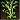 |
| 7 | `40 20 20 20` |  |
| 8 | `60 20 20 20` |  |
| 9 | `80 20 20 20` |  |
| 10 | `0 40 20 20` |  |
| 11 | `20 40 20 20` |  |
| 12 | `40 40 20 20` |  |
| 13 | `60 40 20 20` |  |
| 14 | `80 40 20 20` |  |
| 15 | `0 60 20 20` | 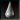 |
| 16 | `20 60 20 20` |  |
| 17 | `40 60 20 20` |  |
| 18 | `60 60 20 20` |  |
| 19 | `80 60 20 20` |  |

---

## TEX31000

**Properties**
- `TextureFile`: `images/Gebaeude_innen/Kneipe_innen.jpg`
- `Count`: `1`
- `UseAlpha`: `false`

**Source image**

- Folder: `exports/TEX31000/`

  - exports/TEX31000/source.png
  - exports/TEX31000/source.tga
  - exports/TEX31000/source.bmp
  - exports/TEX31000/source.jpg
  - exports/TEX31000/source.jpeg
  - exports/TEX31000/source.webp

> Preview: open the folder above to see `source.*` and exported sprites.

**Sprites**

| # | Rect (x,y,w,h) | Image |
|---:|---|---|
| 0 | `0 0 425 510` | 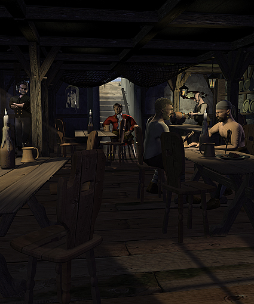 |

---

## TEX31002

**Properties**
- `TextureFile`: `images/AnimationsRahmen.tga`
- `Count`: `8`
- `UseAlpha`: `true`

**Source image**

- Folder: `exports/TEX31002/`

  - exports/TEX31002/source.png
  - exports/TEX31002/source.tga
  - exports/TEX31002/source.bmp
  - exports/TEX31002/source.jpg
  - exports/TEX31002/source.jpeg
  - exports/TEX31002/source.webp

> Preview: open the folder above to see `source.*` and exported sprites.

**Sprites**

| # | Rect (x,y,w,h) | Image |
|---:|---|---|
| 0 | `0 0 12 12` |  |
| 1 | `12 0 14 12` |  |
| 2 | `26 0 14 15` |  |
| 3 | `40 0 12 15` |  |
| 4 | `0 15 25 15` |  |
| 5 | `0 30 25 15` |  |
| 6 | `25 15 14 15` |  |
| 7 | `39 15 14 15` |  |

---

## TEX31003

**Properties**
- `TextureFile`: `images/Gebaeude_innen/innenbild_kontor01.aim`
- `Count`: `1`
- `UseAlpha`: `false`

**Source image**

- Folder: `exports/TEX31003/`

  - exports/TEX31003/source.png
  - exports/TEX31003/source.tga
  - exports/TEX31003/source.bmp
  - exports/TEX31003/source.jpg
  - exports/TEX31003/source.jpeg
  - exports/TEX31003/source.webp

> Preview: open the folder above to see `source.*` and exported sprites.

**Sprites**

| # | Rect (x,y,w,h) | Image |
|---:|---|---|
| 0 | `0 0 425 510` |  |

---

## TEX31004

**Properties**
- `TextureFile`: `images/Gebaeude_innen/innenbild_werft01.jpg`
- `Count`: `1`
- `UseAlpha`: `false`

**Source image**

- Folder: `exports/TEX31004/`

  - exports/TEX31004/source.png
  - exports/TEX31004/source.tga
  - exports/TEX31004/source.bmp
  - exports/TEX31004/source.jpg
  - exports/TEX31004/source.jpeg
  - exports/TEX31004/source.webp

> Preview: open the folder above to see `source.*` and exported sprites.

**Sprites**

| # | Rect (x,y,w,h) | Image |
|---:|---|---|
| 0 | `0 0 425 510` |  |

---

## TEX31005

**Properties**
- `TextureFile`: `images/Gebaeude_innen/innenkirche01.jpg`
- `Count`: `1`
- `UseAlpha`: `false`

**Source image**

- Folder: `exports/TEX31005/`

  - exports/TEX31005/source.png
  - exports/TEX31005/source.tga
  - exports/TEX31005/source.bmp
  - exports/TEX31005/source.jpg
  - exports/TEX31005/source.jpeg
  - exports/TEX31005/source.webp

> Preview: open the folder above to see `source.*` and exported sprites.

**Sprites**

| # | Rect (x,y,w,h) | Image |
|---:|---|---|
| 0 | `0 0 425 510` |  |

---

## TEX31006

**Properties**
- `TextureFile`: `images/Gebaeude_innen/Banner.tga`
- `Count`: `1`
- `UseAlpha`: `true`

**Source image**

- Folder: `exports/TEX31006/`

  - exports/TEX31006/source.png
  - exports/TEX31006/source.tga
  - exports/TEX31006/source.bmp
  - exports/TEX31006/source.jpg
  - exports/TEX31006/source.jpeg
  - exports/TEX31006/source.webp

> Preview: open the folder above to see `source.*` and exported sprites.

**Sprites**

| # | Rect (x,y,w,h) | Image |
|---:|---|---|
| 0 | `0 0 292 50` |  |

---

## TEX31007

**Properties**
- `TextureFile`: `images/Gebaeude_innen/Kneipe/Informant.jpg`
- `Count`: `1`
- `UseAlpha`: `false`

**Source image**

- Folder: `exports/TEX31007/`

  - exports/TEX31007/source.png
  - exports/TEX31007/source.tga
  - exports/TEX31007/source.bmp
  - exports/TEX31007/source.jpg
  - exports/TEX31007/source.jpeg
  - exports/TEX31007/source.webp

> Preview: open the folder above to see `source.*` and exported sprites.

**Sprites**

| # | Rect (x,y,w,h) | Image |
|---:|---|---|
| 0 | `0 0 280 160` |  |

---

## TEX31008

**Properties**
- `TextureFile`: `images/Gebaeude_innen/Kneipe/Kapitaen.jpg`
- `Count`: `1`
- `UseAlpha`: `false`

**Source image**

- Folder: `exports/TEX31008/`

  - exports/TEX31008/source.png
  - exports/TEX31008/source.tga
  - exports/TEX31008/source.bmp
  - exports/TEX31008/source.jpg
  - exports/TEX31008/source.jpeg
  - exports/TEX31008/source.webp

> Preview: open the folder above to see `source.*` and exported sprites.

**Sprites**

| # | Rect (x,y,w,h) | Image |
|---:|---|---|
| 0 | `0 0 280 160` |  |

---

## TEX31009

**Properties**
- `TextureFile`: `images/Gebaeude_innen/Kneipe/Matrose.jpg`
- `Count`: `1`
- `UseAlpha`: `false`

**Source image**

- Folder: `exports/TEX31009/`

  - exports/TEX31009/source.png
  - exports/TEX31009/source.tga
  - exports/TEX31009/source.bmp
  - exports/TEX31009/source.jpg
  - exports/TEX31009/source.jpeg
  - exports/TEX31009/source.webp

> Preview: open the folder above to see `source.*` and exported sprites.

**Sprites**

| # | Rect (x,y,w,h) | Image |
|---:|---|---|
| 0 | `0 0 280 160` |  |

---

## TEX31010

**Properties**
- `TextureFile`: `images/Gebaeude_innen/Kneipe/Pirat.jpg`
- `Count`: `1`
- `UseAlpha`: `false`

**Source image**

- Folder: `exports/TEX31010/`

  - exports/TEX31010/source.png
  - exports/TEX31010/source.tga
  - exports/TEX31010/source.bmp
  - exports/TEX31010/source.jpg
  - exports/TEX31010/source.jpeg
  - exports/TEX31010/source.webp

> Preview: open the folder above to see `source.*` and exported sprites.

**Sprites**

| # | Rect (x,y,w,h) | Image |
|---:|---|---|
| 0 | `0 0 280 160` |  |

---

## TEX31011

**Properties**
- `TextureFile`: `images/Gebaeude_innen/Kneipe/Waffenhaendler.jpg`
- `Count`: `1`
- `UseAlpha`: `false`

**Source image**

- Folder: `exports/TEX31011/`

  - exports/TEX31011/source.png
  - exports/TEX31011/source.tga
  - exports/TEX31011/source.bmp
  - exports/TEX31011/source.jpg
  - exports/TEX31011/source.jpeg
  - exports/TEX31011/source.webp

> Preview: open the folder above to see `source.*` and exported sprites.

**Sprites**

| # | Rect (x,y,w,h) | Image |
|---:|---|---|
| 0 | `0 0 280 160` |  |

---

## TEX31012

**Properties**
- `TextureFile`: `images/Gebaeude_innen/Kneipe/Matrose_Kerze_TP.bmp`
- `Count`: `16`
- `UseAlpha`: `false`

**Source image**

- Folder: `exports/TEX31012/`

  - exports/TEX31012/source.png
  - exports/TEX31012/source.tga
  - exports/TEX31012/source.bmp
  - exports/TEX31012/source.jpg
  - exports/TEX31012/source.jpeg
  - exports/TEX31012/source.webp

> Preview: open the folder above to see `source.*` and exported sprites.

**Sprites**

| # | Rect (x,y,w,h) | Image |
|---:|---|---|
| 0 | `0 0 32 32` |  |
| 1 | `32 0 32 32` |  |
| 2 | `64 0 32 32` |  |
| 3 | `96 0 32 32` |  |
| 4 | `128 0 32 32` |  |
| 5 | `160 0 32 32` |  |
| 6 | `192 0 32 32` |  |
| 7 | `224 0 32 32` |  |
| 8 | `256 0 32 32` |  |
| 9 | `288 0 32 32` |  |
| 10 | `320 0 32 32` |  |
| 11 | `352 0 32 32` |  |
| 12 | `384 0 32 32` |  |
| 13 | `416 0 32 32` |  |
| 14 | `448 0 32 32` |  |
| 15 | `480 0 32 32` |  |

---

## TEX31013

**Properties**
- `TextureFile`: `images/Gebaeude_innen/kleiner_Rahmen_Quer.tga`
- `Count`: `2`
- `UseAlpha`: `true`

**Source image**

- Folder: `exports/TEX31013/`

  - exports/TEX31013/source.png
  - exports/TEX31013/source.tga
  - exports/TEX31013/source.bmp
  - exports/TEX31013/source.jpg
  - exports/TEX31013/source.jpeg
  - exports/TEX31013/source.webp

> Preview: open the folder above to see `source.*` and exported sprites.

**Sprites**

| # | Rect (x,y,w,h) | Image |
|---:|---|---|
| 0 | `0 0 284 8` |  |
| 1 | `0 8 284 12` |  |

---

## TEX31014

**Properties**
- `TextureFile`: `images/Gebaeude_innen/kleiner_Rahmen_Hoch.tga`
- `Count`: `2`
- `UseAlpha`: `true`

**Source image**

- Folder: `exports/TEX31014/`

  - exports/TEX31014/source.png
  - exports/TEX31014/source.tga
  - exports/TEX31014/source.bmp
  - exports/TEX31014/source.jpg
  - exports/TEX31014/source.jpeg
  - exports/TEX31014/source.webp

> Preview: open the folder above to see `source.*` and exported sprites.

**Sprites**

| # | Rect (x,y,w,h) | Image |
|---:|---|---|
| 0 | `0 0 7 144` |  |
| 1 | `7 0 12 144` |  |

---

## TEX31015

**Properties**
- `TextureFile`: `images/Gebaeude_innen/Kneipe/Laterne_linksTP.bmp`
- `Count`: `15`
- `UseAlpha`: `false`

**Source image**

- Folder: `exports/TEX31015/`

  - exports/TEX31015/source.png
  - exports/TEX31015/source.tga
  - exports/TEX31015/source.bmp
  - exports/TEX31015/source.jpg
  - exports/TEX31015/source.jpeg
  - exports/TEX31015/source.webp

> Preview: open the folder above to see `source.*` and exported sprites.

**Sprites**

| # | Rect (x,y,w,h) | Image |
|---:|---|---|
| 0 | `0 0 15 22` |  |
| 1 | `15 0 15 22` |  |
| 2 | `30 0 15 22` |  |
| 3 | `0 22 15 22` |  |
| 4 | `15 22 15 22` |  |
| 5 | `30 22 15 22` |  |
| 6 | `0 44 15 22` |  |
| 7 | `15 44 15 22` |  |
| 8 | `30 44 15 22` |  |
| 9 | `0 66 15 22` |  |
| 10 | `15 66 15 22` |  |
| 11 | `30 66 15 22` |  |
| 12 | `0 88 15 22` |  |
| 13 | `15 88 15 22` |  |
| 14 | `30 88 15 22` |  |

---

## TEX31016

**Properties**
- `TextureFile`: `images/Gebaeude_innen/Kneipe/Laterne_rechtsTP.bmp`
- `Count`: `15`
- `UseAlpha`: `false`

**Source image**

- Folder: `exports/TEX31016/`

  - exports/TEX31016/source.png
  - exports/TEX31016/source.tga
  - exports/TEX31016/source.bmp
  - exports/TEX31016/source.jpg
  - exports/TEX31016/source.jpeg
  - exports/TEX31016/source.webp

> Preview: open the folder above to see `source.*` and exported sprites.

**Sprites**

| # | Rect (x,y,w,h) | Image |
|---:|---|---|
| 0 | `0 0 17 21` |  |
| 1 | `17 0 17 21` |  |
| 2 | `34 0 17 21` |  |
| 3 | `51 0 17 21` |  |
| 4 | `68 0 17 21` |  |
| 5 | `0 21 17 21` |  |
| 6 | `17 21 17 21` |  |
| 7 | `34 21 17 21` |  |
| 8 | `51 21 17 21` |  |
| 9 | `68 21 17 21` |  |
| 10 | `0 42 17 21` |  |
| 11 | `17 42 17 21` |  |
| 12 | `34 42 17 21` |  |
| 13 | `51 42 17 21` |  |
| 14 | `68 42 17 21` |  |

---

## TEX31017

**Properties**
- `TextureFile`: `images/Gebaeude_innen/Kneipe/KerzeTP.bmp`
- `Count`: `4`
- `UseAlpha`: `false`

**Source image**

- Folder: `exports/TEX31017/`

  - exports/TEX31017/source.png
  - exports/TEX31017/source.tga
  - exports/TEX31017/source.bmp
  - exports/TEX31017/source.jpg
  - exports/TEX31017/source.jpeg
  - exports/TEX31017/source.webp

> Preview: open the folder above to see `source.*` and exported sprites.

**Sprites**

| # | Rect (x,y,w,h) | Image |
|---:|---|---|
| 0 | `0 0 13 16` |  |
| 1 | `13 0 13 16` |  |
| 2 | `26 0 13 16` |  |
| 3 | `39 0 13 16` |  |

---

## TEX31018

**Properties**
- `TextureFile`: `images/Gebaeude_innen/Kneipe/Informant_DrehungTP.bmp`
- `Count`: `15`
- `UseAlpha`: `false`

**Source image**

- Folder: `exports/TEX31018/`

  - exports/TEX31018/source.png
  - exports/TEX31018/source.tga
  - exports/TEX31018/source.bmp
  - exports/TEX31018/source.jpg
  - exports/TEX31018/source.jpeg
  - exports/TEX31018/source.webp

> Preview: open the folder above to see `source.*` and exported sprites.

**Sprites**

| # | Rect (x,y,w,h) | Image |
|---:|---|---|
| 0 | `0 0 40 50` |  |
| 1 | `40 0 40 50` |  |
| 2 | `80 0 40 50` |  |
| 3 | `0 50 40 50` |  |
| 4 | `40 50 40 50` |  |
| 5 | `80 50 40 50` |  |
| 6 | `0 100 40 50` |  |
| 7 | `40 100 40 50` |  |
| 8 | `80 100 40 50` |  |
| 9 | `0 150 40 50` |  |
| 10 | `40 150 40 50` |  |
| 11 | `80 150 40 50` |  |
| 12 | `0 200 40 50` |  |
| 13 | `40 200 40 50` |  |
| 14 | `80 200 40 50` |  |

---

## TEX31019

**Properties**
- `TextureFile`: `images/Gebaeude_innen/Kneipe/Informant_DrehungTP.bmp`
- `Count`: `15`
- `UseAlpha`: `false`

**Source image**

- Folder: `exports/TEX31019/`

  - exports/TEX31019/source.png
  - exports/TEX31019/source.tga
  - exports/TEX31019/source.bmp
  - exports/TEX31019/source.jpg
  - exports/TEX31019/source.jpeg
  - exports/TEX31019/source.webp

> Preview: open the folder above to see `source.*` and exported sprites.

**Sprites**

| # | Rect (x,y,w,h) | Image |
|---:|---|---|
| 0 | `80 200 40 50` |  |
| 1 | `40 200 40 50` |  |
| 2 | `0 200 40 50` |  |
| 3 | `80 150 40 50` |  |
| 4 | `40 150 40 50` |  |
| 5 | `0 150 40 50` |  |
| 6 | `80 100 40 50` |  |
| 7 | `40 100 40 50` |  |
| 8 | `0 100 40 50` |  |
| 9 | `80 50 40 50` |  |
| 10 | `40 50 40 50` |  |
| 11 | `0 50 40 50` |  |
| 12 | `80 0 40 50` |  |
| 13 | `40 0 40 50` |  |
| 14 | `0 0 40 50` |  |

---

## TEX31020

**Properties**
- `TextureFile`: `images/Gebaeude_innen/Kneipe/Informant_DrehungTP.bmp`
- `Count`: `1`
- `UseAlpha`: `false`

**Source image**

- Folder: `exports/TEX31020/`

  - exports/TEX31020/source.png
  - exports/TEX31020/source.tga
  - exports/TEX31020/source.bmp
  - exports/TEX31020/source.jpg
  - exports/TEX31020/source.jpeg
  - exports/TEX31020/source.webp

> Preview: open the folder above to see `source.*` and exported sprites.

**Sprites**

| # | Rect (x,y,w,h) | Image |
|---:|---|---|
| 0 | `80 200 40 50` |  |

---

## TEX31021

**Properties**
- `TextureFile`: `images/Gebaeude_innen/Kneipe/MatroseTP.bmp`
- `Count`: `20`
- `UseAlpha`: `false`

**Source image**

- Folder: `exports/TEX31021/`

  - exports/TEX31021/source.png
  - exports/TEX31021/source.tga
  - exports/TEX31021/source.bmp
  - exports/TEX31021/source.jpg
  - exports/TEX31021/source.jpeg
  - exports/TEX31021/source.webp

> Preview: open the folder above to see `source.*` and exported sprites.

**Sprites**

| # | Rect (x,y,w,h) | Image |
|---:|---|---|
| 0 | `0 0 59 92` |  |
| 1 | `59 0 59 92` |  |
| 2 | `118 0 59 92` |  |
| 3 | `177 0 59 92` |  |
| 4 | `0 92 59 92` |  |
| 5 | `59 92 59 92` |  |
| 6 | `118 92 59 92` |  |
| 7 | `177 92 59 92` |  |
| 8 | `0 184 59 92` |  |
| 9 | `59 184 59 92` |  |
| 10 | `118 184 59 92` |  |
| 11 | `177 184 59 92` |  |
| 12 | `0 276 59 92` |  |
| 13 | `59 276 59 92` |  |
| 14 | `118 276 59 92` |  |
| 15 | `177 276 59 92` |  |
| 16 | `0 368 59 92` |  |
| 17 | `59 368 59 92` |  |
| 18 | `118 368 59 92` |  |
| 19 | `177 368 59 92` |  |

---

## TEX31022

**Properties**
- `TextureFile`: `images/Gebaeude_innen/Kneipe/Matrose_HandTP.bmp`
- `Count`: `20`
- `UseAlpha`: `false`

**Source image**

- Folder: `exports/TEX31022/`

  - exports/TEX31022/source.png
  - exports/TEX31022/source.tga
  - exports/TEX31022/source.bmp
  - exports/TEX31022/source.jpg
  - exports/TEX31022/source.jpeg
  - exports/TEX31022/source.webp

> Preview: open the folder above to see `source.*` and exported sprites.

**Sprites**

| # | Rect (x,y,w,h) | Image |
|---:|---|---|
| 0 | `0 0 41 40` |  |
| 1 | `41 0 41 40` |  |
| 2 | `82 0 41 40` |  |
| 3 | `123 0 41 40` |  |
| 4 | `164 0 41 40` |  |
| 5 | `205 0 41 40` |  |
| 6 | `246 0 41 40` |  |
| 7 | `287 0 41 40` |  |
| 8 | `328 0 41 40` |  |
| 9 | `369 0 41 40` |  |
| 10 | `410 0 41 40` |  |
| 11 | `451 0 41 40` |  |
| 12 | `492 0 41 40` |  |
| 13 | `533 0 41 40` |  |
| 14 | `574 0 41 40` |  |
| 15 | `615 0 41 40` |  |
| 16 | `656 0 41 40` |  |
| 17 | `697 0 41 40` |  |
| 18 | `738 0 41 40` |  |
| 19 | `779 0 41 40` |  |

---

## TEX31023

**Properties**
- `TextureFile`: `images/Gebaeude_innen/Kneipe/PiratTP.bmp`
- `Count`: `20`
- `UseAlpha`: `false`

**Source image**

- Folder: `exports/TEX31023/`

  - exports/TEX31023/source.png
  - exports/TEX31023/source.tga
  - exports/TEX31023/source.bmp
  - exports/TEX31023/source.jpg
  - exports/TEX31023/source.jpeg
  - exports/TEX31023/source.webp

> Preview: open the folder above to see `source.*` and exported sprites.

**Sprites**

| # | Rect (x,y,w,h) | Image |
|---:|---|---|
| 0 | `0 0 43 57` |  |
| 1 | `43 0 43 57` |  |
| 2 | `86 0 43 57` |  |
| 3 | `129 0 43 57` |  |
| 4 | `172 0 43 57` |  |
| 5 | `215 0 43 57` |  |
| 6 | `258 0 43 57` |  |
| 7 | `301 0 43 57` |  |
| 8 | `344 0 43 57` |  |
| 9 | `387 0 43 57` |  |
| 10 | `430 0 43 57` |  |
| 11 | `473 0 43 57` |  |
| 12 | `516 0 43 57` |  |
| 13 | `559 0 43 57` |  |
| 14 | `602 0 43 57` |  |
| 15 | `645 0 43 57` |  |
| 16 | `688 0 43 57` |  |
| 17 | `731 0 43 57` |  |
| 18 | `774 0 43 57` |  |
| 19 | `817 0 43 57` |  |

---

## TEX31024

**Properties**
- `TextureFile`: `images/Gebaeude_innen/Kneipe/Kapitaen_HandTP.aim`
- `Count`: `22`
- `UseAlpha`: `false`

**Source image**

- Folder: `exports/TEX31024/`

  - exports/TEX31024/source.png
  - exports/TEX31024/source.tga
  - exports/TEX31024/source.bmp
  - exports/TEX31024/source.jpg
  - exports/TEX31024/source.jpeg
  - exports/TEX31024/source.webp

> Preview: open the folder above to see `source.*` and exported sprites.

**Sprites**

| # | Rect (x,y,w,h) | Image |
|---:|---|---|
| 0 | `0 0 64 64` |  |
| 1 | `64 0 64 64` |  |
| 2 | `128 0 64 64` |  |
| 3 | `192 0 64 64` |  |
| 4 | `256 0 64 64` |  |
| 5 | `320 0 64 64` |  |
| 6 | `0 64 64 64` |  |
| 7 | `64 64 64 64` |  |
| 8 | `128 64 64 64` |  |
| 9 | `192 64 64 64` |  |
| 10 | `256 64 64 64` |  |
| 11 | `320 64 64 64` |  |
| 12 | `0 128 64 64` |  |
| 13 | `64 128 64 64` |  |
| 14 | `128 128 64 64` |  |
| 15 | `192 128 64 64` |  |
| 16 | `256 128 64 64` |  |
| 17 | `320 128 64 64` |  |
| 18 | `0 192 64 64` |  |
| 19 | `64 192 64 64` |  |
| 20 | `128 192 64 64` |  |
| 21 | `192 192 64 64` |  |

---

## TEX31025

**Properties**
- `TextureFile`: `images/Gebaeude_innen/Kneipe/Barkeeper_putztTP.bmp`
- `Count`: `12`
- `UseAlpha`: `false`

**Source image**

- Folder: `exports/TEX31025/`

  - exports/TEX31025/source.png
  - exports/TEX31025/source.tga
  - exports/TEX31025/source.bmp
  - exports/TEX31025/source.jpg
  - exports/TEX31025/source.jpeg
  - exports/TEX31025/source.webp

> Preview: open the folder above to see `source.*` and exported sprites.

**Sprites**

| # | Rect (x,y,w,h) | Image |
|---:|---|---|
| 0 | `0 0 45 50` |  |
| 1 | `45 0 45 50` |  |
| 2 | `90 0 45 50` |  |
| 3 | `135 0 45 50` |  |
| 4 | `180 0 45 50` |  |
| 5 | `225 0 45 50` |  |
| 6 | `270 0 45 50` |  |
| 7 | `315 0 45 50` |  |
| 8 | `360 0 45 50` |  |
| 9 | `405 0 45 50` |  |
| 10 | `450 0 45 50` |  |
| 11 | `495 0 45 50` |  |

---

## TEX31026

**Properties**
- `TextureFile`: `images/Gebaeude_innen/Kneipe/Barkeeper_schautTP.bmp`
- `Count`: `25`
- `UseAlpha`: `false`

**Source image**

- Folder: `exports/TEX31026/`

  - exports/TEX31026/source.png
  - exports/TEX31026/source.tga
  - exports/TEX31026/source.bmp
  - exports/TEX31026/source.jpg
  - exports/TEX31026/source.jpeg
  - exports/TEX31026/source.webp

> Preview: open the folder above to see `source.*` and exported sprites.

**Sprites**

| # | Rect (x,y,w,h) | Image |
|---:|---|---|
| 0 | `0 0 45 50` |  |
| 1 | `45 0 45 50` |  |
| 2 | `90 0 45 50` |  |
| 3 | `135 0 45 50` |  |
| 4 | `180 0 45 50` |  |
| 5 | `0 50 45 50` |  |
| 6 | `45 50 45 50` |  |
| 7 | `90 50 45 50` |  |
| 8 | `135 50 45 50` |  |
| 9 | `180 50 45 50` |  |
| 10 | `0 100 45 50` |  |
| 11 | `45 100 45 50` |  |
| 12 | `90 100 45 50` |  |
| 13 | `135 100 45 50` |  |
| 14 | `180 100 45 50` |  |
| 15 | `0 150 45 50` |  |
| 16 | `45 150 45 50` |  |
| 17 | `90 150 45 50` |  |
| 18 | `135 150 45 50` |  |
| 19 | `180 150 45 50` |  |
| 20 | `0 200 45 50` |  |
| 21 | `45 200 45 50` |  |
| 22 | `90 200 45 50` |  |
| 23 | `135 200 45 50` |  |
| 24 | `180 200 45 50` |  |

---

## TEX31027

**Properties**
- `TextureFile`: `images/Gebaeude_innen/Kneipe/Kapitaen_trinktTP.aim`
- `Count`: `34`
- `UseAlpha`: `false`

**Source image**

- Folder: `exports/TEX31027/`

  - exports/TEX31027/source.png
  - exports/TEX31027/source.tga
  - exports/TEX31027/source.bmp
  - exports/TEX31027/source.jpg
  - exports/TEX31027/source.jpeg
  - exports/TEX31027/source.webp

> Preview: open the folder above to see `source.*` and exported sprites.

**Sprites**

| # | Rect (x,y,w,h) | Image |
|---:|---|---|
| 0 | `0 0 64 64` |  |
| 1 | `64 0 64 64` |  |
| 2 | `128 0 64 64` |  |
| 3 | `192 0 64 64` |  |
| 4 | `256 0 64 64` |  |
| 5 | `320 0 64 64` |  |
| 6 | `384 0 64 64` |  |
| 7 | `0 64 64 64` |  |
| 8 | `64 64 64 64` |  |
| 9 | `128 64 64 64` |  |
| 10 | `192 64 64 64` |  |
| 11 | `256 64 64 64` |  |
| 12 | `320 64 64 64` |  |
| 13 | `384 64 64 64` |  |
| 14 | `0 128 64 64` |  |
| 15 | `64 128 64 64` |  |
| 16 | `128 128 64 64` |  |
| 17 | `192 128 64 64` |  |
| 18 | `256 128 64 64` |  |
| 19 | `320 128 64 64` |  |
| 20 | `384 128 64 64` |  |
| 21 | `0 192 64 64` |  |
| 22 | `64 192 64 64` |  |
| 23 | `128 192 64 64` |  |
| 24 | `192 192 64 64` |  |
| 25 | `256 192 64 64` |  |
| 26 | `320 192 64 64` |  |
| 27 | `384 192 64 64` |  |
| 28 | `0 256 64 64` |  |
| 29 | `64 256 64 64` |  |
| 30 | `128 256 64 64` |  |
| 31 | `192 256 64 64` |  |
| 32 | `256 256 64 64` |  |
| 33 | `320 256 64 64` |  |

---

## TEX31028

**Properties**
- `TextureFile`: `images/Gebaeude_innen/Kneipe/Informant_HandTP.bmp`
- `Count`: `12`
- `UseAlpha`: `false`

**Source image**

- Folder: `exports/TEX31028/`

  - exports/TEX31028/source.png
  - exports/TEX31028/source.tga
  - exports/TEX31028/source.bmp
  - exports/TEX31028/source.jpg
  - exports/TEX31028/source.jpeg
  - exports/TEX31028/source.webp

> Preview: open the folder above to see `source.*` and exported sprites.

**Sprites**

| # | Rect (x,y,w,h) | Image |
|---:|---|---|
| 0 | `0 0 40 50` |  |
| 1 | `40 0 40 50` |  |
| 2 | `80 0 40 50` |  |
| 3 | `120 0 40 50` |  |
| 4 | `160 0 40 50` |  |
| 5 | `200 0 40 50` |  |
| 6 | `240 0 40 50` |  |
| 7 | `280 0 40 50` |  |
| 8 | `320 0 40 50` |  |
| 9 | `360 0 40 50` |  |
| 10 | `400 0 40 50` |  |
| 11 | `440 0 40 50` |  |

---

## TEX31029

**Properties**
- `TextureFile`: `images/Gebaeude_innen/darlehensgeber01.jpg`
- `Count`: `1`
- `UseAlpha`: `false`

**Source image**

- Folder: `exports/TEX31029/`

  - exports/TEX31029/source.png
  - exports/TEX31029/source.tga
  - exports/TEX31029/source.bmp
  - exports/TEX31029/source.jpg
  - exports/TEX31029/source.jpeg
  - exports/TEX31029/source.webp

> Preview: open the folder above to see `source.*` and exported sprites.

**Sprites**

| # | Rect (x,y,w,h) | Image |
|---:|---|---|
| 0 | `0 0 425 510` |  |

---

## TEX31030

**Properties**
- `TextureFile`: `images/Gebaeude_innen/markthalle.jpg`
- `Count`: `1`
- `UseAlpha`: `false`

**Source image**

- Folder: `exports/TEX31030/`

  - exports/TEX31030/source.png
  - exports/TEX31030/source.tga
  - exports/TEX31030/source.bmp
  - exports/TEX31030/source.jpg
  - exports/TEX31030/source.jpeg
  - exports/TEX31030/source.webp

> Preview: open the folder above to see `source.*` and exported sprites.

**Sprites**

| # | Rect (x,y,w,h) | Image |
|---:|---|---|
| 0 | `0 0 425 510` | 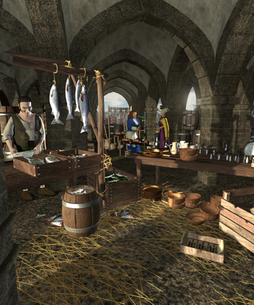 |

---

## TEX31033

**Properties**
- `TextureFile`: `images/Gebaeude_innen/gildenhaus.jpg`
- `Count`: `1`
- `UseAlpha`: `false`

**Source image**

- Folder: `exports/TEX31033/`

  - exports/TEX31033/source.png
  - exports/TEX31033/source.tga
  - exports/TEX31033/source.bmp
  - exports/TEX31033/source.jpg
  - exports/TEX31033/source.jpeg
  - exports/TEX31033/source.webp

> Preview: open the folder above to see `source.*` and exported sprites.

**Sprites**

| # | Rect (x,y,w,h) | Image |
|---:|---|---|
| 0 | `0 0 425 510` |  |

---

## TEX31034

**Properties**
- `TextureFile`: `images/Gebaeude_innen/rathaus.jpg`
- `Count`: `1`
- `UseAlpha`: `false`

**Source image**

- Folder: `exports/TEX31034/`

  - exports/TEX31034/source.png
  - exports/TEX31034/source.tga
  - exports/TEX31034/source.bmp
  - exports/TEX31034/source.jpg
  - exports/TEX31034/source.jpeg
  - exports/TEX31034/source.webp

> Preview: open the folder above to see `source.*` and exported sprites.

**Sprites**

| # | Rect (x,y,w,h) | Image |
|---:|---|---|
| 0 | `0 0 425 510` | 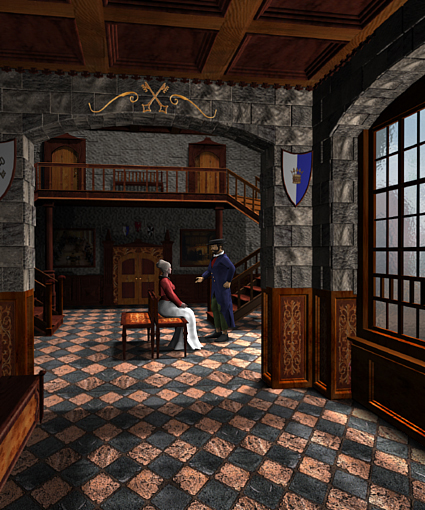 |

---

## TEX31035

**Properties**
- `TextureFile`: `images/Gebaeude_innen/badhaus.jpg`
- `Count`: `1`
- `UseAlpha`: `false`

**Source image**

- Folder: `exports/TEX31035/`

  - exports/TEX31035/source.png
  - exports/TEX31035/source.tga
  - exports/TEX31035/source.bmp
  - exports/TEX31035/source.jpg
  - exports/TEX31035/source.jpeg
  - exports/TEX31035/source.webp

> Preview: open the folder above to see `source.*` and exported sprites.

**Sprites**

| # | Rect (x,y,w,h) | Image |
|---:|---|---|
| 0 | `0 0 425 510` | 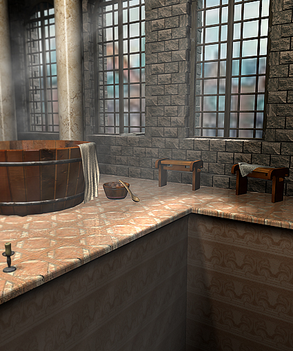 |

---

## TEX31036

**Properties**
- `TextureFile`: `images/Gebaeude_innen/schmied.jpg`
- `Count`: `1`
- `UseAlpha`: `false`

**Source image**

- Folder: `exports/TEX31036/`

  - exports/TEX31036/source.png
  - exports/TEX31036/source.tga
  - exports/TEX31036/source.bmp
  - exports/TEX31036/source.jpg
  - exports/TEX31036/source.jpeg
  - exports/TEX31036/source.webp

> Preview: open the folder above to see `source.*` and exported sprites.

**Sprites**

| # | Rect (x,y,w,h) | Image |
|---:|---|---|
| 0 | `0 0 425 510` |  |

---

## TEX31037

**Properties**
- `TextureFile`: `images/Gebaeude_innen/Waffen.tga`
- `Count`: `11`
- `UseAlpha`: `true`

**Source image**

- Folder: `exports/TEX31037/`

  - exports/TEX31037/source.png
  - exports/TEX31037/source.tga
  - exports/TEX31037/source.bmp
  - exports/TEX31037/source.jpg
  - exports/TEX31037/source.jpeg
  - exports/TEX31037/source.webp

> Preview: open the folder above to see `source.*` and exported sprites.

**Sprites**

| # | Rect (x,y,w,h) | Image |
|---:|---|---|
| 0 | `0 0 80 50` |  |
| 1 | `0 50 80 50` |  |
| 2 | `0 100 80 50` |  |
| 3 | `0 150 80 50` |  |
| 4 | `0 200 80 50` |  |
| 5 | `0 250 80 50` |  |
| 6 | `0 300 80 50` |  |
| 7 | `0 350 80 50` |  |
| 8 | `0 400 80 50` |  |
| 9 | `0 450 80 50` |  |
| 10 | `0 500 80 50` |  |

---

## TEX31038

**Properties**
- `TextureFile`: `images/Video_Schlussbild/Haendler.bmp`
- `Count`: `1`
- `UseAlpha`: `false`

**Source image**

- Folder: `exports/TEX31038/`

  - exports/TEX31038/source.png
  - exports/TEX31038/source.tga
  - exports/TEX31038/source.bmp
  - exports/TEX31038/source.jpg
  - exports/TEX31038/source.jpeg
  - exports/TEX31038/source.webp

> Preview: open the folder above to see `source.*` and exported sprites.

**Sprites**

| # | Rect (x,y,w,h) | Image |
|---:|---|---|
| 0 | `0 0 400 300` |  |

---

## TEX31039

**Properties**
- `TextureFile`: `images/Video_Schlussbild/Kaufmann.bmp`
- `Count`: `1`
- `UseAlpha`: `false`

**Source image**

- Folder: `exports/TEX31039/`

  - exports/TEX31039/source.png
  - exports/TEX31039/source.tga
  - exports/TEX31039/source.bmp
  - exports/TEX31039/source.jpg
  - exports/TEX31039/source.jpeg
  - exports/TEX31039/source.webp

> Preview: open the folder above to see `source.*` and exported sprites.

**Sprites**

| # | Rect (x,y,w,h) | Image |
|---:|---|---|
| 0 | `0 0 400 300` |  |

---

## TEX31040

**Properties**
- `TextureFile`: `images/Video_Schlussbild/Fernkaufmann.bmp`
- `Count`: `1`
- `UseAlpha`: `false`

**Source image**

- Folder: `exports/TEX31040/`

  - exports/TEX31040/source.png
  - exports/TEX31040/source.tga
  - exports/TEX31040/source.bmp
  - exports/TEX31040/source.jpg
  - exports/TEX31040/source.jpeg
  - exports/TEX31040/source.webp

> Preview: open the folder above to see `source.*` and exported sprites.

**Sprites**

| # | Rect (x,y,w,h) | Image |
|---:|---|---|
| 0 | `0 0 400 300` |  |

---

## TEX31041

**Properties**
- `TextureFile`: `images/Video_Schlussbild/Patrizier.bmp`
- `Count`: `1`
- `UseAlpha`: `false`

**Source image**

- Folder: `exports/TEX31041/`

  - exports/TEX31041/source.png
  - exports/TEX31041/source.tga
  - exports/TEX31041/source.bmp
  - exports/TEX31041/source.jpg
  - exports/TEX31041/source.jpeg
  - exports/TEX31041/source.webp

> Preview: open the folder above to see `source.*` and exported sprites.

**Sprites**

| # | Rect (x,y,w,h) | Image |
|---:|---|---|
| 0 | `0 0 400 300` |  |

---

## TEX31042

**Properties**
- `TextureFile`: `images/Video_Schlussbild/Ratsmitglied.bmp`
- `Count`: `1`
- `UseAlpha`: `false`

**Source image**

- Folder: `exports/TEX31042/`

  - exports/TEX31042/source.png
  - exports/TEX31042/source.tga
  - exports/TEX31042/source.bmp
  - exports/TEX31042/source.jpg
  - exports/TEX31042/source.jpeg
  - exports/TEX31042/source.webp

> Preview: open the folder above to see `source.*` and exported sprites.

**Sprites**

| # | Rect (x,y,w,h) | Image |
|---:|---|---|
| 0 | `0 0 400 300` |  |

---

## TEX31043

**Properties**
- `TextureFile`: `images/Video_Schlussbild/Buergermeister.bmp`
- `Count`: `1`
- `UseAlpha`: `false`

**Source image**

- Folder: `exports/TEX31043/`

  - exports/TEX31043/source.png
  - exports/TEX31043/source.tga
  - exports/TEX31043/source.bmp
  - exports/TEX31043/source.jpg
  - exports/TEX31043/source.jpeg
  - exports/TEX31043/source.webp

> Preview: open the folder above to see `source.*` and exported sprites.

**Sprites**

| # | Rect (x,y,w,h) | Image |
|---:|---|---|
| 0 | `0 0 400 300` |  |

---

## TEX31044

**Properties**
- `TextureFile`: `images/Video_Schlussbild/eldermann.bmp`
- `Count`: `1`
- `UseAlpha`: `false`

**Source image**

- Folder: `exports/TEX31044/`

  - exports/TEX31044/source.png
  - exports/TEX31044/source.tga
  - exports/TEX31044/source.bmp
  - exports/TEX31044/source.jpg
  - exports/TEX31044/source.jpeg
  - exports/TEX31044/source.webp

> Preview: open the folder above to see `source.*` and exported sprites.

**Sprites**

| # | Rect (x,y,w,h) | Image |
|---:|---|---|
| 0 | `0 0 400 300` | 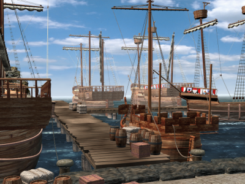 |

---

## TEX31045

**Properties**
- `TextureFile`: `images/Video_Schlussbild/Ueberraschung.bmp`
- `Count`: `1`
- `UseAlpha`: `false`

**Source image**

- Folder: `exports/TEX31045/`

  - exports/TEX31045/source.png
  - exports/TEX31045/source.tga
  - exports/TEX31045/source.bmp
  - exports/TEX31045/source.jpg
  - exports/TEX31045/source.jpeg
  - exports/TEX31045/source.webp

> Preview: open the folder above to see `source.*` and exported sprites.

**Sprites**

| # | Rect (x,y,w,h) | Image |
|---:|---|---|
| 0 | `0 0 400 300` |  |

---

## TEX31046

**Properties**
- `TextureFile`: `images/Video_Schlussbild/Warenumschlagsplatz.bmp`
- `Count`: `1`
- `UseAlpha`: `false`

**Source image**

- Folder: `exports/TEX31046/`

  - exports/TEX31046/source.png
  - exports/TEX31046/source.tga
  - exports/TEX31046/source.bmp
  - exports/TEX31046/source.jpg
  - exports/TEX31046/source.jpeg
  - exports/TEX31046/source.webp

> Preview: open the folder above to see `source.*` and exported sprites.

**Sprites**

| # | Rect (x,y,w,h) | Image |
|---:|---|---|
| 0 | `0 0 400 300` |  |

---

## TEX31047

**Properties**
- `TextureFile`: `images/Video_Schlussbild/Fest.bmp`
- `Count`: `1`
- `UseAlpha`: `false`

**Source image**

- Folder: `exports/TEX31047/`

  - exports/TEX31047/source.png
  - exports/TEX31047/source.tga
  - exports/TEX31047/source.bmp
  - exports/TEX31047/source.jpg
  - exports/TEX31047/source.jpeg
  - exports/TEX31047/source.webp

> Preview: open the folder above to see `source.*` and exported sprites.

**Sprites**

| # | Rect (x,y,w,h) | Image |
|---:|---|---|
| 0 | `0 0 400 300` |  |

---

## TEX31048

**Properties**
- `TextureFile`: `images/Video_Schlussbild/Schnigge.bmp`
- `Count`: `1`
- `UseAlpha`: `false`

**Source image**

- Folder: `exports/TEX31048/`

  - exports/TEX31048/source.png
  - exports/TEX31048/source.tga
  - exports/TEX31048/source.bmp
  - exports/TEX31048/source.jpg
  - exports/TEX31048/source.jpeg
  - exports/TEX31048/source.webp

> Preview: open the folder above to see `source.*` and exported sprites.

**Sprites**

| # | Rect (x,y,w,h) | Image |
|---:|---|---|
| 0 | `0 0 400 300` |  |

---

## TEX31049

**Properties**
- `TextureFile`: `images/Video_Schlussbild/Kraier.bmp`
- `Count`: `1`
- `UseAlpha`: `false`

**Source image**

- Folder: `exports/TEX31049/`

  - exports/TEX31049/source.png
  - exports/TEX31049/source.tga
  - exports/TEX31049/source.bmp
  - exports/TEX31049/source.jpg
  - exports/TEX31049/source.jpeg
  - exports/TEX31049/source.webp

> Preview: open the folder above to see `source.*` and exported sprites.

**Sprites**

| # | Rect (x,y,w,h) | Image |
|---:|---|---|
| 0 | `0 0 400 300` |  |

---

## TEX31050

**Properties**
- `TextureFile`: `images/Video_Schlussbild/Kogge.bmp`
- `Count`: `1`
- `UseAlpha`: `false`

**Source image**

- Folder: `exports/TEX31050/`

  - exports/TEX31050/source.png
  - exports/TEX31050/source.tga
  - exports/TEX31050/source.bmp
  - exports/TEX31050/source.jpg
  - exports/TEX31050/source.jpeg
  - exports/TEX31050/source.webp

> Preview: open the folder above to see `source.*` and exported sprites.

**Sprites**

| # | Rect (x,y,w,h) | Image |
|---:|---|---|
| 0 | `0 0 400 300` |  |

---

## TEX31051

**Properties**
- `TextureFile`: `images/Video_Schlussbild/Holk.bmp`
- `Count`: `1`
- `UseAlpha`: `false`

**Source image**

- Folder: `exports/TEX31051/`

  - exports/TEX31051/source.png
  - exports/TEX31051/source.tga
  - exports/TEX31051/source.bmp
  - exports/TEX31051/source.jpg
  - exports/TEX31051/source.jpeg
  - exports/TEX31051/source.webp

> Preview: open the folder above to see `source.*` and exported sprites.

**Sprites**

| # | Rect (x,y,w,h) | Image |
|---:|---|---|
| 0 | `0 0 400 300` |  |

---

## TEX31052

**Properties**
- `TextureFile`: `images/Video_Schlussbild/Hochzeit.bmp`
- `Count`: `1`
- `UseAlpha`: `false`

**Source image**

- Folder: `exports/TEX31052/`

  - exports/TEX31052/source.png
  - exports/TEX31052/source.tga
  - exports/TEX31052/source.bmp
  - exports/TEX31052/source.jpg
  - exports/TEX31052/source.jpeg
  - exports/TEX31052/source.webp

> Preview: open the folder above to see `source.*` and exported sprites.

**Sprites**

| # | Rect (x,y,w,h) | Image |
|---:|---|---|
| 0 | `0 0 400 300` |  |

---

## TEX31053

**Properties**
- `TextureFile`: `images/Video_Schlussbild/Spiel_gewonnen.bmp`
- `Count`: `1`
- `UseAlpha`: `false`

**Source image**

- Folder: `exports/TEX31053/`

  - exports/TEX31053/source.png
  - exports/TEX31053/source.tga
  - exports/TEX31053/source.bmp
  - exports/TEX31053/source.jpg
  - exports/TEX31053/source.jpeg
  - exports/TEX31053/source.webp

> Preview: open the folder above to see `source.*` and exported sprites.

**Sprites**

| # | Rect (x,y,w,h) | Image |
|---:|---|---|
| 0 | `0 0 400 300` | 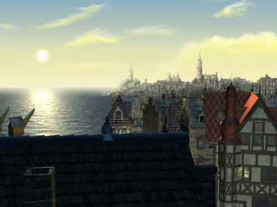 |

---

## TEX31054

**Properties**
- `TextureFile`: `images/Video_Schlussbild/Spiel_verloren.bmp`
- `Count`: `1`
- `UseAlpha`: `false`

**Source image**

- Folder: `exports/TEX31054/`

  - exports/TEX31054/source.png
  - exports/TEX31054/source.tga
  - exports/TEX31054/source.bmp
  - exports/TEX31054/source.jpg
  - exports/TEX31054/source.jpeg
  - exports/TEX31054/source.webp

> Preview: open the folder above to see `source.*` and exported sprites.

**Sprites**

| # | Rect (x,y,w,h) | Image |
|---:|---|---|
| 0 | `0 0 400 300` |  |

---

## TEX31055

**Properties**
- `TextureFile`: `images/Video_Schlussbild/hungersnot.bmp`
- `Count`: `1`
- `UseAlpha`: `false`

**Source image**

- Folder: `exports/TEX31055/`

  - exports/TEX31055/source.png
  - exports/TEX31055/source.tga
  - exports/TEX31055/source.bmp
  - exports/TEX31055/source.jpg
  - exports/TEX31055/source.jpeg
  - exports/TEX31055/source.webp

> Preview: open the folder above to see `source.*` and exported sprites.

**Sprites**

| # | Rect (x,y,w,h) | Image |
|---:|---|---|
| 0 | `0 0 400 300` |  |

---

## TEX31056

**Properties**
- `TextureFile`: `images/Video_Schlussbild/Pest.bmp`
- `Count`: `1`
- `UseAlpha`: `false`

**Source image**

- Folder: `exports/TEX31056/`

  - exports/TEX31056/source.png
  - exports/TEX31056/source.tga
  - exports/TEX31056/source.bmp
  - exports/TEX31056/source.jpg
  - exports/TEX31056/source.jpeg
  - exports/TEX31056/source.webp

> Preview: open the folder above to see `source.*` and exported sprites.

**Sprites**

| # | Rect (x,y,w,h) | Image |
|---:|---|---|
| 0 | `0 0 400 300` | 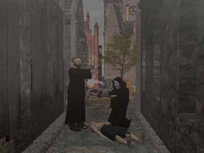 |

---

## TEX31057

**Properties**
- `TextureFile`: `images/Video_Schlussbild/Feuer.bmp`
- `Count`: `1`
- `UseAlpha`: `false`

**Source image**

- Folder: `exports/TEX31057/`

  - exports/TEX31057/source.png
  - exports/TEX31057/source.tga
  - exports/TEX31057/source.bmp
  - exports/TEX31057/source.jpg
  - exports/TEX31057/source.jpeg
  - exports/TEX31057/source.webp

> Preview: open the folder above to see `source.*` and exported sprites.

**Sprites**

| # | Rect (x,y,w,h) | Image |
|---:|---|---|
| 0 | `0 0 400 300` |  |

---

## TEX31058

**Properties**
- `TextureFile`: `images/Video_Schlussbild/Piraten.bmp`
- `Count`: `1`
- `UseAlpha`: `false`

**Source image**

- Folder: `exports/TEX31058/`

  - exports/TEX31058/source.png
  - exports/TEX31058/source.tga
  - exports/TEX31058/source.bmp
  - exports/TEX31058/source.jpg
  - exports/TEX31058/source.jpeg
  - exports/TEX31058/source.webp

> Preview: open the folder above to see `source.*` and exported sprites.

**Sprites**

| # | Rect (x,y,w,h) | Image |
|---:|---|---|
| 0 | `0 0 400 300` |  |

---

## TEX31059

**Properties**
- `TextureFile`: `images/Video_Schlussbild/Belagerung.bmp`
- `Count`: `1`
- `UseAlpha`: `false`

**Source image**

- Folder: `exports/TEX31059/`

  - exports/TEX31059/source.png
  - exports/TEX31059/source.tga
  - exports/TEX31059/source.bmp
  - exports/TEX31059/source.jpg
  - exports/TEX31059/source.jpeg
  - exports/TEX31059/source.webp

> Preview: open the folder above to see `source.*` and exported sprites.

**Sprites**

| # | Rect (x,y,w,h) | Image |
|---:|---|---|
| 0 | `0 0 400 300` |  |

---

## TEX31060

**Properties**
- `TextureFile`: `images/Video_Schlussbild/historisches_Ereignis.bmp`
- `Count`: `1`
- `UseAlpha`: `false`

**Source image**

- Folder: `exports/TEX31060/`

  - exports/TEX31060/source.png
  - exports/TEX31060/source.tga
  - exports/TEX31060/source.bmp
  - exports/TEX31060/source.jpg
  - exports/TEX31060/source.jpeg
  - exports/TEX31060/source.webp

> Preview: open the folder above to see `source.*` and exported sprites.

**Sprites**

| # | Rect (x,y,w,h) | Image |
|---:|---|---|
| 0 | `0 0 400 300` |  |

---

## TEX31061

**Properties**
- `TextureFile`: `images/Video_Schlussbild/Pergament_Video.bmp`
- `Count`: `1`
- `UseAlpha`: `false`

**Source image**

- Folder: `exports/TEX31061/`

  - exports/TEX31061/source.png
  - exports/TEX31061/source.tga
  - exports/TEX31061/source.bmp
  - exports/TEX31061/source.jpg
  - exports/TEX31061/source.jpeg
  - exports/TEX31061/source.webp

> Preview: open the folder above to see `source.*` and exported sprites.

**Sprites**

| # | Rect (x,y,w,h) | Image |
|---:|---|---|
| 0 | `0 0 406 105` |  |

---

## TEX31062

**Properties**
- `TextureFile`: `images/Gebaeude_innen/Kirche/Priester_ohneAltar_HG.bmp`
- `Count`: `1`
- `UseAlpha`: `false`

**Source image**

- Folder: `exports/TEX31062/`

  - exports/TEX31062/source.png
  - exports/TEX31062/source.tga
  - exports/TEX31062/source.bmp
  - exports/TEX31062/source.jpg
  - exports/TEX31062/source.jpeg
  - exports/TEX31062/source.webp

> Preview: open the folder above to see `source.*` and exported sprites.

**Sprites**

| # | Rect (x,y,w,h) | Image |
|---:|---|---|
| 0 | `0 0 280 160` |  |

---

## TEX31063

**Properties**
- `TextureFile`: `images/Gebaeude_innen/Kirche/Priester_mitAltar_HG.bmp`
- `Count`: `1`
- `UseAlpha`: `false`

**Source image**

- Folder: `exports/TEX31063/`

  - exports/TEX31063/source.png
  - exports/TEX31063/source.tga
  - exports/TEX31063/source.bmp
  - exports/TEX31063/source.jpg
  - exports/TEX31063/source.jpeg
  - exports/TEX31063/source.webp

> Preview: open the folder above to see `source.*` and exported sprites.

**Sprites**

| # | Rect (x,y,w,h) | Image |
|---:|---|---|
| 0 | `0 0 280 160` |  |

---

## TEX31064

**Properties**
- `TextureFile`: `images/Gebaeude_innen/Kirche/Status01_TP.bmp`
- `Count`: `11`
- `UseAlpha`: `false`

**Source image**

- Folder: `exports/TEX31064/`

  - exports/TEX31064/source.png
  - exports/TEX31064/source.tga
  - exports/TEX31064/source.bmp
  - exports/TEX31064/source.jpg
  - exports/TEX31064/source.jpeg
  - exports/TEX31064/source.webp

> Preview: open the folder above to see `source.*` and exported sprites.

**Sprites**

| # | Rect (x,y,w,h) | Image |
|---:|---|---|
| 0 | `0 0 21 71` |  |
| 1 | `21 0 21 71` |  |
| 2 | `42 0 21 71` |  |
| 3 | `63 0 21 71` | 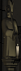 |
| 4 | `84 0 21 71` |  |
| 5 | `105 0 21 71` |  |
| 6 | `126 0 21 71` |  |
| 7 | `147 0 21 71` |  |
| 8 | `168 0 21 71` |  |
| 9 | `189 0 21 71` |  |
| 10 | `210 0 21 71` |  |

---

## TEX31065

**Properties**
- `TextureFile`: `images/Gebaeude_innen/Kirche/Status02_TP.bmp`
- `Count`: `11`
- `UseAlpha`: `false`

**Source image**

- Folder: `exports/TEX31065/`

  - exports/TEX31065/source.png
  - exports/TEX31065/source.tga
  - exports/TEX31065/source.bmp
  - exports/TEX31065/source.jpg
  - exports/TEX31065/source.jpeg
  - exports/TEX31065/source.webp

> Preview: open the folder above to see `source.*` and exported sprites.

**Sprites**

| # | Rect (x,y,w,h) | Image |
|---:|---|---|
| 0 | `0 0 23 72` |  |
| 1 | `23 0 23 72` |  |
| 2 | `46 0 23 72` |  |
| 3 | `69 0 23 72` |  |
| 4 | `92 0 23 72` |  |
| 5 | `115 0 23 72` |  |
| 6 | `138 0 23 72` |  |
| 7 | `161 0 23 72` |  |
| 8 | `184 0 23 72` |  |
| 9 | `207 0 23 72` |  |
| 10 | `230 0 23 72` |  |

---

## TEX31066

**Properties**
- `TextureFile`: `images/Gebaeude_innen/Kirche/Status03_TP.bmp`
- `Count`: `11`
- `UseAlpha`: `false`

**Source image**

- Folder: `exports/TEX31066/`

  - exports/TEX31066/source.png
  - exports/TEX31066/source.tga
  - exports/TEX31066/source.bmp
  - exports/TEX31066/source.jpg
  - exports/TEX31066/source.jpeg
  - exports/TEX31066/source.webp

> Preview: open the folder above to see `source.*` and exported sprites.

**Sprites**

| # | Rect (x,y,w,h) | Image |
|---:|---|---|
| 0 | `0 0 30 109` |  |
| 1 | `30 0 30 109` |  |
| 2 | `60 0 30 109` |  |
| 3 | `90 0 30 109` |  |
| 4 | `120 0 30 109` |  |
| 5 | `150 0 30 109` |  |
| 6 | `180 0 30 109` |  |
| 7 | `210 0 30 109` |  |
| 8 | `240 0 30 109` |  |
| 9 | `270 0 30 109` |  |
| 10 | `300 0 30 109` |  |

---

## TEX31067

**Properties**
- `TextureFile`: `images/Gebaeude_innen/Kirche/Status04_TP.bmp`
- `Count`: `11`
- `UseAlpha`: `false`

**Source image**

- Folder: `exports/TEX31067/`

  - exports/TEX31067/source.png
  - exports/TEX31067/source.tga
  - exports/TEX31067/source.bmp
  - exports/TEX31067/source.jpg
  - exports/TEX31067/source.jpeg
  - exports/TEX31067/source.webp

> Preview: open the folder above to see `source.*` and exported sprites.

**Sprites**

| # | Rect (x,y,w,h) | Image |
|---:|---|---|
| 0 | `0 0 37 105` |  |
| 1 | `37 0 37 105` |  |
| 2 | `74 0 37 105` |  |
| 3 | `111 0 37 105` |  |
| 4 | `148 0 37 105` |  |
| 5 | `185 0 37 105` |  |
| 6 | `222 0 37 105` |  |
| 7 | `259 0 37 105` |  |
| 8 | `296 0 37 105` |  |
| 9 | `333 0 37 105` |  |
| 10 | `370 0 37 105` |  |

---

## TEX31068

**Properties**
- `TextureFile`: `images/Gebaeude_innen/Kirche/Altar01.tga`
- `Count`: `1`
- `UseAlpha`: `true`

**Source image**

- Folder: `exports/TEX31068/`

  - exports/TEX31068/source.png
  - exports/TEX31068/source.tga
  - exports/TEX31068/source.bmp
  - exports/TEX31068/source.jpg
  - exports/TEX31068/source.jpeg
  - exports/TEX31068/source.webp

> Preview: open the folder above to see `source.*` and exported sprites.

**Sprites**

| # | Rect (x,y,w,h) | Image |
|---:|---|---|
| 0 | `0 0 132 194` |  |

---

## TEX31069

**Properties**
- `TextureFile`: `images/Gebaeude_innen/Werft/Flaschenzug/WerftFlaschenzug_TP.aim`
- `Count`: `20`
- `UseAlpha`: `false`

**Source image**

- Folder: `exports/TEX31069/`

  - exports/TEX31069/source.png
  - exports/TEX31069/source.tga
  - exports/TEX31069/source.bmp
  - exports/TEX31069/source.jpg
  - exports/TEX31069/source.jpeg
  - exports/TEX31069/source.webp

> Preview: open the folder above to see `source.*` and exported sprites.

**Sprites**

| # | Rect (x,y,w,h) | Image |
|---:|---|---|
| 0 | `0 0 113 170` |  |
| 1 | `0 170 113 170` |  |
| 2 | `0 340 113 170` |  |
| 3 | `0 510 113 170` |  |
| 4 | `0 680 113 170` |  |
| 5 | `0 850 113 170` |  |
| 6 | `0 1020 113 170` |  |
| 7 | `0 1190 113 170` |  |
| 8 | `0 1360 113 170` |  |
| 9 | `0 1530 113 170` |  |
| 10 | `0 1700 113 170` |  |
| 11 | `0 1870 113 170` |  |
| 12 | `0 2040 113 170` |  |
| 13 | `0 2210 113 170` |  |
| 14 | `0 2380 113 170` |  |
| 15 | `0 2550 113 170` |  |
| 16 | `0 2720 113 170` |  |
| 17 | `0 2890 113 170` |  |
| 18 | `0 3060 113 170` |  |
| 19 | `0 3230 113 170` |  |

---

## TEX31070

**Properties**
- `TextureFile`: `images/Gebaeude_innen/Werft/Moewen/Werft_Moewen_TP.aim`
- `Count`: `40`
- `UseAlpha`: `false`

**Source image**

- Folder: `exports/TEX31070/`

  - exports/TEX31070/source.png
  - exports/TEX31070/source.tga
  - exports/TEX31070/source.bmp
  - exports/TEX31070/source.jpg
  - exports/TEX31070/source.jpeg
  - exports/TEX31070/source.webp

> Preview: open the folder above to see `source.*` and exported sprites.

**Sprites**

| # | Rect (x,y,w,h) | Image |
|---:|---|---|
| 0 | `0 0 204 51` |  |
| 1 | `204 0 204 51` |  |
| 2 | `408 0 204 51` |  |
| 3 | `612 0 204 51` |  |
| 4 | `816 0 204 51` |  |
| 5 | `1020 0 204 51` |  |
| 6 | `1224 0 204 51` |  |
| 7 | `1428 0 204 51` |  |
| 8 | `0 51 204 51` |  |
| 9 | `204 51 204 51` |  |
| 10 | `408 51 204 51` |  |
| 11 | `612 51 204 51` |  |
| 12 | `816 51 204 51` |  |
| 13 | `1020 51 204 51` |  |
| 14 | `1224 51 204 51` |  |
| 15 | `1428 51 204 51` |  |
| 16 | `0 102 204 51` |  |
| 17 | `204 102 204 51` |  |
| 18 | `408 102 204 51` |  |
| 19 | `612 102 204 51` |  |
| 20 | `816 102 204 51` |  |
| 21 | `1020 102 204 51` |  |
| 22 | `1224 102 204 51` |  |
| 23 | `1428 102 204 51` |  |
| 24 | `0 153 204 51` |  |
| 25 | `204 153 204 51` |  |
| 26 | `408 153 204 51` |  |
| 27 | `612 153 204 51` |  |
| 28 | `816 153 204 51` |  |
| 29 | `1020 153 204 51` |  |
| 30 | `1224 153 204 51` |  |
| 31 | `1428 153 204 51` |  |
| 32 | `0 204 204 51` |  |
| 33 | `204 204 204 51` |  |
| 34 | `408 204 204 51` |  |
| 35 | `612 204 204 51` |  |
| 36 | `816 204 204 51` |  |
| 37 | `1020 204 204 51` |  |
| 38 | `1224 204 204 51` |  |
| 39 | `1428 204 204 51` |  |

---

## TEX31071

**Properties**
- `TextureFile`: `images/Gebaeude_innen/Werft/Werft_Arbeiter_TP.aim`
- `Count`: `20`
- `UseAlpha`: `false`

**Source image**

- Folder: `exports/TEX31071/`

  - exports/TEX31071/source.png
  - exports/TEX31071/source.tga
  - exports/TEX31071/source.bmp
  - exports/TEX31071/source.jpg
  - exports/TEX31071/source.jpeg
  - exports/TEX31071/source.webp

> Preview: open the folder above to see `source.*` and exported sprites.

**Sprites**

| # | Rect (x,y,w,h) | Image |
|---:|---|---|
| 0 | `0 0 107 56` |  |
| 1 | `107 0 107 56` |  |
| 2 | `214 0 107 56` |  |
| 3 | `321 0 107 56` |  |
| 4 | `428 0 107 56` |  |
| 5 | `535 0 107 56` |  |
| 6 | `642 0 107 56` |  |
| 7 | `749 0 107 56` |  |
| 8 | `856 0 107 56` |  |
| 9 | `963 0 107 56` |  |
| 10 | `1070 0 107 56` |  |
| 11 | `1177 0 107 56` |  |
| 12 | `1284 0 107 56` |  |
| 13 | `1391 0 107 56` |  |
| 14 | `1498 0 107 56` |  |
| 15 | `1605 0 107 56` |  |
| 16 | `1712 0 107 56` |  |
| 17 | `1819 0 107 56` |  |
| 18 | `1926 0 107 56` |  |
| 19 | `2033 0 107 56` |  |

---

## TEX31072

**Properties**
- `TextureFile`: `images/Gebaeude_innen/Werft/Werft_Wasser_gross_TP.aim`
- `Count`: `30`
- `UseAlpha`: `false`

**Source image**

- Folder: `exports/TEX31072/`

  - exports/TEX31072/source.png
  - exports/TEX31072/source.tga
  - exports/TEX31072/source.bmp
  - exports/TEX31072/source.jpg
  - exports/TEX31072/source.jpeg
  - exports/TEX31072/source.webp

> Preview: open the folder above to see `source.*` and exported sprites.

**Sprites**

| # | Rect (x,y,w,h) | Image |
|---:|---|---|
| 0 | `0 0 362 154` |  |
| 1 | `0 154 362 154` |  |
| 2 | `0 308 362 154` |  |
| 3 | `0 462 362 154` |  |
| 4 | `0 616 362 154` |  |
| 5 | `0 770 362 154` |  |
| 6 | `0 924 362 154` |  |
| 7 | `0 1078 362 154` |  |
| 8 | `0 1232 362 154` |  |
| 9 | `0 1386 362 154` |  |
| 10 | `0 1540 362 154` |  |
| 11 | `0 1694 362 154` |  |
| 12 | `0 1848 362 154` |  |
| 13 | `0 2002 362 154` |  |
| 14 | `0 2156 362 154` |  |
| 15 | `0 2310 362 154` |  |
| 16 | `0 2464 362 154` |  |
| 17 | `0 2618 362 154` |  |
| 18 | `0 2772 362 154` |  |
| 19 | `0 2926 362 154` |  |
| 20 | `0 3080 362 154` |  |
| 21 | `0 3234 362 154` |  |
| 22 | `0 3388 362 154` |  |
| 23 | `0 3542 362 154` |  |
| 24 | `0 3696 362 154` |  |
| 25 | `0 3850 362 154` |  |
| 26 | `0 4004 362 154` |  |
| 27 | `0 4158 362 154` |  |
| 28 | `0 4312 362 154` |  |
| 29 | `0 4466 362 154` |  |

---

## TEX31073

**Properties**
- `TextureFile`: `images/Gebaeude_innen/Werft/Werft_Wasser_klein_TP.bmp`
- `Count`: `30`
- `UseAlpha`: `false`

**Source image**

- Folder: `exports/TEX31073/`

  - exports/TEX31073/source.png
  - exports/TEX31073/source.tga
  - exports/TEX31073/source.bmp
  - exports/TEX31073/source.jpg
  - exports/TEX31073/source.jpeg
  - exports/TEX31073/source.webp

> Preview: open the folder above to see `source.*` and exported sprites.

**Sprites**

| # | Rect (x,y,w,h) | Image |
|---:|---|---|
| 0 | `0 0 64 23` |  |
| 1 | `0 23 64 23` |  |
| 2 | `0 46 64 23` |  |
| 3 | `0 69 64 23` |  |
| 4 | `0 92 64 23` |  |
| 5 | `0 115 64 23` | 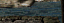 |
| 6 | `0 138 64 23` |  |
| 7 | `0 161 64 23` |  |
| 8 | `0 184 64 23` |  |
| 9 | `0 207 64 23` |  |
| 10 | `0 230 64 23` |  |
| 11 | `0 253 64 23` | 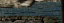 |
| 12 | `0 276 64 23` |  |
| 13 | `0 299 64 23` | 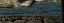 |
| 14 | `0 322 64 23` |  |
| 15 | `0 345 64 23` |  |
| 16 | `0 368 64 23` |  |
| 17 | `0 391 64 23` | 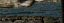 |
| 18 | `0 414 64 23` | 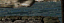 |
| 19 | `0 437 64 23` |  |
| 20 | `0 460 64 23` |  |
| 21 | `0 483 64 23` |  |
| 22 | `0 506 64 23` | 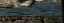 |
| 23 | `0 529 64 23` |  |
| 24 | `0 552 64 23` | 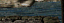 |
| 25 | `0 575 64 23` |  |
| 26 | `0 598 64 23` |  |
| 27 | `0 621 64 23` | 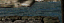 |
| 28 | `0 644 64 23` | 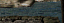 |
| 29 | `0 667 64 23` |  |

---

## TEX31074

**Properties**
- `TextureFile`: `images/Video_Schlussbild/Blockade.bmp`
- `Count`: `1`
- `UseAlpha`: `false`

**Source image**

- Folder: `exports/TEX31074/`

  - exports/TEX31074/source.png
  - exports/TEX31074/source.tga
  - exports/TEX31074/source.bmp
  - exports/TEX31074/source.jpg
  - exports/TEX31074/source.jpeg
  - exports/TEX31074/source.webp

> Preview: open the folder above to see `source.*` and exported sprites.

**Sprites**

| # | Rect (x,y,w,h) | Image |
|---:|---|---|
| 0 | `0 0 400 300` | 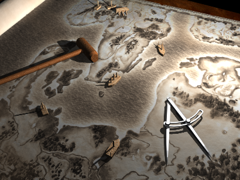 |

---

## TEX31075

**Properties**
- `TextureFile`: `images/Gebaeude_innen/Kontor/kontor_TP.aim`
- `Count`: `30`
- `UseAlpha`: `false`

**Source image**

- Folder: `exports/TEX31075/`

  - exports/TEX31075/source.png
  - exports/TEX31075/source.tga
  - exports/TEX31075/source.bmp
  - exports/TEX31075/source.jpg
  - exports/TEX31075/source.jpeg
  - exports/TEX31075/source.webp

> Preview: open the folder above to see `source.*` and exported sprites.

**Sprites**

| # | Rect (x,y,w,h) | Image |
|---:|---|---|
| 0 | `0 0 258 363` |  |
| 1 | `258 0 258 363` |  |
| 2 | `516 0 258 363` |  |
| 3 | `774 0 258 363` |  |
| 4 | `1032 0 258 363` |  |
| 5 | `1290 0 258 363` |  |
| 6 | `1548 0 258 363` |  |
| 7 | `1806 0 258 363` |  |
| 8 | `2064 0 258 363` |  |
| 9 | `2322 0 258 363` |  |
| 10 | `2580 0 258 363` |  |
| 11 | `2838 0 258 363` |  |
| 12 | `3096 0 258 363` |  |
| 13 | `3354 0 258 363` |  |
| 14 | `3612 0 258 363` |  |
| 15 | `3870 0 258 363` |  |
| 16 | `4128 0 258 363` |  |
| 17 | `4386 0 258 363` |  |
| 18 | `4644 0 258 363` |  |
| 19 | `4902 0 258 363` |  |
| 20 | `5160 0 258 363` |  |
| 21 | `5418 0 258 363` |  |
| 22 | `5676 0 258 363` |  |
| 23 | `5934 0 258 363` |  |
| 24 | `6192 0 258 363` |  |
| 25 | `6450 0 258 363` |  |
| 26 | `6708 0 258 363` |  |
| 27 | `6966 0 258 363` |  |
| 28 | `7224 0 258 363` |  |
| 29 | `7482 0 258 363` |  |

---

## TEX31076

**Properties**
- `TextureFile`: `images/Gebaeude_innen/Bad/Badhaus_Dampf_TP.aim`
- `Count`: `10`
- `UseAlpha`: `false`

**Source image**

- Folder: `exports/TEX31076/`

  - exports/TEX31076/source.png
  - exports/TEX31076/source.tga
  - exports/TEX31076/source.bmp
  - exports/TEX31076/source.jpg
  - exports/TEX31076/source.jpeg
  - exports/TEX31076/source.webp

> Preview: open the folder above to see `source.*` and exported sprites.

**Sprites**

| # | Rect (x,y,w,h) | Image |
|---:|---|---|
| 0 | `0 0 130 222` |  |
| 1 | `130 0 130 222` |  |
| 2 | `260 0 130 222` |  |
| 3 | `390 0 130 222` |  |
| 4 | `520 0 130 222` |  |
| 5 | `650 0 130 222` |  |
| 6 | `780 0 130 222` |  |
| 7 | `910 0 130 222` |  |
| 8 | `1040 0 130 222` |  |
| 9 | `1170 0 130 222` |  |

---

## TEX31077

**Properties**
- `TextureFile`: `images/Gebaeude_innen/Rathaus/Rathaus_F_reden_A_TP.bmp`
- `Count`: `21`
- `UseAlpha`: `false`

**Source image**

- Folder: `exports/TEX31077/`

  - exports/TEX31077/source.png
  - exports/TEX31077/source.tga
  - exports/TEX31077/source.bmp
  - exports/TEX31077/source.jpg
  - exports/TEX31077/source.jpeg
  - exports/TEX31077/source.webp

> Preview: open the folder above to see `source.*` and exported sprites.

**Sprites**

| # | Rect (x,y,w,h) | Image |
|---:|---|---|
| 0 | `0 0 39 64` |  |
| 1 | `39 0 39 64` |  |
| 2 | `78 0 39 64` |  |
| 3 | `117 0 39 64` |  |
| 4 | `156 0 39 64` |  |
| 5 | `195 0 39 64` |  |
| 6 | `234 0 39 64` |  |
| 7 | `273 0 39 64` |  |
| 8 | `312 0 39 64` |  |
| 9 | `351 0 39 64` |  |
| 10 | `390 0 39 64` |  |
| 11 | `429 0 39 64` |  |
| 12 | `468 0 39 64` |  |
| 13 | `507 0 39 64` |  |
| 14 | `546 0 39 64` |  |
| 15 | `585 0 39 64` |  |
| 16 | `624 0 39 64` |  |
| 17 | `663 0 39 64` |  |
| 18 | `702 0 39 64` |  |
| 19 | `741 0 39 64` |  |
| 20 | `780 0 39 64` |  |

---

## TEX31078

**Properties**
- `TextureFile`: `images/Gebaeude_innen/Rathaus/Rathaus_F_reden_B_TP.bmp`
- `Count`: `31`
- `UseAlpha`: `false`

**Source image**

- Folder: `exports/TEX31078/`

  - exports/TEX31078/source.png
  - exports/TEX31078/source.tga
  - exports/TEX31078/source.bmp
  - exports/TEX31078/source.jpg
  - exports/TEX31078/source.jpeg
  - exports/TEX31078/source.webp

> Preview: open the folder above to see `source.*` and exported sprites.

**Sprites**

| # | Rect (x,y,w,h) | Image |
|---:|---|---|
| 0 | `0 0 39 64` |  |
| 1 | `39 0 39 64` |  |
| 2 | `78 0 39 64` |  |
| 3 | `117 0 39 64` |  |
| 4 | `156 0 39 64` |  |
| 5 | `195 0 39 64` |  |
| 6 | `234 0 39 64` |  |
| 7 | `273 0 39 64` |  |
| 8 | `312 0 39 64` |  |
| 9 | `351 0 39 64` |  |
| 10 | `390 0 39 64` |  |
| 11 | `429 0 39 64` |  |
| 12 | `468 0 39 64` |  |
| 13 | `507 0 39 64` |  |
| 14 | `546 0 39 64` |  |
| 15 | `585 0 39 64` |  |
| 16 | `624 0 39 64` |  |
| 17 | `663 0 39 64` |  |
| 18 | `702 0 39 64` |  |
| 19 | `741 0 39 64` |  |
| 20 | `780 0 39 64` |  |
| 21 | `819 0 39 64` |  |
| 22 | `858 0 39 64` |  |
| 23 | `897 0 39 64` |  |
| 24 | `936 0 39 64` |  |
| 25 | `975 0 39 64` |  |
| 26 | `1014 0 39 64` |  |
| 27 | `1053 0 39 64` |  |
| 28 | `1092 0 39 64` |  |
| 29 | `1131 0 39 64` |  |
| 30 | `1170 0 39 64` |  |

---

## TEX31079

**Properties**
- `TextureFile`: `images/Gebaeude_innen/Rathaus/Rathaus_P_reden_A_TP.bmp`
- `Count`: `21`
- `UseAlpha`: `false`

**Source image**

- Folder: `exports/TEX31079/`

  - exports/TEX31079/source.png
  - exports/TEX31079/source.tga
  - exports/TEX31079/source.bmp
  - exports/TEX31079/source.jpg
  - exports/TEX31079/source.jpeg
  - exports/TEX31079/source.webp

> Preview: open the folder above to see `source.*` and exported sprites.

**Sprites**

| # | Rect (x,y,w,h) | Image |
|---:|---|---|
| 0 | `0 0 52 58` |  |
| 1 | `52 0 52 58` |  |
| 2 | `104 0 52 58` |  |
| 3 | `156 0 52 58` |  |
| 4 | `208 0 52 58` |  |
| 5 | `260 0 52 58` |  |
| 6 | `312 0 52 58` |  |
| 7 | `364 0 52 58` |  |
| 8 | `416 0 52 58` |  |
| 9 | `468 0 52 58` |  |
| 10 | `520 0 52 58` |  |
| 11 | `572 0 52 58` |  |
| 12 | `624 0 52 58` |  |
| 13 | `676 0 52 58` |  |
| 14 | `728 0 52 58` |  |
| 15 | `780 0 52 58` |  |
| 16 | `832 0 52 58` |  |
| 17 | `884 0 52 58` |  |
| 18 | `936 0 52 58` |  |
| 19 | `988 0 52 58` |  |
| 20 | `1040 0 52 58` |  |

---

## TEX31080

**Properties**
- `TextureFile`: `images/Gebaeude_innen/Rathaus/Rathaus_P_reden_B_TP.bmp`
- `Count`: `31`
- `UseAlpha`: `false`

**Source image**

- Folder: `exports/TEX31080/`

  - exports/TEX31080/source.png
  - exports/TEX31080/source.tga
  - exports/TEX31080/source.bmp
  - exports/TEX31080/source.jpg
  - exports/TEX31080/source.jpeg
  - exports/TEX31080/source.webp

> Preview: open the folder above to see `source.*` and exported sprites.

**Sprites**

| # | Rect (x,y,w,h) | Image |
|---:|---|---|
| 0 | `0 0 52 58` |  |
| 1 | `52 0 52 58` |  |
| 2 | `104 0 52 58` |  |
| 3 | `156 0 52 58` |  |
| 4 | `208 0 52 58` |  |
| 5 | `260 0 52 58` |  |
| 6 | `312 0 52 58` |  |
| 7 | `364 0 52 58` |  |
| 8 | `416 0 52 58` |  |
| 9 | `468 0 52 58` |  |
| 10 | `520 0 52 58` |  |
| 11 | `572 0 52 58` |  |
| 12 | `624 0 52 58` |  |
| 13 | `676 0 52 58` |  |
| 14 | `728 0 52 58` |  |
| 15 | `780 0 52 58` |  |
| 16 | `832 0 52 58` |  |
| 17 | `884 0 52 58` |  |
| 18 | `936 0 52 58` |  |
| 19 | `988 0 52 58` |  |
| 20 | `1040 0 52 58` |  |
| 21 | `1092 0 52 58` |  |
| 22 | `1144 0 52 58` |  |
| 23 | `1196 0 52 58` |  |
| 24 | `1248 0 52 58` |  |
| 25 | `1300 0 52 58` |  |
| 26 | `1352 0 52 58` |  |
| 27 | `1404 0 52 58` |  |
| 28 | `1456 0 52 58` |  |
| 29 | `1508 0 52 58` |  |
| 30 | `1560 0 52 58` |  |

---

## TEX31081

**Properties**
- `TextureFile`: `images/Gebaeude_innen/Rathaus/Rathaus_R_TP.bmp`
- `Count`: `40`
- `UseAlpha`: `false`

**Source image**

- Folder: `exports/TEX31081/`

  - exports/TEX31081/source.png
  - exports/TEX31081/source.tga
  - exports/TEX31081/source.bmp
  - exports/TEX31081/source.jpg
  - exports/TEX31081/source.jpeg
  - exports/TEX31081/source.webp

> Preview: open the folder above to see `source.*` and exported sprites.

**Sprites**

| # | Rect (x,y,w,h) | Image |
|---:|---|---|
| 0 | `0 0 53 61` |  |
| 1 | `53 0 53 61` |  |
| 2 | `106 0 53 61` |  |
| 3 | `159 0 53 61` |  |
| 4 | `212 0 53 61` |  |
| 5 | `265 0 53 61` |  |
| 6 | `318 0 53 61` | 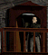 |
| 7 | `371 0 53 61` |  |
| 8 | `424 0 53 61` |  |
| 9 | `477 0 53 61` |  |
| 10 | `530 0 53 61` |  |
| 11 | `583 0 53 61` |  |
| 12 | `636 0 53 61` |  |
| 13 | `689 0 53 61` |  |
| 14 | `742 0 53 61` |  |
| 15 | `795 0 53 61` |  |
| 16 | `848 0 53 61` |  |
| 17 | `901 0 53 61` | 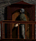 |
| 18 | `954 0 53 61` |  |
| 19 | `1007 0 53 61` |  |
| 20 | `1060 0 53 61` |  |
| 21 | `1113 0 53 61` |  |
| 22 | `1166 0 53 61` |  |
| 23 | `1219 0 53 61` |  |
| 24 | `1272 0 53 61` |  |
| 25 | `1325 0 53 61` | 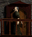 |
| 26 | `1378 0 53 61` |  |
| 27 | `1431 0 53 61` | 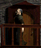 |
| 28 | `1484 0 53 61` |  |
| 29 | `1537 0 53 61` | 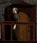 |
| 30 | `1590 0 53 61` |  |
| 31 | `1643 0 53 61` |  |
| 32 | `1696 0 53 61` |  |
| 33 | `1749 0 53 61` |  |
| 34 | `1802 0 53 61` | 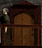 |
| 35 | `1855 0 53 61` |  |
| 36 | `1908 0 53 61` |  |
| 37 | `1961 0 53 61` |  |
| 38 | `2014 0 53 61` |  |
| 39 | `2067 0 53 61` |  |

---

## TEX31082

**Properties**
- `TextureFile`: `images/Gebaeude_innen/Kneipe/Kneipe_Kapitn_Kerze_TP.bmp`
- `Count`: `4`
- `UseAlpha`: `false`

**Source image**

- Folder: `exports/TEX31082/`

  - exports/TEX31082/source.png
  - exports/TEX31082/source.tga
  - exports/TEX31082/source.bmp
  - exports/TEX31082/source.jpg
  - exports/TEX31082/source.jpeg
  - exports/TEX31082/source.webp

> Preview: open the folder above to see `source.*` and exported sprites.

**Sprites**

| # | Rect (x,y,w,h) | Image |
|---:|---|---|
| 0 | `0 0 37 37` |  |
| 1 | `37 0 37 37` |  |
| 2 | `74 0 37 37` |  |
| 3 | `111 0 37 37` |  |

---

## TEX31083

**Properties**
- `TextureFile`: `images/Gebaeude_innen/Gilde/Kaminfeuer_TP.bmp`
- `Count`: `67`
- `UseAlpha`: `false`

**Source image**

- Folder: `exports/TEX31083/`

  - exports/TEX31083/source.png
  - exports/TEX31083/source.tga
  - exports/TEX31083/source.bmp
  - exports/TEX31083/source.jpg
  - exports/TEX31083/source.jpeg
  - exports/TEX31083/source.webp

> Preview: open the folder above to see `source.*` and exported sprites.

**Sprites**

| # | Rect (x,y,w,h) | Image |
|---:|---|---|
| 0 | `0 0 27 68` |  |
| 1 | `0 68 27 68` |  |
| 2 | `0 136 27 68` |  |
| 3 | `0 204 27 68` |  |
| 4 | `0 272 27 68` |  |
| 5 | `0 340 27 68` |  |
| 6 | `0 408 27 68` |  |
| 7 | `0 476 27 68` |  |
| 8 | `0 544 27 68` |  |
| 9 | `0 612 27 68` |  |
| 10 | `0 680 27 68` |  |
| 11 | `0 748 27 68` |  |
| 12 | `0 816 27 68` |  |
| 13 | `0 884 27 68` |  |
| 14 | `0 952 27 68` |  |
| 15 | `0 1020 27 68` |  |
| 16 | `0 1088 27 68` |  |
| 17 | `0 1156 27 68` |  |
| 18 | `0 1224 27 68` |  |
| 19 | `0 1292 27 68` |  |
| 20 | `0 1360 27 68` |  |
| 21 | `0 1428 27 68` |  |
| 22 | `0 1496 27 68` |  |
| 23 | `0 1564 27 68` |  |
| 24 | `0 1632 27 68` |  |
| 25 | `0 1700 27 68` |  |
| 26 | `0 1768 27 68` |  |
| 27 | `0 1836 27 68` |  |
| 28 | `0 1904 27 68` |  |
| 29 | `0 1972 27 68` | 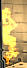 |
| 30 | `0 2040 27 68` |  |
| 31 | `0 2108 27 68` |  |
| 32 | `0 2176 27 68` |  |
| 33 | `0 2244 27 68` |  |
| 34 | `0 2312 27 68` |  |
| 35 | `0 2380 27 68` |  |
| 36 | `0 2448 27 68` |  |
| 37 | `0 2516 27 68` |  |
| 38 | `0 2584 27 68` |  |
| 39 | `0 2652 27 68` |  |
| 40 | `0 2720 27 68` |  |
| 41 | `0 2788 27 68` |  |
| 42 | `0 2856 27 68` |  |
| 43 | `0 2924 27 68` |  |
| 44 | `0 2992 27 68` |  |
| 45 | `0 3060 27 68` |  |
| 46 | `0 3128 27 68` |  |
| 47 | `0 3196 27 68` |  |
| 48 | `0 3264 27 68` |  |
| 49 | `0 3332 27 68` |  |
| 50 | `0 3400 27 68` |  |
| 51 | `0 3468 27 68` |  |
| 52 | `0 3536 27 68` |  |
| 53 | `0 3604 27 68` |  |
| 54 | `0 3672 27 68` |  |
| 55 | `0 3740 27 68` |  |
| 56 | `0 3808 27 68` |  |
| 57 | `0 3876 27 68` |  |
| 58 | `0 3944 27 68` |  |
| 59 | `0 4012 27 68` |  |
| 60 | `0 4080 27 68` | 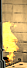 |
| 61 | `0 4148 27 68` |  |
| 62 | `0 4216 27 68` |  |
| 63 | `0 4284 27 68` |  |
| 64 | `0 4352 27 68` |  |
| 65 | `0 4420 27 68` |  |
| 66 | `0 4488 27 68` |  |

---

## TEX31084

**Properties**
- `TextureFile`: `images/Gebaeude_innen/Gilde/Mann_A_Teil1_TP.aim`
- `Count`: `40`
- `UseAlpha`: `false`

**Source image**

- Folder: `exports/TEX31084/`

  - exports/TEX31084/source.png
  - exports/TEX31084/source.tga
  - exports/TEX31084/source.bmp
  - exports/TEX31084/source.jpg
  - exports/TEX31084/source.jpeg
  - exports/TEX31084/source.webp

> Preview: open the folder above to see `source.*` and exported sprites.

**Sprites**

| # | Rect (x,y,w,h) | Image |
|---:|---|---|
| 0 | `0 0 60 72` |  |
| 1 | `60 0 60 72` |  |
| 2 | `120 0 60 72` |  |
| 3 | `180 0 60 72` |  |
| 4 | `240 0 60 72` |  |
| 5 | `300 0 60 72` |  |
| 6 | `360 0 60 72` |  |
| 7 | `420 0 60 72` |  |
| 8 | `480 0 60 72` |  |
| 9 | `540 0 60 72` |  |
| 10 | `600 0 60 72` |  |
| 11 | `660 0 60 72` |  |
| 12 | `720 0 60 72` |  |
| 13 | `780 0 60 72` |  |
| 14 | `840 0 60 72` |  |
| 15 | `900 0 60 72` |  |
| 16 | `960 0 60 72` |  |
| 17 | `1020 0 60 72` |  |
| 18 | `1080 0 60 72` |  |
| 19 | `1140 0 60 72` |  |
| 20 | `1200 0 60 72` |  |
| 21 | `1260 0 60 72` |  |
| 22 | `1320 0 60 72` |  |
| 23 | `1380 0 60 72` |  |
| 24 | `1440 0 60 72` |  |
| 25 | `1500 0 60 72` |  |
| 26 | `1560 0 60 72` |  |
| 27 | `1620 0 60 72` |  |
| 28 | `1680 0 60 72` |  |
| 29 | `1740 0 60 72` |  |
| 30 | `1800 0 60 72` |  |
| 31 | `1860 0 60 72` |  |
| 32 | `1920 0 60 72` |  |
| 33 | `1980 0 60 72` |  |
| 34 | `2040 0 60 72` |  |
| 35 | `2100 0 60 72` |  |
| 36 | `2160 0 60 72` |  |
| 37 | `2220 0 60 72` |  |
| 38 | `2280 0 60 72` |  |
| 39 | `2340 0 60 72` |  |

---

## TEX31085

**Properties**
- `TextureFile`: `images/Gebaeude_innen/Gilde/Mann_B_Teil1_TP.aim`
- `Count`: `30`
- `UseAlpha`: `false`

**Source image**

- Folder: `exports/TEX31085/`

  - exports/TEX31085/source.png
  - exports/TEX31085/source.tga
  - exports/TEX31085/source.bmp
  - exports/TEX31085/source.jpg
  - exports/TEX31085/source.jpeg
  - exports/TEX31085/source.webp

> Preview: open the folder above to see `source.*` and exported sprites.

**Sprites**

| # | Rect (x,y,w,h) | Image |
|---:|---|---|
| 0 | `0 0 56 70` |  |
| 1 | `56 0 56 70` |  |
| 2 | `112 0 56 70` |  |
| 3 | `168 0 56 70` |  |
| 4 | `224 0 56 70` |  |
| 5 | `280 0 56 70` |  |
| 6 | `336 0 56 70` |  |
| 7 | `392 0 56 70` |  |
| 8 | `448 0 56 70` |  |
| 9 | `504 0 56 70` |  |
| 10 | `560 0 56 70` |  |
| 11 | `616 0 56 70` |  |
| 12 | `672 0 56 70` |  |
| 13 | `728 0 56 70` |  |
| 14 | `784 0 56 70` |  |
| 15 | `840 0 56 70` |  |
| 16 | `896 0 56 70` |  |
| 17 | `952 0 56 70` |  |
| 18 | `1008 0 56 70` |  |
| 19 | `1064 0 56 70` |  |
| 20 | `1120 0 56 70` |  |
| 21 | `1176 0 56 70` |  |
| 22 | `1232 0 56 70` |  |
| 23 | `1288 0 56 70` |  |
| 24 | `1344 0 56 70` |  |
| 25 | `1400 0 56 70` |  |
| 26 | `1456 0 56 70` |  |
| 27 | `1512 0 56 70` |  |
| 28 | `1568 0 56 70` |  |
| 29 | `1624 0 56 70` |  |

---

## TEX31086

**Properties**
- `TextureFile`: `images/Gebaeude_innen/Gilde/Gilde_Hocker_S_TP.bmp`
- `Count`: `2`
- `UseAlpha`: `false`

**Source image**

- Folder: `exports/TEX31086/`

  - exports/TEX31086/source.png
  - exports/TEX31086/source.tga
  - exports/TEX31086/source.bmp
  - exports/TEX31086/source.jpg
  - exports/TEX31086/source.jpeg
  - exports/TEX31086/source.webp

> Preview: open the folder above to see `source.*` and exported sprites.

**Sprites**

| # | Rect (x,y,w,h) | Image |
|---:|---|---|
| 0 | `0 0 37 52` |  |
| 1 | `37 0 37 52` |  |

---

## TEX31087

**Properties**
- `TextureFile`: `images/Gebaeude_innen/Gilde/Gilde_Ecke_S_TP.bmp`
- `Count`: `2`
- `UseAlpha`: `false`

**Source image**

- Folder: `exports/TEX31087/`

  - exports/TEX31087/source.png
  - exports/TEX31087/source.tga
  - exports/TEX31087/source.bmp
  - exports/TEX31087/source.jpg
  - exports/TEX31087/source.jpeg
  - exports/TEX31087/source.webp

> Preview: open the folder above to see `source.*` and exported sprites.

**Sprites**

| # | Rect (x,y,w,h) | Image |
|---:|---|---|
| 0 | `0 0 60 13` |  |
| 1 | `60 0 60 13` |  |

---

## TEX31088

**Properties**
- `TextureFile`: `images/Gebaeude_innen/Gilde/Mann_A_Teil2_TP.aim`
- `Count`: `53`
- `UseAlpha`: `false`

**Source image**

- Folder: `exports/TEX31088/`

  - exports/TEX31088/source.png
  - exports/TEX31088/source.tga
  - exports/TEX31088/source.bmp
  - exports/TEX31088/source.jpg
  - exports/TEX31088/source.jpeg
  - exports/TEX31088/source.webp

> Preview: open the folder above to see `source.*` and exported sprites.

**Sprites**

| # | Rect (x,y,w,h) | Image |
|---:|---|---|
| 0 | `0 0 60 72` |  |
| 1 | `60 0 60 72` |  |
| 2 | `120 0 60 72` |  |
| 3 | `180 0 60 72` |  |
| 4 | `240 0 60 72` |  |
| 5 | `300 0 60 72` |  |
| 6 | `360 0 60 72` |  |
| 7 | `420 0 60 72` |  |
| 8 | `480 0 60 72` |  |
| 9 | `540 0 60 72` |  |
| 10 | `600 0 60 72` |  |
| 11 | `660 0 60 72` |  |
| 12 | `720 0 60 72` |  |
| 13 | `780 0 60 72` |  |
| 14 | `840 0 60 72` |  |
| 15 | `900 0 60 72` |  |
| 16 | `960 0 60 72` |  |
| 17 | `1020 0 60 72` |  |
| 18 | `1080 0 60 72` |  |
| 19 | `1140 0 60 72` |  |
| 20 | `1200 0 60 72` |  |
| 21 | `1260 0 60 72` |  |
| 22 | `1320 0 60 72` |  |
| 23 | `1380 0 60 72` |  |
| 24 | `1440 0 60 72` |  |
| 25 | `1500 0 60 72` |  |
| 26 | `1560 0 60 72` |  |
| 27 | `1620 0 60 72` |  |
| 28 | `1680 0 60 72` |  |
| 29 | `1740 0 60 72` |  |
| 30 | `1800 0 60 72` |  |
| 31 | `1860 0 60 72` |  |
| 32 | `1920 0 60 72` |  |
| 33 | `1980 0 60 72` |  |
| 34 | `2040 0 60 72` |  |
| 35 | `2100 0 60 72` |  |
| 36 | `2160 0 60 72` |  |
| 37 | `2220 0 60 72` |  |
| 38 | `2280 0 60 72` |  |
| 39 | `2340 0 60 72` |  |
| 40 | `2400 0 60 72` |  |
| 41 | `2460 0 60 72` |  |
| 42 | `2520 0 60 72` |  |
| 43 | `2580 0 60 72` |  |
| 44 | `2640 0 60 72` |  |
| 45 | `2700 0 60 72` |  |
| 46 | `2760 0 60 72` |  |
| 47 | `2820 0 60 72` |  |
| 48 | `2880 0 60 72` |  |
| 49 | `2940 0 60 72` |  |
| 50 | `3000 0 60 72` |  |
| 51 | `3060 0 60 72` |  |
| 52 | `3120 0 60 72` |  |

---

## TEX31089

**Properties**
- `TextureFile`: `images/Gebaeude_innen/Gilde/Mann_B_Teil2_TP.aim`
- `Count`: `40`
- `UseAlpha`: `false`

**Source image**

- Folder: `exports/TEX31089/`

  - exports/TEX31089/source.png
  - exports/TEX31089/source.tga
  - exports/TEX31089/source.bmp
  - exports/TEX31089/source.jpg
  - exports/TEX31089/source.jpeg
  - exports/TEX31089/source.webp

> Preview: open the folder above to see `source.*` and exported sprites.

**Sprites**

| # | Rect (x,y,w,h) | Image |
|---:|---|---|
| 0 | `0 0 56 70` |  |
| 1 | `56 0 56 70` |  |
| 2 | `112 0 56 70` |  |
| 3 | `168 0 56 70` |  |
| 4 | `224 0 56 70` |  |
| 5 | `280 0 56 70` |  |
| 6 | `336 0 56 70` |  |
| 7 | `392 0 56 70` |  |
| 8 | `448 0 56 70` |  |
| 9 | `504 0 56 70` |  |
| 10 | `560 0 56 70` |  |
| 11 | `616 0 56 70` |  |
| 12 | `672 0 56 70` |  |
| 13 | `728 0 56 70` |  |
| 14 | `784 0 56 70` |  |
| 15 | `840 0 56 70` |  |
| 16 | `896 0 56 70` |  |
| 17 | `952 0 56 70` |  |
| 18 | `1008 0 56 70` |  |
| 19 | `1064 0 56 70` |  |
| 20 | `1120 0 56 70` |  |
| 21 | `1176 0 56 70` |  |
| 22 | `1232 0 56 70` |  |
| 23 | `1288 0 56 70` |  |
| 24 | `1344 0 56 70` |  |
| 25 | `1400 0 56 70` |  |
| 26 | `1456 0 56 70` |  |
| 27 | `1512 0 56 70` |  |
| 28 | `1568 0 56 70` |  |
| 29 | `1624 0 56 70` |  |
| 30 | `1680 0 56 70` |  |
| 31 | `1736 0 56 70` |  |
| 32 | `1792 0 56 70` |  |
| 33 | `1848 0 56 70` |  |
| 34 | `1904 0 56 70` |  |
| 35 | `1960 0 56 70` |  |
| 36 | `2016 0 56 70` |  |
| 37 | `2072 0 56 70` |  |
| 38 | `2128 0 56 70` |  |
| 39 | `2184 0 56 70` |  |

---

## TEX31090

**Properties**
- `TextureFile`: `images/Video_Schlussbild/Ueberraschung2.bmp`
- `Count`: `1`
- `UseAlpha`: `false`

**Source image**

- Folder: `exports/TEX31090/`

  - exports/TEX31090/source.png
  - exports/TEX31090/source.tga
  - exports/TEX31090/source.bmp
  - exports/TEX31090/source.jpg
  - exports/TEX31090/source.jpeg
  - exports/TEX31090/source.webp

> Preview: open the folder above to see `source.*` and exported sprites.

**Sprites**

| # | Rect (x,y,w,h) | Image |
|---:|---|---|
| 0 | `0 0 400 300` | 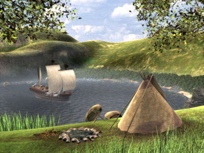 |

---

## TEX31091

**Properties**
- `TextureFile`: `images/Gebaeude_innen/Bank/DG_schreibt_TP.aim`
- `Count`: `62`
- `UseAlpha`: `false`

**Source image**

- Folder: `exports/TEX31091/`

  - exports/TEX31091/source.png
  - exports/TEX31091/source.tga
  - exports/TEX31091/source.bmp
  - exports/TEX31091/source.jpg
  - exports/TEX31091/source.jpeg
  - exports/TEX31091/source.webp

> Preview: open the folder above to see `source.*` and exported sprites.

**Sprites**

| # | Rect (x,y,w,h) | Image |
|---:|---|---|
| 0 | `0 0 147 159` |  |
| 1 | `147 0 147 159` |  |
| 2 | `294 0 147 159` |  |
| 3 | `441 0 147 159` |  |
| 4 | `588 0 147 159` |  |
| 5 | `735 0 147 159` |  |
| 6 | `882 0 147 159` |  |
| 7 | `1029 0 147 159` |  |
| 8 | `1176 0 147 159` |  |
| 9 | `1323 0 147 159` |  |
| 10 | `1470 0 147 159` |  |
| 11 | `1617 0 147 159` |  |
| 12 | `1764 0 147 159` |  |
| 13 | `1911 0 147 159` |  |
| 14 | `2058 0 147 159` |  |
| 15 | `2205 0 147 159` |  |
| 16 | `2352 0 147 159` |  |
| 17 | `2499 0 147 159` |  |
| 18 | `2646 0 147 159` |  |
| 19 | `2793 0 147 159` |  |
| 20 | `2940 0 147 159` |  |
| 21 | `3087 0 147 159` |  |
| 22 | `3234 0 147 159` |  |
| 23 | `3381 0 147 159` |  |
| 24 | `3528 0 147 159` |  |
| 25 | `3675 0 147 159` |  |
| 26 | `3822 0 147 159` |  |
| 27 | `3969 0 147 159` |  |
| 28 | `4116 0 147 159` |  |
| 29 | `4263 0 147 159` |  |
| 30 | `4410 0 147 159` |  |
| 31 | `4557 0 147 159` |  |
| 32 | `4704 0 147 159` |  |
| 33 | `4851 0 147 159` |  |
| 34 | `4998 0 147 159` |  |
| 35 | `5145 0 147 159` |  |
| 36 | `5292 0 147 159` |  |
| 37 | `5439 0 147 159` |  |
| 38 | `5586 0 147 159` |  |
| 39 | `5733 0 147 159` |  |
| 40 | `5880 0 147 159` |  |
| 41 | `6027 0 147 159` |  |
| 42 | `6174 0 147 159` |  |
| 43 | `6321 0 147 159` |  |
| 44 | `6468 0 147 159` |  |
| 45 | `6615 0 147 159` |  |
| 46 | `6762 0 147 159` |  |
| 47 | `6909 0 147 159` |  |
| 48 | `7056 0 147 159` |  |
| 49 | `7203 0 147 159` |  |
| 50 | `7350 0 147 159` |  |
| 51 | `7497 0 147 159` |  |
| 52 | `7644 0 147 159` |  |
| 53 | `7791 0 147 159` |  |
| 54 | `7938 0 147 159` |  |
| 55 | `8085 0 147 159` |  |
| 56 | `8232 0 147 159` |  |
| 57 | `8379 0 147 159` |  |
| 58 | `8526 0 147 159` |  |
| 59 | `8673 0 147 159` |  |
| 60 | `8820 0 147 159` |  |
| 61 | `8967 0 147 159` |  |

---

## TEX31092

**Properties**
- `TextureFile`: `images/Gebaeude_innen/Bad/Badhaus_Wasser_TP.aim`
- `Count`: `20`
- `UseAlpha`: `false`
- `UseColorKey`: `true`
- `ColorKey`: `0xffff00ff`

**Source image**

- Folder: `exports/TEX31092/`

  - exports/TEX31092/source.png
  - exports/TEX31092/source.tga
  - exports/TEX31092/source.bmp
  - exports/TEX31092/source.jpg
  - exports/TEX31092/source.jpeg
  - exports/TEX31092/source.webp

> Preview: open the folder above to see `source.*` and exported sprites.

**Sprites**

| # | Rect (x,y,w,h) | Image |
|---:|---|---|
| 0 | `0 0 425 201` |  |
| 1 | `425 0 425 201` |  |
| 2 | `850 0 425 201` |  |
| 3 | `1275 0 425 201` |  |
| 4 | `1700 0 425 201` |  |
| 5 | `2125 0 425 201` |  |
| 6 | `2550 0 425 201` |  |
| 7 | `2975 0 425 201` |  |
| 8 | `3400 0 425 201` |  |
| 9 | `3825 0 425 201` |  |
| 10 | `4250 0 425 201` |  |
| 11 | `4675 0 425 201` |  |
| 12 | `5100 0 425 201` |  |
| 13 | `5525 0 425 201` |  |
| 14 | `5950 0 425 201` |  |
| 15 | `6375 0 425 201` |  |
| 16 | `6800 0 425 201` |  |
| 17 | `7225 0 425 201` |  |
| 18 | `7650 0 425 201` |  |
| 19 | `8075 0 425 201` |  |

---

## TEX31093

**Properties**
- `TextureFile`: `images/Gebaeude_innen/Kontor/kontor_TP2.aim`
- `Count`: `16`
- `UseAlpha`: `false`

**Source image**

- Folder: `exports/TEX31093/`

  - exports/TEX31093/source.png
  - exports/TEX31093/source.tga
  - exports/TEX31093/source.bmp
  - exports/TEX31093/source.jpg
  - exports/TEX31093/source.jpeg
  - exports/TEX31093/source.webp

> Preview: open the folder above to see `source.*` and exported sprites.

**Sprites**

| # | Rect (x,y,w,h) | Image |
|---:|---|---|
| 0 | `0 0 163 280` |  |
| 1 | `163 0 163 280` |  |
| 2 | `326 0 163 280` |  |
| 3 | `489 0 163 280` |  |
| 4 | `652 0 163 280` |  |
| 5 | `815 0 163 280` |  |
| 6 | `978 0 163 280` |  |
| 7 | `1141 0 163 280` |  |
| 8 | `1304 0 163 280` |  |
| 9 | `1467 0 163 280` |  |
| 10 | `1630 0 163 280` |  |
| 11 | `1793 0 163 280` |  |
| 12 | `1956 0 163 280` |  |
| 13 | `2119 0 163 280` |  |
| 14 | `2282 0 163 280` |  |
| 15 | `2445 0 163 280` |  |

---

## TEX31094

**Properties**
- `TextureFile`: `images/Gebaeude_innen/Markt/Markthalle_Frauen_TP.aim`
- `Count`: `50`
- `UseAlpha`: `false`

**Source image**

- Folder: `exports/TEX31094/`

  - exports/TEX31094/source.png
  - exports/TEX31094/source.tga
  - exports/TEX31094/source.bmp
  - exports/TEX31094/source.jpg
  - exports/TEX31094/source.jpeg
  - exports/TEX31094/source.webp

> Preview: open the folder above to see `source.*` and exported sprites.

**Sprites**

| # | Rect (x,y,w,h) | Image |
|---:|---|---|
| 0 | `0 0 82 78` |  |
| 1 | `82 0 82 78` |  |
| 2 | `164 0 82 78` |  |
| 3 | `246 0 82 78` |  |
| 4 | `328 0 82 78` |  |
| 5 | `410 0 82 78` |  |
| 6 | `492 0 82 78` |  |
| 7 | `574 0 82 78` |  |
| 8 | `656 0 82 78` |  |
| 9 | `738 0 82 78` |  |
| 10 | `820 0 82 78` |  |
| 11 | `902 0 82 78` |  |
| 12 | `984 0 82 78` |  |
| 13 | `1066 0 82 78` |  |
| 14 | `1148 0 82 78` |  |
| 15 | `1230 0 82 78` |  |
| 16 | `1312 0 82 78` |  |
| 17 | `1394 0 82 78` |  |
| 18 | `1476 0 82 78` |  |
| 19 | `1558 0 82 78` |  |
| 20 | `1640 0 82 78` |  |
| 21 | `1722 0 82 78` |  |
| 22 | `1804 0 82 78` |  |
| 23 | `1886 0 82 78` |  |
| 24 | `1968 0 82 78` |  |
| 25 | `2050 0 82 78` |  |
| 26 | `2132 0 82 78` |  |
| 27 | `2214 0 82 78` |  |
| 28 | `2296 0 82 78` |  |
| 29 | `2378 0 82 78` |  |
| 30 | `2460 0 82 78` |  |
| 31 | `2542 0 82 78` |  |
| 32 | `2624 0 82 78` |  |
| 33 | `2706 0 82 78` |  |
| 34 | `2788 0 82 78` |  |
| 35 | `2870 0 82 78` |  |
| 36 | `2952 0 82 78` |  |
| 37 | `3034 0 82 78` |  |
| 38 | `3116 0 82 78` |  |
| 39 | `3198 0 82 78` |  |
| 40 | `3280 0 82 78` |  |
| 41 | `3362 0 82 78` |  |
| 42 | `3444 0 82 78` |  |
| 43 | `3526 0 82 78` |  |
| 44 | `3608 0 82 78` |  |
| 45 | `3690 0 82 78` |  |
| 46 | `3772 0 82 78` |  |
| 47 | `3854 0 82 78` |  |
| 48 | `3936 0 82 78` |  |
| 49 | `4018 0 82 78` |  |

---

## TEX31095

**Properties**
- `TextureFile`: `images/Gebaeude_innen/Markt/Markthalle_Haendler_TP.aim`
- `Count`: `50`
- `UseAlpha`: `false`

**Source image**

- Folder: `exports/TEX31095/`

  - exports/TEX31095/source.png
  - exports/TEX31095/source.tga
  - exports/TEX31095/source.bmp
  - exports/TEX31095/source.jpg
  - exports/TEX31095/source.jpeg
  - exports/TEX31095/source.webp

> Preview: open the folder above to see `source.*` and exported sprites.

**Sprites**

| # | Rect (x,y,w,h) | Image |
|---:|---|---|
| 0 | `0 0 88 118` |  |
| 1 | `88 0 88 118` |  |
| 2 | `176 0 88 118` |  |
| 3 | `264 0 88 118` |  |
| 4 | `352 0 88 118` |  |
| 5 | `440 0 88 118` |  |
| 6 | `528 0 88 118` |  |
| 7 | `616 0 88 118` |  |
| 8 | `704 0 88 118` |  |
| 9 | `792 0 88 118` |  |
| 10 | `880 0 88 118` |  |
| 11 | `968 0 88 118` |  |
| 12 | `1056 0 88 118` |  |
| 13 | `1144 0 88 118` |  |
| 14 | `1232 0 88 118` |  |
| 15 | `1320 0 88 118` |  |
| 16 | `1408 0 88 118` |  |
| 17 | `1496 0 88 118` |  |
| 18 | `1584 0 88 118` |  |
| 19 | `1672 0 88 118` |  |
| 20 | `1760 0 88 118` |  |
| 21 | `1848 0 88 118` |  |
| 22 | `1936 0 88 118` |  |
| 23 | `2024 0 88 118` |  |
| 24 | `2112 0 88 118` |  |
| 25 | `2200 0 88 118` |  |
| 26 | `2288 0 88 118` |  |
| 27 | `2376 0 88 118` |  |
| 28 | `2464 0 88 118` |  |
| 29 | `2552 0 88 118` |  |
| 30 | `2640 0 88 118` |  |
| 31 | `2728 0 88 118` |  |
| 32 | `2816 0 88 118` |  |
| 33 | `2904 0 88 118` |  |
| 34 | `2992 0 88 118` |  |
| 35 | `3080 0 88 118` |  |
| 36 | `3168 0 88 118` |  |
| 37 | `3256 0 88 118` |  |
| 38 | `3344 0 88 118` |  |
| 39 | `3432 0 88 118` |  |
| 40 | `3520 0 88 118` |  |
| 41 | `3608 0 88 118` |  |
| 42 | `3696 0 88 118` |  |
| 43 | `3784 0 88 118` |  |
| 44 | `3872 0 88 118` |  |
| 45 | `3960 0 88 118` |  |
| 46 | `4048 0 88 118` |  |
| 47 | `4136 0 88 118` |  |
| 48 | `4224 0 88 118` |  |
| 49 | `4312 0 88 118` |  |

---

## TEX31096

**Properties**
- `TextureFile`: `images/Gebaeude_innen/Markt/Markthalle_Schatten_Frau_TP.aim`
- `Count`: `30`
- `UseAlpha`: `false`

**Source image**

- Folder: `exports/TEX31096/`

  - exports/TEX31096/source.png
  - exports/TEX31096/source.tga
  - exports/TEX31096/source.bmp
  - exports/TEX31096/source.jpg
  - exports/TEX31096/source.jpeg
  - exports/TEX31096/source.webp

> Preview: open the folder above to see `source.*` and exported sprites.

**Sprites**

| # | Rect (x,y,w,h) | Image |
|---:|---|---|
| 0 | `0 0 425 76` |  |
| 1 | `425 0 425 76` |  |
| 2 | `850 0 425 76` |  |
| 3 | `1275 0 425 76` |  |
| 4 | `1700 0 425 76` |  |
| 5 | `2125 0 425 76` |  |
| 6 | `2550 0 425 76` |  |
| 7 | `2975 0 425 76` |  |
| 8 | `3400 0 425 76` |  |
| 9 | `3825 0 425 76` |  |
| 10 | `4250 0 425 76` |  |
| 11 | `4675 0 425 76` |  |
| 12 | `5100 0 425 76` |  |
| 13 | `5525 0 425 76` |  |
| 14 | `5950 0 425 76` |  |
| 15 | `6375 0 425 76` |  |
| 16 | `6800 0 425 76` |  |
| 17 | `7225 0 425 76` |  |
| 18 | `7650 0 425 76` |  |
| 19 | `8075 0 425 76` |  |
| 20 | `8500 0 425 76` |  |
| 21 | `8925 0 425 76` |  |
| 22 | `9350 0 425 76` |  |
| 23 | `9775 0 425 76` |  |
| 24 | `10200 0 425 76` |  |
| 25 | `10625 0 425 76` |  |
| 26 | `11050 0 425 76` |  |
| 27 | `11475 0 425 76` |  |
| 28 | `11900 0 425 76` |  |
| 29 | `12325 0 425 76` |  |

---

## TEX31097

**Properties**
- `TextureFile`: `images/Gebaeude_innen/Markt/Markthalle_Schatten_Mann_TP.aim`
- `Count`: `30`
- `UseAlpha`: `false`

**Source image**

- Folder: `exports/TEX31097/`

  - exports/TEX31097/source.png
  - exports/TEX31097/source.tga
  - exports/TEX31097/source.bmp
  - exports/TEX31097/source.jpg
  - exports/TEX31097/source.jpeg
  - exports/TEX31097/source.webp

> Preview: open the folder above to see `source.*` and exported sprites.

**Sprites**

| # | Rect (x,y,w,h) | Image |
|---:|---|---|
| 0 | `0 0 276 135` |  |
| 1 | `276 0 276 135` |  |
| 2 | `552 0 276 135` |  |
| 3 | `828 0 276 135` |  |
| 4 | `1104 0 276 135` |  |
| 5 | `1380 0 276 135` |  |
| 6 | `1656 0 276 135` |  |
| 7 | `1932 0 276 135` |  |
| 8 | `2208 0 276 135` |  |
| 9 | `2484 0 276 135` |  |
| 10 | `2760 0 276 135` |  |
| 11 | `3036 0 276 135` |  |
| 12 | `3312 0 276 135` |  |
| 13 | `3588 0 276 135` |  |
| 14 | `3864 0 276 135` |  |
| 15 | `4140 0 276 135` |  |
| 16 | `4416 0 276 135` |  |
| 17 | `4692 0 276 135` |  |
| 18 | `4968 0 276 135` |  |
| 19 | `5244 0 276 135` |  |
| 20 | `5520 0 276 135` |  |
| 21 | `5796 0 276 135` |  |
| 22 | `6072 0 276 135` |  |
| 23 | `6348 0 276 135` |  |
| 24 | `6624 0 276 135` |  |
| 25 | `6900 0 276 135` |  |
| 26 | `7176 0 276 135` |  |
| 27 | `7452 0 276 135` |  |
| 28 | `7728 0 276 135` |  |
| 29 | `8004 0 276 135` |  |

---

## TEX31098

**Properties**
- `TextureFile`: `images/Gebaeude_innen/Bank/DG_ruhe_TP.aim`
- `Count`: `50`
- `UseAlpha`: `false`

**Source image**

- Folder: `exports/TEX31098/`

  - exports/TEX31098/source.png
  - exports/TEX31098/source.tga
  - exports/TEX31098/source.bmp
  - exports/TEX31098/source.jpg
  - exports/TEX31098/source.jpeg
  - exports/TEX31098/source.webp

> Preview: open the folder above to see `source.*` and exported sprites.

**Sprites**

| # | Rect (x,y,w,h) | Image |
|---:|---|---|
| 0 | `0 0 136 153` |  |
| 1 | `136 0 136 153` |  |
| 2 | `272 0 136 153` |  |
| 3 | `408 0 136 153` |  |
| 4 | `544 0 136 153` |  |
| 5 | `680 0 136 153` |  |
| 6 | `816 0 136 153` |  |
| 7 | `952 0 136 153` |  |
| 8 | `1088 0 136 153` |  |
| 9 | `1224 0 136 153` |  |
| 10 | `1360 0 136 153` |  |
| 11 | `1496 0 136 153` |  |
| 12 | `1632 0 136 153` |  |
| 13 | `1768 0 136 153` |  |
| 14 | `1904 0 136 153` |  |
| 15 | `2040 0 136 153` |  |
| 16 | `2176 0 136 153` |  |
| 17 | `2312 0 136 153` |  |
| 18 | `2448 0 136 153` |  |
| 19 | `2584 0 136 153` |  |
| 20 | `2720 0 136 153` |  |
| 21 | `2856 0 136 153` |  |
| 22 | `2992 0 136 153` |  |
| 23 | `3128 0 136 153` |  |
| 24 | `3264 0 136 153` |  |
| 25 | `3400 0 136 153` |  |
| 26 | `3536 0 136 153` |  |
| 27 | `3672 0 136 153` |  |
| 28 | `3808 0 136 153` |  |
| 29 | `3944 0 136 153` |  |
| 30 | `4080 0 136 153` |  |
| 31 | `4216 0 136 153` |  |
| 32 | `4352 0 136 153` |  |
| 33 | `4488 0 136 153` |  |
| 34 | `4624 0 136 153` |  |
| 35 | `4760 0 136 153` |  |
| 36 | `4896 0 136 153` |  |
| 37 | `5032 0 136 153` |  |
| 38 | `5168 0 136 153` |  |
| 39 | `5304 0 136 153` |  |
| 40 | `5440 0 136 153` |  |
| 41 | `5576 0 136 153` |  |
| 42 | `5712 0 136 153` |  |
| 43 | `5848 0 136 153` |  |
| 44 | `5984 0 136 153` |  |
| 45 | `6120 0 136 153` |  |
| 46 | `6256 0 136 153` |  |
| 47 | `6392 0 136 153` |  |
| 48 | `6528 0 136 153` |  |
| 49 | `6664 0 136 153` |  |

---

## TEX31099

**Properties**
- `TextureFile`: `images/Gebaeude_innen/Kneipe/EinbrecherHG.jpg`
- `Count`: `1`
- `UseAlpha`: `false`

**Source image**

- Folder: `exports/TEX31099/`

  - exports/TEX31099/source.png
  - exports/TEX31099/source.tga
  - exports/TEX31099/source.bmp
  - exports/TEX31099/source.jpg
  - exports/TEX31099/source.jpeg
  - exports/TEX31099/source.webp

> Preview: open the folder above to see `source.*` and exported sprites.

**Sprites**

| # | Rect (x,y,w,h) | Image |
|---:|---|---|
| 0 | `0 0 280 160` |  |

---

## TEX31100

**Properties**
- `TextureFile`: `images/Gebaeude_innen/Kneipe/ReisenderHG.bmp`
- `Count`: `1`
- `UseAlpha`: `false`

**Source image**

- Folder: `exports/TEX31100/`

  - exports/TEX31100/source.png
  - exports/TEX31100/source.tga
  - exports/TEX31100/source.bmp
  - exports/TEX31100/source.jpg
  - exports/TEX31100/source.jpeg
  - exports/TEX31100/source.webp

> Preview: open the folder above to see `source.*` and exported sprites.

**Sprites**

| # | Rect (x,y,w,h) | Image |
|---:|---|---|
| 0 | `0 0 280 160` |  |

---

## TEX31101

**Properties**
- `TextureFile`: `images/Gebaeude_innen/Bad/Badhaus_Wasser_Mann_TP.aim`
- `Count`: `20`
- `UseAlpha`: `false`
- `UseColorKey`: `true`
- `ColorKey`: `0xffff00ff`

**Source image**

- Folder: `exports/TEX31101/`

  - exports/TEX31101/source.png
  - exports/TEX31101/source.tga
  - exports/TEX31101/source.bmp
  - exports/TEX31101/source.jpg
  - exports/TEX31101/source.jpeg
  - exports/TEX31101/source.webp

> Preview: open the folder above to see `source.*` and exported sprites.

**Sprites**

| # | Rect (x,y,w,h) | Image |
|---:|---|---|
| 0 | `0 0 425 201` |  |
| 1 | `425 0 425 201` |  |
| 2 | `850 0 425 201` |  |
| 3 | `1275 0 425 201` |  |
| 4 | `1700 0 425 201` |  |
| 5 | `2125 0 425 201` |  |
| 6 | `2550 0 425 201` |  |
| 7 | `2975 0 425 201` |  |
| 8 | `3400 0 425 201` |  |
| 9 | `3825 0 425 201` |  |
| 10 | `4250 0 425 201` |  |
| 11 | `4675 0 425 201` |  |
| 12 | `5100 0 425 201` |  |
| 13 | `5525 0 425 201` |  |
| 14 | `5950 0 425 201` |  |
| 15 | `6375 0 425 201` |  |
| 16 | `6800 0 425 201` |  |
| 17 | `7225 0 425 201` |  |
| 18 | `7650 0 425 201` |  |
| 19 | `8075 0 425 201` |  |

---

## TEX31102

**Properties**
- `TextureFile`: `images/Gebaeude_innen/Bad/Badhaus_Mann_trinkt_TP.aim`
- `Count`: `65`
- `UseAlpha`: `false`
- `UseColorKey`: `true`
- `ColorKey`: `0xffff00ff`

**Source image**

- Folder: `exports/TEX31102/`

  - exports/TEX31102/source.png
  - exports/TEX31102/source.tga
  - exports/TEX31102/source.bmp
  - exports/TEX31102/source.jpg
  - exports/TEX31102/source.jpeg
  - exports/TEX31102/source.webp

> Preview: open the folder above to see `source.*` and exported sprites.

**Sprites**

| # | Rect (x,y,w,h) | Image |
|---:|---|---|
| 0 | `0 0 140 94` |  |
| 1 | `140 0 140 94` |  |
| 2 | `280 0 140 94` |  |
| 3 | `420 0 140 94` |  |
| 4 | `560 0 140 94` |  |
| 5 | `700 0 140 94` |  |
| 6 | `840 0 140 94` |  |
| 7 | `980 0 140 94` |  |
| 8 | `1120 0 140 94` |  |
| 9 | `1260 0 140 94` |  |
| 10 | `1400 0 140 94` |  |
| 11 | `1540 0 140 94` |  |
| 12 | `1680 0 140 94` |  |
| 13 | `1820 0 140 94` |  |
| 14 | `1960 0 140 94` |  |
| 15 | `2100 0 140 94` |  |
| 16 | `2240 0 140 94` |  |
| 17 | `2380 0 140 94` |  |
| 18 | `2520 0 140 94` |  |
| 19 | `2660 0 140 94` |  |
| 20 | `2800 0 140 94` |  |
| 21 | `2940 0 140 94` |  |
| 22 | `3080 0 140 94` |  |
| 23 | `3220 0 140 94` |  |
| 24 | `3360 0 140 94` |  |
| 25 | `3500 0 140 94` |  |
| 26 | `3640 0 140 94` |  |
| 27 | `3780 0 140 94` |  |
| 28 | `3920 0 140 94` |  |
| 29 | `4060 0 140 94` |  |
| 30 | `4200 0 140 94` |  |
| 31 | `4340 0 140 94` |  |
| 32 | `4480 0 140 94` |  |
| 33 | `4620 0 140 94` |  |
| 34 | `4760 0 140 94` |  |
| 35 | `4900 0 140 94` |  |
| 36 | `5040 0 140 94` |  |
| 37 | `5180 0 140 94` |  |
| 38 | `5320 0 140 94` |  |
| 39 | `5460 0 140 94` |  |
| 40 | `5600 0 140 94` |  |
| 41 | `5740 0 140 94` |  |
| 42 | `5880 0 140 94` |  |
| 43 | `6020 0 140 94` |  |
| 44 | `6160 0 140 94` |  |
| 45 | `6300 0 140 94` |  |
| 46 | `6440 0 140 94` |  |
| 47 | `6580 0 140 94` |  |
| 48 | `6720 0 140 94` |  |
| 49 | `6860 0 140 94` |  |
| 50 | `7000 0 140 94` |  |
| 51 | `7140 0 140 94` |  |
| 52 | `7280 0 140 94` |  |
| 53 | `7420 0 140 94` |  |
| 54 | `7560 0 140 94` |  |
| 55 | `7700 0 140 94` |  |
| 56 | `7840 0 140 94` |  |
| 57 | `7980 0 140 94` |  |
| 58 | `8120 0 140 94` |  |
| 59 | `8260 0 140 94` |  |
| 60 | `8400 0 140 94` |  |
| 61 | `8540 0 140 94` |  |
| 62 | `8680 0 140 94` |  |
| 63 | `8820 0 140 94` |  |
| 64 | `8960 0 140 94` |  |

---

## TEX31103

**Properties**
- `TextureFile`: `images/Gebaeude_innen/Bad/Badhaus_Mann_ruhe_TP.aim`
- `Count`: `40`
- `UseAlpha`: `false`
- `UseColorKey`: `true`
- `ColorKey`: `0xffff00ff`

**Source image**

- Folder: `exports/TEX31103/`

  - exports/TEX31103/source.png
  - exports/TEX31103/source.tga
  - exports/TEX31103/source.bmp
  - exports/TEX31103/source.jpg
  - exports/TEX31103/source.jpeg
  - exports/TEX31103/source.webp

> Preview: open the folder above to see `source.*` and exported sprites.

**Sprites**

| # | Rect (x,y,w,h) | Image |
|---:|---|---|
| 0 | `0 0 140 94` |  |
| 1 | `140 0 140 94` |  |
| 2 | `280 0 140 94` |  |
| 3 | `420 0 140 94` |  |
| 4 | `560 0 140 94` |  |
| 5 | `700 0 140 94` |  |
| 6 | `840 0 140 94` |  |
| 7 | `980 0 140 94` |  |
| 8 | `1120 0 140 94` |  |
| 9 | `1260 0 140 94` |  |
| 10 | `1400 0 140 94` |  |
| 11 | `1540 0 140 94` |  |
| 12 | `1680 0 140 94` |  |
| 13 | `1820 0 140 94` |  |
| 14 | `1960 0 140 94` |  |
| 15 | `2100 0 140 94` |  |
| 16 | `2240 0 140 94` |  |
| 17 | `2380 0 140 94` |  |
| 18 | `2520 0 140 94` |  |
| 19 | `2660 0 140 94` |  |
| 20 | `2660 0 140 94` |  |
| 21 | `2520 0 140 94` |  |
| 22 | `2380 0 140 94` |  |
| 23 | `2240 0 140 94` |  |
| 24 | `2100 0 140 94` |  |
| 25 | `1960 0 140 94` |  |
| 26 | `1820 0 140 94` |  |
| 27 | `1680 0 140 94` |  |
| 28 | `1540 0 140 94` |  |
| 29 | `1400 0 140 94` |  |
| 30 | `1260 0 140 94` |  |
| 31 | `1120 0 140 94` |  |
| 32 | `980 0 140 94` |  |
| 33 | `840 0 140 94` |  |
| 34 | `700 0 140 94` |  |
| 35 | `560 0 140 94` |  |
| 36 | `420 0 140 94` |  |
| 37 | `280 0 140 94` |  |
| 38 | `140 0 140 94` |  |
| 39 | `0 0 140 94` |  |

---

## TEX31104

**Properties**
- `TextureFile`: `images/Gebaeude_innen/stadttor.aim`
- `Count`: `1`
- `UseAlpha`: `false`

**Source image**

- Folder: `exports/TEX31104/`

  - exports/TEX31104/source.png
  - exports/TEX31104/source.tga
  - exports/TEX31104/source.bmp
  - exports/TEX31104/source.jpg
  - exports/TEX31104/source.jpeg
  - exports/TEX31104/source.webp

> Preview: open the folder above to see `source.*` and exported sprites.

**Sprites**

| # | Rect (x,y,w,h) | Image |
|---:|---|---|
| 0 | `0 0 425 510` |  |

---

## TEX31105

**Properties**
- `TextureFile`: `images/Gebaeude_innen/pergament.aim`
- `Count`: `1`
- `UseAlpha`: `false`

**Source image**

- Folder: `exports/TEX31105/`

  - exports/TEX31105/source.png
  - exports/TEX31105/source.tga
  - exports/TEX31105/source.bmp
  - exports/TEX31105/source.jpg
  - exports/TEX31105/source.jpeg
  - exports/TEX31105/source.webp

> Preview: open the folder above to see `source.*` and exported sprites.

**Sprites**

| # | Rect (x,y,w,h) | Image |
|---:|---|---|
| 0 | `0 0 425 510` |  |

---

## TEX31106

**Properties**
- `TextureFile`: `images/Gebaeude_innen/kette.aim`
- `Count`: `1`
- `UseAlpha`: `true`
- `UseColorKey`: `false`

**Source image**

- Folder: `exports/TEX31106/`

  - exports/TEX31106/source.png
  - exports/TEX31106/source.tga
  - exports/TEX31106/source.bmp
  - exports/TEX31106/source.jpg
  - exports/TEX31106/source.jpeg
  - exports/TEX31106/source.webp

> Preview: open the folder above to see `source.*` and exported sprites.

**Sprites**

| # | Rect (x,y,w,h) | Image |
|---:|---|---|
| 0 | `0 0 32 32` |  |

---

## TEX31107

**Properties**
- `TextureFile`: `images/Gebaeude_innen/scheune.aim`
- `Count`: `1`
- `UseAlpha`: `false`

**Source image**

- Folder: `exports/TEX31107/`

  - exports/TEX31107/source.png
  - exports/TEX31107/source.tga
  - exports/TEX31107/source.bmp
  - exports/TEX31107/source.jpg
  - exports/TEX31107/source.jpeg
  - exports/TEX31107/source.webp

> Preview: open the folder above to see `source.*` and exported sprites.

**Sprites**

| # | Rect (x,y,w,h) | Image |
|---:|---|---|
| 0 | `0 0 425 510` |  |

---

## TEX31108

**Properties**
- `TextureFile`: `images/Video_Schlussbild/Schatz_Gefunden.bmp`
- `Count`: `1`
- `UseAlpha`: `false`

**Source image**

- Folder: `exports/TEX31108/`

  - exports/TEX31108/source.png
  - exports/TEX31108/source.tga
  - exports/TEX31108/source.bmp
  - exports/TEX31108/source.jpg
  - exports/TEX31108/source.jpeg
  - exports/TEX31108/source.webp

> Preview: open the folder above to see `source.*` and exported sprites.

**Sprites**

| # | Rect (x,y,w,h) | Image |
|---:|---|---|
| 0 | `0 0 400 300` | 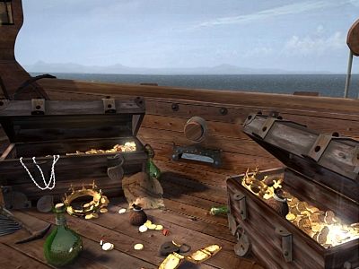 |

---

## TEX31109

**Properties**
- `TextureFile`: `images/Gebaeude_innen/Kugel_halb.tga`
- `Count`: `1`
- `UseAlpha`: `true`

**Source image**

- Folder: `exports/TEX31109/`

  - exports/TEX31109/source.png
  - exports/TEX31109/source.tga
  - exports/TEX31109/source.bmp
  - exports/TEX31109/source.jpg
  - exports/TEX31109/source.jpeg
  - exports/TEX31109/source.webp

> Preview: open the folder above to see `source.*` and exported sprites.

**Sprites**

| # | Rect (x,y,w,h) | Image |
|---:|---|---|
| 0 | `0 0 6 16` |  |

---

## TEX31110

**Properties**
- `TextureFile`: `images/Gebaeude_innen/Kugel_klein.tga`
- `Count`: `1`
- `UseAlpha`: `true`

**Source image**

- Folder: `exports/TEX31110/`

  - exports/TEX31110/source.png
  - exports/TEX31110/source.tga
  - exports/TEX31110/source.bmp
  - exports/TEX31110/source.jpg
  - exports/TEX31110/source.jpeg
  - exports/TEX31110/source.webp

> Preview: open the folder above to see `source.*` and exported sprites.

**Sprites**

| # | Rect (x,y,w,h) | Image |
|---:|---|---|
| 0 | `0 0 12 16` |  |

---

## TEX31111

**Properties**
- `TextureFile`: `images/Gebaeude_innen/Kugel_gross.tga`
- `Count`: `1`
- `UseAlpha`: `true`

**Source image**

- Folder: `exports/TEX31111/`

  - exports/TEX31111/source.png
  - exports/TEX31111/source.tga
  - exports/TEX31111/source.bmp
  - exports/TEX31111/source.jpg
  - exports/TEX31111/source.jpeg
  - exports/TEX31111/source.webp

> Preview: open the folder above to see `source.*` and exported sprites.

**Sprites**

| # | Rect (x,y,w,h) | Image |
|---:|---|---|
| 0 | `0 0 12 16` |  |

---

## TEX31112

**Properties**
- `TextureFile`: `images/Gebaeude_innen/Kugel_gross_halb.tga`
- `Count`: `1`
- `UseAlpha`: `true`

**Source image**

- Folder: `exports/TEX31112/`

  - exports/TEX31112/source.png
  - exports/TEX31112/source.tga
  - exports/TEX31112/source.bmp
  - exports/TEX31112/source.jpg
  - exports/TEX31112/source.jpeg
  - exports/TEX31112/source.webp

> Preview: open the folder above to see `source.*` and exported sprites.

**Sprites**

| # | Rect (x,y,w,h) | Image |
|---:|---|---|
| 0 | `0 0 12 16` |  |

---

## TEX31113

**Properties**
- `TextureFile`: `images/Gebaeude_innen/Kugel_gross_klein.tga`
- `Count`: `1`
- `UseAlpha`: `true`

**Source image**

- Folder: `exports/TEX31113/`

  - exports/TEX31113/source.png
  - exports/TEX31113/source.tga
  - exports/TEX31113/source.bmp
  - exports/TEX31113/source.jpg
  - exports/TEX31113/source.jpeg
  - exports/TEX31113/source.webp

> Preview: open the folder above to see `source.*` and exported sprites.

**Sprites**

| # | Rect (x,y,w,h) | Image |
|---:|---|---|
| 0 | `0 0 12 16` |  |

---

## TEX31114

**Properties**
- `TextureFile`: `images/Gebaeude_innen/stadttor/basisbild2.aim`
- `Count`: `1`
- `UseAlpha`: `false`

**Source image**

- Folder: `exports/TEX31114/`

  - exports/TEX31114/source.png
  - exports/TEX31114/source.tga
  - exports/TEX31114/source.bmp
  - exports/TEX31114/source.jpg
  - exports/TEX31114/source.jpeg
  - exports/TEX31114/source.webp

> Preview: open the folder above to see `source.*` and exported sprites.

**Sprites**

| # | Rect (x,y,w,h) | Image |
|---:|---|---|
| 0 | `0 0 246 286` |  |

---

## TEX31115

**Properties**
- `TextureFile`: `images/Gebaeude_innen/stadttor/anima.aim`
- `Count`: `60`
- `UseAlpha`: `false`

**Source image**

- Folder: `exports/TEX31115/`

  - exports/TEX31115/source.png
  - exports/TEX31115/source.tga
  - exports/TEX31115/source.bmp
  - exports/TEX31115/source.jpg
  - exports/TEX31115/source.jpeg
  - exports/TEX31115/source.webp

> Preview: open the folder above to see `source.*` and exported sprites.

**Sprites**

| # | Rect (x,y,w,h) | Image |
|---:|---|---|
| 0 | `0 0 121 160` |  |
| 1 | `121 0 121 160` |  |
| 2 | `242 0 121 160` |  |
| 3 | `363 0 121 160` |  |
| 4 | `484 0 121 160` |  |
| 5 | `605 0 121 160` |  |
| 6 | `726 0 121 160` |  |
| 7 | `847 0 121 160` |  |
| 8 | `968 0 121 160` |  |
| 9 | `1089 0 121 160` |  |
| 10 | `1210 0 121 160` |  |
| 11 | `1331 0 121 160` |  |
| 12 | `1452 0 121 160` |  |
| 13 | `1573 0 121 160` |  |
| 14 | `1694 0 121 160` |  |
| 15 | `1815 0 121 160` |  |
| 16 | `1936 0 121 160` |  |
| 17 | `2057 0 121 160` |  |
| 18 | `2178 0 121 160` |  |
| 19 | `2299 0 121 160` |  |
| 20 | `2420 0 121 160` |  |
| 21 | `2541 0 121 160` |  |
| 22 | `2662 0 121 160` |  |
| 23 | `2783 0 121 160` |  |
| 24 | `2904 0 121 160` |  |
| 25 | `3025 0 121 160` |  |
| 26 | `3146 0 121 160` |  |
| 27 | `3267 0 121 160` |  |
| 28 | `3388 0 121 160` |  |
| 29 | `3509 0 121 160` |  |
| 30 | `3509 0 121 160` |  |
| 31 | `3388 0 121 160` |  |
| 32 | `3267 0 121 160` |  |
| 33 | `3146 0 121 160` |  |
| 34 | `3025 0 121 160` |  |
| 35 | `2904 0 121 160` |  |
| 36 | `2783 0 121 160` |  |
| 37 | `2662 0 121 160` |  |
| 38 | `2541 0 121 160` |  |
| 39 | `2420 0 121 160` |  |
| 40 | `2299 0 121 160` |  |
| 41 | `2178 0 121 160` |  |
| 42 | `2057 0 121 160` |  |
| 43 | `1936 0 121 160` |  |
| 44 | `1815 0 121 160` |  |
| 45 | `1694 0 121 160` |  |
| 46 | `1573 0 121 160` |  |
| 47 | `1452 0 121 160` |  |
| 48 | `1331 0 121 160` |  |
| 49 | `1210 0 121 160` |  |
| 50 | `1089 0 121 160` |  |
| 51 | `968 0 121 160` |  |
| 52 | `847 0 121 160` |  |
| 53 | `726 0 121 160` |  |
| 54 | `605 0 121 160` |  |
| 55 | `484 0 121 160` |  |
| 56 | `363 0 121 160` |  |
| 57 | `242 0 121 160` |  |
| 58 | `121 0 121 160` |  |
| 59 | `0 0 121 160` |  |

---

## TEX31116

**Properties**
- `TextureFile`: `images/Gebaeude_innen/stadttor/animb.aim`
- `Count`: `60`
- `UseAlpha`: `false`

**Source image**

- Folder: `exports/TEX31116/`

  - exports/TEX31116/source.png
  - exports/TEX31116/source.tga
  - exports/TEX31116/source.bmp
  - exports/TEX31116/source.jpg
  - exports/TEX31116/source.jpeg
  - exports/TEX31116/source.webp

> Preview: open the folder above to see `source.*` and exported sprites.

**Sprites**

| # | Rect (x,y,w,h) | Image |
|---:|---|---|
| 0 | `0 0 120 170` |  |
| 1 | `120 0 120 170` |  |
| 2 | `240 0 120 170` |  |
| 3 | `360 0 120 170` |  |
| 4 | `480 0 120 170` |  |
| 5 | `600 0 120 170` |  |
| 6 | `720 0 120 170` |  |
| 7 | `840 0 120 170` |  |
| 8 | `960 0 120 170` |  |
| 9 | `1080 0 120 170` |  |
| 10 | `1200 0 120 170` |  |
| 11 | `1320 0 120 170` |  |
| 12 | `1440 0 120 170` |  |
| 13 | `1560 0 120 170` |  |
| 14 | `1680 0 120 170` |  |
| 15 | `1800 0 120 170` |  |
| 16 | `1920 0 120 170` |  |
| 17 | `2040 0 120 170` |  |
| 18 | `2160 0 120 170` |  |
| 19 | `2280 0 120 170` |  |
| 20 | `2400 0 120 170` |  |
| 21 | `2520 0 120 170` |  |
| 22 | `2640 0 120 170` |  |
| 23 | `2760 0 120 170` |  |
| 24 | `2880 0 120 170` |  |
| 25 | `3000 0 120 170` |  |
| 26 | `3120 0 120 170` |  |
| 27 | `3240 0 120 170` |  |
| 28 | `3360 0 120 170` |  |
| 29 | `3480 0 120 170` |  |
| 30 | `3480 0 120 170` |  |
| 31 | `3360 0 120 170` |  |
| 32 | `3240 0 120 170` |  |
| 33 | `3120 0 120 170` |  |
| 34 | `3000 0 120 170` |  |
| 35 | `2880 0 120 170` |  |
| 36 | `2760 0 120 170` |  |
| 37 | `2640 0 120 170` |  |
| 38 | `2520 0 120 170` |  |
| 39 | `2400 0 120 170` |  |
| 40 | `2280 0 120 170` |  |
| 41 | `2160 0 120 170` |  |
| 42 | `2040 0 120 170` |  |
| 43 | `1920 0 120 170` |  |
| 44 | `1800 0 120 170` |  |
| 45 | `1680 0 120 170` |  |
| 46 | `1560 0 120 170` |  |
| 47 | `1440 0 120 170` |  |
| 48 | `1320 0 120 170` |  |
| 49 | `1200 0 120 170` |  |
| 50 | `1080 0 120 170` |  |
| 51 | `960 0 120 170` |  |
| 52 | `840 0 120 170` |  |
| 53 | `720 0 120 170` |  |
| 54 | `600 0 120 170` |  |
| 55 | `480 0 120 170` |  |
| 56 | `360 0 120 170` |  |
| 57 | `240 0 120 170` |  |
| 58 | `120 0 120 170` |  |
| 59 | `0 0 120 170` |  |

---

## TEX31117

**Properties**
- `TextureFile`: `images/Gebaeude_innen/scheune/pferd.aim`
- `Count`: `30`
- `UseAlpha`: `false`

**Source image**

- Folder: `exports/TEX31117/`

  - exports/TEX31117/source.png
  - exports/TEX31117/source.tga
  - exports/TEX31117/source.bmp
  - exports/TEX31117/source.jpg
  - exports/TEX31117/source.jpeg
  - exports/TEX31117/source.webp

> Preview: open the folder above to see `source.*` and exported sprites.

**Sprites**

| # | Rect (x,y,w,h) | Image |
|---:|---|---|
| 0 | `0 0 129 165` |  |
| 1 | `129 0 129 165` |  |
| 2 | `258 0 129 165` |  |
| 3 | `387 0 129 165` |  |
| 4 | `516 0 129 165` |  |
| 5 | `645 0 129 165` |  |
| 6 | `774 0 129 165` |  |
| 7 | `903 0 129 165` |  |
| 8 | `1032 0 129 165` |  |
| 9 | `1161 0 129 165` |  |
| 10 | `1290 0 129 165` |  |
| 11 | `1419 0 129 165` |  |
| 12 | `1548 0 129 165` |  |
| 13 | `1677 0 129 165` |  |
| 14 | `1806 0 129 165` |  |
| 15 | `1935 0 129 165` |  |
| 16 | `2064 0 129 165` |  |
| 17 | `2193 0 129 165` |  |
| 18 | `2322 0 129 165` |  |
| 19 | `2451 0 129 165` |  |
| 20 | `2580 0 129 165` |  |
| 21 | `2709 0 129 165` |  |
| 22 | `2838 0 129 165` |  |
| 23 | `2967 0 129 165` |  |
| 24 | `3096 0 129 165` |  |
| 25 | `3225 0 129 165` |  |
| 26 | `3354 0 129 165` |  |
| 27 | `3483 0 129 165` |  |
| 28 | `3612 0 129 165` |  |
| 29 | `3741 0 129 165` |  |

---

## TEX31118

**Properties**
- `TextureFile`: `images/Gebaeude_innen/stadttor/hauptmann.aim`
- `Count`: `1`
- `UseAlpha`: `false`

**Source image**

- Folder: `exports/TEX31118/`

  - exports/TEX31118/source.png
  - exports/TEX31118/source.tga
  - exports/TEX31118/source.bmp
  - exports/TEX31118/source.jpg
  - exports/TEX31118/source.jpeg
  - exports/TEX31118/source.webp

> Preview: open the folder above to see `source.*` and exported sprites.

**Sprites**

| # | Rect (x,y,w,h) | Image |
|---:|---|---|
| 0 | `0 0 320 363` |  |

---

## TEX31119

**Properties**
- `TextureFile`: `images/Video_Schlussbild/hansetag.bmp`
- `Count`: `1`
- `UseAlpha`: `false`

**Source image**

- Folder: `exports/TEX31119/`

  - exports/TEX31119/source.png
  - exports/TEX31119/source.tga
  - exports/TEX31119/source.bmp
  - exports/TEX31119/source.jpg
  - exports/TEX31119/source.jpeg
  - exports/TEX31119/source.webp

> Preview: open the folder above to see `source.*` and exported sprites.

**Sprites**

| # | Rect (x,y,w,h) | Image |
|---:|---|---|
| 0 | `0 0 400 300` |  |

---

## TEX31120

**Properties**
- `TextureFile`: `images/Video_Schlussbild/niederlassung.bmp`
- `Count`: `1`
- `UseAlpha`: `false`

**Source image**

- Folder: `exports/TEX31120/`

  - exports/TEX31120/source.png
  - exports/TEX31120/source.tga
  - exports/TEX31120/source.bmp
  - exports/TEX31120/source.jpg
  - exports/TEX31120/source.jpeg
  - exports/TEX31120/source.webp

> Preview: open the folder above to see `source.*` and exported sprites.

**Sprites**

| # | Rect (x,y,w,h) | Image |
|---:|---|---|
| 0 | `0 0 400 300` | 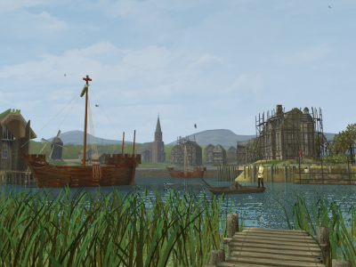 |

---

## TEX31121

**Properties**
- `TextureFile`: `images/Video_Schlussbild/landweg.bmp`
- `Count`: `1`
- `UseAlpha`: `false`

**Source image**

- Folder: `exports/TEX31121/`

  - exports/TEX31121/source.png
  - exports/TEX31121/source.tga
  - exports/TEX31121/source.bmp
  - exports/TEX31121/source.jpg
  - exports/TEX31121/source.jpeg
  - exports/TEX31121/source.webp

> Preview: open the folder above to see `source.*` and exported sprites.

**Sprites**

| # | Rect (x,y,w,h) | Image |
|---:|---|---|
| 0 | `0 0 400 300` |  |

---

## TEX31122

**Properties**
- `TextureFile`: `images/Video_Schlussbild/pirat_versenkt.bmp`
- `Count`: `1`
- `UseAlpha`: `false`

**Source image**

- Folder: `exports/TEX31122/`

  - exports/TEX31122/source.png
  - exports/TEX31122/source.tga
  - exports/TEX31122/source.bmp
  - exports/TEX31122/source.jpg
  - exports/TEX31122/source.jpeg
  - exports/TEX31122/source.webp

> Preview: open the folder above to see `source.*` and exported sprites.

**Sprites**

| # | Rect (x,y,w,h) | Image |
|---:|---|---|
| 0 | `0 0 400 300` |  |

---

## TEX31123

**Properties**
- `TextureFile`: `images/Video_Schlussbild/piratennest.bmp`
- `Count`: `1`
- `UseAlpha`: `false`

**Source image**

- Folder: `exports/TEX31123/`

  - exports/TEX31123/source.png
  - exports/TEX31123/source.tga
  - exports/TEX31123/source.bmp
  - exports/TEX31123/source.jpg
  - exports/TEX31123/source.jpeg
  - exports/TEX31123/source.webp

> Preview: open the folder above to see `source.*` and exported sprites.

**Sprites**

| # | Rect (x,y,w,h) | Image |
|---:|---|---|
| 0 | `0 0 400 300` |  |

---

## TEX31124

**Properties**
- `TextureFile`: `images/Video_Schlussbild/stadt_aufgebaut.bmp`
- `Count`: `1`
- `UseAlpha`: `false`

**Source image**

- Folder: `exports/TEX31124/`

  - exports/TEX31124/source.png
  - exports/TEX31124/source.tga
  - exports/TEX31124/source.bmp
  - exports/TEX31124/source.jpg
  - exports/TEX31124/source.jpeg
  - exports/TEX31124/source.webp

> Preview: open the folder above to see `source.*` and exported sprites.

**Sprites**

| # | Rect (x,y,w,h) | Image |
|---:|---|---|
| 0 | `0 0 400 300` |  |

---

## TEX32000

**Properties**
- `TextureFile`: `images/Schiffe/page_schiffe.aim`
- `Count`: `10`
- `UseAlpha`: `true`

**Source image**

- Folder: `exports/TEX32000/`

  - exports/TEX32000/source.png
  - exports/TEX32000/source.tga
  - exports/TEX32000/source.bmp
  - exports/TEX32000/source.jpg
  - exports/TEX32000/source.jpeg
  - exports/TEX32000/source.webp

> Preview: open the folder above to see `source.*` and exported sprites.

**Sprites**

| # | Rect (x,y,w,h) | Image |
|---:|---|---|
| 0 | `0 0 400 140` |  |
| 1 | `400 0 38 32` |  |
| 2 | `438 0 38 32` |  |
| 3 | `0 140 275 105` |  |
| 4 | `0 245 275 105` |  |
| 5 | `0 350 275 105` |  |
| 6 | `400 32 38 32` |  |
| 7 | `438 32 38 32` |  |
| 8 | `400 64 38 32` |  |
| 9 | `438 64 38 32` |  |

---

## TEX32001

**Properties**
- `TextureFile`: `images/Time.tga`
- `Count`: `1`
- `UseAlpha`: `true`

**Source image**

- Folder: `exports/TEX32001/`

  - exports/TEX32001/source.png
  - exports/TEX32001/source.tga
  - exports/TEX32001/source.bmp
  - exports/TEX32001/source.jpg
  - exports/TEX32001/source.jpeg
  - exports/TEX32001/source.webp

> Preview: open the folder above to see `source.*` and exported sprites.

**Sprites**

| # | Rect (x,y,w,h) | Image |
|---:|---|---|
| 0 | `0 0 16 21` |  |

---

## TEX32003

**Properties**
- `TextureFile`: `images/Haus.bmp`
- `Count`: `2`
- `UseColorKey`: `true`
- `ColorKey`: `0xffff00ff`

**Source image**

- Folder: `exports/TEX32003/`

  - exports/TEX32003/source.png
  - exports/TEX32003/source.tga
  - exports/TEX32003/source.bmp
  - exports/TEX32003/source.jpg
  - exports/TEX32003/source.jpeg
  - exports/TEX32003/source.webp

> Preview: open the folder above to see `source.*` and exported sprites.

**Sprites**

| # | Rect (x,y,w,h) | Image |
|---:|---|---|
| 0 | `0 0 24 16` |  |
| 1 | `24 0 24 16` |  |

---

## TEX32004

**Properties**
- `TextureFile`: `images/Pergament_Line.bmp`
- `Count`: `2`
- `UseAlpha`: `false`

**Source image**

- Folder: `exports/TEX32004/`

  - exports/TEX32004/source.png
  - exports/TEX32004/source.tga
  - exports/TEX32004/source.bmp
  - exports/TEX32004/source.jpg
  - exports/TEX32004/source.jpeg
  - exports/TEX32004/source.webp

> Preview: open the folder above to see `source.*` and exported sprites.

**Sprites**

| # | Rect (x,y,w,h) | Image |
|---:|---|---|
| 0 | `0 0 357 83` | 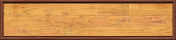 |
| 1 | `0 83 357 57` |  |

---

## TEX32005

**Properties**
- `TextureFile`: `images/vliste_haken01.tga`
- `Count`: `1`
- `UseAlpha`: `true`

**Source image**

- Folder: `exports/TEX32005/`

  - exports/TEX32005/source.png
  - exports/TEX32005/source.tga
  - exports/TEX32005/source.bmp
  - exports/TEX32005/source.jpg
  - exports/TEX32005/source.jpeg
  - exports/TEX32005/source.webp

> Preview: open the folder above to see `source.*` and exported sprites.

**Sprites**

| # | Rect (x,y,w,h) | Image |
|---:|---|---|
| 0 | `0 0 11 25` |  |

---

## TEX32006

**Properties**
- `TextureFile`: `images/Abstimmung1.bmp`
- `Count`: `1`
- `UseAlpha`: `true`

**Source image**

- Folder: `exports/TEX32006/`

  - exports/TEX32006/source.png
  - exports/TEX32006/source.tga
  - exports/TEX32006/source.bmp
  - exports/TEX32006/source.jpg
  - exports/TEX32006/source.jpeg
  - exports/TEX32006/source.webp

> Preview: open the folder above to see `source.*` and exported sprites.

**Sprites**

| # | Rect (x,y,w,h) | Image |
|---:|---|---|
| 0 | `0 0 8 16` |  |

---

## TEX32007

**Properties**
- `TextureFile`: `images/Abstimmung2.bmp`
- `Count`: `1`
- `UseAlpha`: `true`

**Source image**

- Folder: `exports/TEX32007/`

  - exports/TEX32007/source.png
  - exports/TEX32007/source.tga
  - exports/TEX32007/source.bmp
  - exports/TEX32007/source.jpg
  - exports/TEX32007/source.jpeg
  - exports/TEX32007/source.webp

> Preview: open the folder above to see `source.*` and exported sprites.

**Sprites**

| # | Rect (x,y,w,h) | Image |
|---:|---|---|
| 0 | `0 0 13 16` |  |

---

## TEX32008

**Properties**
- `TextureFile`: `images/Abstimmung3.bmp`
- `Count`: `1`
- `UseAlpha`: `true`

**Source image**

- Folder: `exports/TEX32008/`

  - exports/TEX32008/source.png
  - exports/TEX32008/source.tga
  - exports/TEX32008/source.bmp
  - exports/TEX32008/source.jpg
  - exports/TEX32008/source.jpeg
  - exports/TEX32008/source.webp

> Preview: open the folder above to see `source.*` and exported sprites.

**Sprites**

| # | Rect (x,y,w,h) | Image |
|---:|---|---|
| 0 | `0 0 17 16` |  |

---

## TEX32009

**Properties**
- `TextureFile`: `images/Abstimmung4.bmp`
- `Count`: `1`
- `UseAlpha`: `true`

**Source image**

- Folder: `exports/TEX32009/`

  - exports/TEX32009/source.png
  - exports/TEX32009/source.tga
  - exports/TEX32009/source.bmp
  - exports/TEX32009/source.jpg
  - exports/TEX32009/source.jpeg
  - exports/TEX32009/source.webp

> Preview: open the folder above to see `source.*` and exported sprites.

**Sprites**

| # | Rect (x,y,w,h) | Image |
|---:|---|---|
| 0 | `0 0 23 16` |  |

---

## TEX32010

**Properties**
- `TextureFile`: `images/Abstimmung5.bmp`
- `Count`: `1`
- `UseAlpha`: `true`

**Source image**

- Folder: `exports/TEX32010/`

  - exports/TEX32010/source.png
  - exports/TEX32010/source.tga
  - exports/TEX32010/source.bmp
  - exports/TEX32010/source.jpg
  - exports/TEX32010/source.jpeg
  - exports/TEX32010/source.webp

> Preview: open the folder above to see `source.*` and exported sprites.

**Sprites**

| # | Rect (x,y,w,h) | Image |
|---:|---|---|
| 0 | `0 0 31 16` |  |

---

## TEX32011

**Properties**
- `TextureFile`: `images/Gebaeude_innen/Handel_Sperren.tga`
- `Count`: `1`
- `UseAlpha`: `true`

**Source image**

- Folder: `exports/TEX32011/`

  - exports/TEX32011/source.png
  - exports/TEX32011/source.tga
  - exports/TEX32011/source.bmp
  - exports/TEX32011/source.jpg
  - exports/TEX32011/source.jpeg
  - exports/TEX32011/source.webp

> Preview: open the folder above to see `source.*` and exported sprites.

**Sprites**

| # | Rect (x,y,w,h) | Image |
|---:|---|---|
| 0 | `0 0 48 21` |  |

---

## TEX35000

**Properties**
- `TextureFile`: `images/Gesichter/Frauen_nett/Frau_1.bmp`
- `Count`: `1`
- `UseColorKey`: `true`
- `ColorKey`: `0xffff00ff`

**Source image**

- Folder: `exports/TEX35000/`

  - exports/TEX35000/source.png
  - exports/TEX35000/source.tga
  - exports/TEX35000/source.bmp
  - exports/TEX35000/source.jpg
  - exports/TEX35000/source.jpeg
  - exports/TEX35000/source.webp

> Preview: open the folder above to see `source.*` and exported sprites.

**Sprites**

| # | Rect (x,y,w,h) | Image |
|---:|---|---|
| 0 | `0 0 104 132` |  |

---

## TEX35001

**Properties**
- `TextureFile`: `images/Gesichter/Frauen_nett/Frau_2.bmp`
- `Count`: `1`
- `UseColorKey`: `true`
- `ColorKey`: `0xffff00ff`

**Source image**

- Folder: `exports/TEX35001/`

  - exports/TEX35001/source.png
  - exports/TEX35001/source.tga
  - exports/TEX35001/source.bmp
  - exports/TEX35001/source.jpg
  - exports/TEX35001/source.jpeg
  - exports/TEX35001/source.webp

> Preview: open the folder above to see `source.*` and exported sprites.

**Sprites**

| # | Rect (x,y,w,h) | Image |
|---:|---|---|
| 0 | `0 0 104 132` |  |

---

## TEX35002

**Properties**
- `TextureFile`: `images/Gesichter/Frauen_nett/Frau_3.bmp`
- `Count`: `1`
- `UseColorKey`: `true`
- `ColorKey`: `0xffff00ff`

**Source image**

- Folder: `exports/TEX35002/`

  - exports/TEX35002/source.png
  - exports/TEX35002/source.tga
  - exports/TEX35002/source.bmp
  - exports/TEX35002/source.jpg
  - exports/TEX35002/source.jpeg
  - exports/TEX35002/source.webp

> Preview: open the folder above to see `source.*` and exported sprites.

**Sprites**

| # | Rect (x,y,w,h) | Image |
|---:|---|---|
| 0 | `0 0 104 132` |  |

---

## TEX35003

**Properties**
- `TextureFile`: `images/Gesichter/Frauen_nett/Frau_4.bmp`
- `Count`: `1`
- `UseColorKey`: `true`
- `ColorKey`: `0xffff00ff`

**Source image**

- Folder: `exports/TEX35003/`

  - exports/TEX35003/source.png
  - exports/TEX35003/source.tga
  - exports/TEX35003/source.bmp
  - exports/TEX35003/source.jpg
  - exports/TEX35003/source.jpeg
  - exports/TEX35003/source.webp

> Preview: open the folder above to see `source.*` and exported sprites.

**Sprites**

| # | Rect (x,y,w,h) | Image |
|---:|---|---|
| 0 | `0 0 104 132` |  |

---

## TEX35004

**Properties**
- `TextureFile`: `images/Gesichter/Frauen_nett/Frau_5.bmp`
- `Count`: `1`
- `UseColorKey`: `true`
- `ColorKey`: `0xffff00ff`

**Source image**

- Folder: `exports/TEX35004/`

  - exports/TEX35004/source.png
  - exports/TEX35004/source.tga
  - exports/TEX35004/source.bmp
  - exports/TEX35004/source.jpg
  - exports/TEX35004/source.jpeg
  - exports/TEX35004/source.webp

> Preview: open the folder above to see `source.*` and exported sprites.

**Sprites**

| # | Rect (x,y,w,h) | Image |
|---:|---|---|
| 0 | `0 0 104 132` |  |

---

## TEX35005

**Properties**
- `TextureFile`: `images/Gesichter/Frauen_normal/Frau_1.bmp`
- `Count`: `1`
- `UseColorKey`: `true`
- `ColorKey`: `0xffff00ff`

**Source image**

- Folder: `exports/TEX35005/`

  - exports/TEX35005/source.png
  - exports/TEX35005/source.tga
  - exports/TEX35005/source.bmp
  - exports/TEX35005/source.jpg
  - exports/TEX35005/source.jpeg
  - exports/TEX35005/source.webp

> Preview: open the folder above to see `source.*` and exported sprites.

**Sprites**

| # | Rect (x,y,w,h) | Image |
|---:|---|---|
| 0 | `0 0 104 132` |  |

---

## TEX35006

**Properties**
- `TextureFile`: `images/Gesichter/Frauen_normal/Frau_2.bmp`
- `Count`: `1`
- `UseColorKey`: `true`
- `ColorKey`: `0xffff00ff`

**Source image**

- Folder: `exports/TEX35006/`

  - exports/TEX35006/source.png
  - exports/TEX35006/source.tga
  - exports/TEX35006/source.bmp
  - exports/TEX35006/source.jpg
  - exports/TEX35006/source.jpeg
  - exports/TEX35006/source.webp

> Preview: open the folder above to see `source.*` and exported sprites.

**Sprites**

| # | Rect (x,y,w,h) | Image |
|---:|---|---|
| 0 | `0 0 104 132` |  |

---

## TEX35007

**Properties**
- `TextureFile`: `images/Gesichter/Frauen_normal/Frau_3.bmp`
- `Count`: `1`
- `UseColorKey`: `true`
- `ColorKey`: `0xffff00ff`

**Source image**

- Folder: `exports/TEX35007/`

  - exports/TEX35007/source.png
  - exports/TEX35007/source.tga
  - exports/TEX35007/source.bmp
  - exports/TEX35007/source.jpg
  - exports/TEX35007/source.jpeg
  - exports/TEX35007/source.webp

> Preview: open the folder above to see `source.*` and exported sprites.

**Sprites**

| # | Rect (x,y,w,h) | Image |
|---:|---|---|
| 0 | `0 0 104 132` |  |

---

## TEX35008

**Properties**
- `TextureFile`: `images/Gesichter/Frauen_normal/Frau_4.bmp`
- `Count`: `1`
- `UseColorKey`: `true`
- `ColorKey`: `0xffff00ff`

**Source image**

- Folder: `exports/TEX35008/`

  - exports/TEX35008/source.png
  - exports/TEX35008/source.tga
  - exports/TEX35008/source.bmp
  - exports/TEX35008/source.jpg
  - exports/TEX35008/source.jpeg
  - exports/TEX35008/source.webp

> Preview: open the folder above to see `source.*` and exported sprites.

**Sprites**

| # | Rect (x,y,w,h) | Image |
|---:|---|---|
| 0 | `0 0 104 132` |  |

---

## TEX35009

**Properties**
- `TextureFile`: `images/Gesichter/Frauen_normal/Frau_5.bmp`
- `Count`: `1`
- `UseColorKey`: `true`
- `ColorKey`: `0xffff00ff`

**Source image**

- Folder: `exports/TEX35009/`

  - exports/TEX35009/source.png
  - exports/TEX35009/source.tga
  - exports/TEX35009/source.bmp
  - exports/TEX35009/source.jpg
  - exports/TEX35009/source.jpeg
  - exports/TEX35009/source.webp

> Preview: open the folder above to see `source.*` and exported sprites.

**Sprites**

| # | Rect (x,y,w,h) | Image |
|---:|---|---|
| 0 | `0 0 104 132` |  |

---

## TEX35010

**Properties**
- `TextureFile`: `images/Gesichter/Frauen_ernst/Frau_1.bmp`
- `Count`: `1`
- `UseColorKey`: `true`
- `ColorKey`: `0xffff00ff`

**Source image**

- Folder: `exports/TEX35010/`

  - exports/TEX35010/source.png
  - exports/TEX35010/source.tga
  - exports/TEX35010/source.bmp
  - exports/TEX35010/source.jpg
  - exports/TEX35010/source.jpeg
  - exports/TEX35010/source.webp

> Preview: open the folder above to see `source.*` and exported sprites.

**Sprites**

| # | Rect (x,y,w,h) | Image |
|---:|---|---|
| 0 | `0 0 104 132` |  |

---

## TEX35011

**Properties**
- `TextureFile`: `images/Gesichter/Frauen_ernst/Frau_2.bmp`
- `Count`: `1`
- `UseColorKey`: `true`
- `ColorKey`: `0xffff00ff`

**Source image**

- Folder: `exports/TEX35011/`

  - exports/TEX35011/source.png
  - exports/TEX35011/source.tga
  - exports/TEX35011/source.bmp
  - exports/TEX35011/source.jpg
  - exports/TEX35011/source.jpeg
  - exports/TEX35011/source.webp

> Preview: open the folder above to see `source.*` and exported sprites.

**Sprites**

| # | Rect (x,y,w,h) | Image |
|---:|---|---|
| 0 | `0 0 104 132` |  |

---

## TEX35012

**Properties**
- `TextureFile`: `images/Gesichter/Frauen_ernst/Frau_3.bmp`
- `Count`: `1`
- `UseColorKey`: `true`
- `ColorKey`: `0xffff00ff`

**Source image**

- Folder: `exports/TEX35012/`

  - exports/TEX35012/source.png
  - exports/TEX35012/source.tga
  - exports/TEX35012/source.bmp
  - exports/TEX35012/source.jpg
  - exports/TEX35012/source.jpeg
  - exports/TEX35012/source.webp

> Preview: open the folder above to see `source.*` and exported sprites.

**Sprites**

| # | Rect (x,y,w,h) | Image |
|---:|---|---|
| 0 | `0 0 104 132` |  |

---

## TEX35013

**Properties**
- `TextureFile`: `images/Gesichter/Frauen_ernst/Frau_4.bmp`
- `Count`: `1`
- `UseColorKey`: `true`
- `ColorKey`: `0xffff00ff`

**Source image**

- Folder: `exports/TEX35013/`

  - exports/TEX35013/source.png
  - exports/TEX35013/source.tga
  - exports/TEX35013/source.bmp
  - exports/TEX35013/source.jpg
  - exports/TEX35013/source.jpeg
  - exports/TEX35013/source.webp

> Preview: open the folder above to see `source.*` and exported sprites.

**Sprites**

| # | Rect (x,y,w,h) | Image |
|---:|---|---|
| 0 | `0 0 104 132` |  |

---

## TEX35014

**Properties**
- `TextureFile`: `images/Gesichter/Frauen_ernst/Frau_5.bmp`
- `Count`: `1`
- `UseColorKey`: `true`
- `ColorKey`: `0xffff00ff`

**Source image**

- Folder: `exports/TEX35014/`

  - exports/TEX35014/source.png
  - exports/TEX35014/source.tga
  - exports/TEX35014/source.bmp
  - exports/TEX35014/source.jpg
  - exports/TEX35014/source.jpeg
  - exports/TEX35014/source.webp

> Preview: open the folder above to see `source.*` and exported sprites.

**Sprites**

| # | Rect (x,y,w,h) | Image |
|---:|---|---|
| 0 | `0 0 104 132` |  |

---

## TEX35015

**Properties**
- `TextureFile`: `images/Gesichter/Mann_nett/Mann_1.bmp`
- `Count`: `1`
- `UseColorKey`: `true`
- `ColorKey`: `0xffff00ff`

**Source image**

- Folder: `exports/TEX35015/`

  - exports/TEX35015/source.png
  - exports/TEX35015/source.tga
  - exports/TEX35015/source.bmp
  - exports/TEX35015/source.jpg
  - exports/TEX35015/source.jpeg
  - exports/TEX35015/source.webp

> Preview: open the folder above to see `source.*` and exported sprites.

**Sprites**

| # | Rect (x,y,w,h) | Image |
|---:|---|---|
| 0 | `0 0 104 132` |  |

---

## TEX35016

**Properties**
- `TextureFile`: `images/Gesichter/Mann_nett/Mann_2.bmp`
- `Count`: `1`
- `UseColorKey`: `true`
- `ColorKey`: `0xffff00ff`

**Source image**

- Folder: `exports/TEX35016/`

  - exports/TEX35016/source.png
  - exports/TEX35016/source.tga
  - exports/TEX35016/source.bmp
  - exports/TEX35016/source.jpg
  - exports/TEX35016/source.jpeg
  - exports/TEX35016/source.webp

> Preview: open the folder above to see `source.*` and exported sprites.

**Sprites**

| # | Rect (x,y,w,h) | Image |
|---:|---|---|
| 0 | `0 0 104 132` |  |

---

## TEX35017

**Properties**
- `TextureFile`: `images/Gesichter/Mann_nett/Mann_3.bmp`
- `Count`: `1`
- `UseColorKey`: `true`
- `ColorKey`: `0xffff00ff`

**Source image**

- Folder: `exports/TEX35017/`

  - exports/TEX35017/source.png
  - exports/TEX35017/source.tga
  - exports/TEX35017/source.bmp
  - exports/TEX35017/source.jpg
  - exports/TEX35017/source.jpeg
  - exports/TEX35017/source.webp

> Preview: open the folder above to see `source.*` and exported sprites.

**Sprites**

| # | Rect (x,y,w,h) | Image |
|---:|---|---|
| 0 | `0 0 104 132` |  |

---

## TEX35018

**Properties**
- `TextureFile`: `images/Gesichter/Mann_nett/Mann_4.bmp`
- `Count`: `1`
- `UseColorKey`: `true`
- `ColorKey`: `0xffff00ff`

**Source image**

- Folder: `exports/TEX35018/`

  - exports/TEX35018/source.png
  - exports/TEX35018/source.tga
  - exports/TEX35018/source.bmp
  - exports/TEX35018/source.jpg
  - exports/TEX35018/source.jpeg
  - exports/TEX35018/source.webp

> Preview: open the folder above to see `source.*` and exported sprites.

**Sprites**

| # | Rect (x,y,w,h) | Image |
|---:|---|---|
| 0 | `0 0 104 132` |  |

---

## TEX35019

**Properties**
- `TextureFile`: `images/Gesichter/Mann_nett/Mann_5.bmp`
- `Count`: `1`
- `UseColorKey`: `true`
- `ColorKey`: `0xffff00ff`

**Source image**

- Folder: `exports/TEX35019/`

  - exports/TEX35019/source.png
  - exports/TEX35019/source.tga
  - exports/TEX35019/source.bmp
  - exports/TEX35019/source.jpg
  - exports/TEX35019/source.jpeg
  - exports/TEX35019/source.webp

> Preview: open the folder above to see `source.*` and exported sprites.

**Sprites**

| # | Rect (x,y,w,h) | Image |
|---:|---|---|
| 0 | `0 0 104 132` |  |

---

## TEX35020

**Properties**
- `TextureFile`: `images/Gesichter/Mann_normal/Mann_1.bmp`
- `Count`: `1`
- `UseColorKey`: `true`
- `ColorKey`: `0xffff00ff`

**Source image**

- Folder: `exports/TEX35020/`

  - exports/TEX35020/source.png
  - exports/TEX35020/source.tga
  - exports/TEX35020/source.bmp
  - exports/TEX35020/source.jpg
  - exports/TEX35020/source.jpeg
  - exports/TEX35020/source.webp

> Preview: open the folder above to see `source.*` and exported sprites.

**Sprites**

| # | Rect (x,y,w,h) | Image |
|---:|---|---|
| 0 | `0 0 104 132` |  |

---

## TEX35021

**Properties**
- `TextureFile`: `images/Gesichter/Mann_normal/Mann_2.bmp`
- `Count`: `1`
- `UseColorKey`: `true`
- `ColorKey`: `0xffff00ff`

**Source image**

- Folder: `exports/TEX35021/`

  - exports/TEX35021/source.png
  - exports/TEX35021/source.tga
  - exports/TEX35021/source.bmp
  - exports/TEX35021/source.jpg
  - exports/TEX35021/source.jpeg
  - exports/TEX35021/source.webp

> Preview: open the folder above to see `source.*` and exported sprites.

**Sprites**

| # | Rect (x,y,w,h) | Image |
|---:|---|---|
| 0 | `0 0 104 132` |  |

---

## TEX35022

**Properties**
- `TextureFile`: `images/Gesichter/Mann_normal/Mann_3.bmp`
- `Count`: `1`
- `UseColorKey`: `true`
- `ColorKey`: `0xffff00ff`

**Source image**

- Folder: `exports/TEX35022/`

  - exports/TEX35022/source.png
  - exports/TEX35022/source.tga
  - exports/TEX35022/source.bmp
  - exports/TEX35022/source.jpg
  - exports/TEX35022/source.jpeg
  - exports/TEX35022/source.webp

> Preview: open the folder above to see `source.*` and exported sprites.

**Sprites**

| # | Rect (x,y,w,h) | Image |
|---:|---|---|
| 0 | `0 0 104 132` |  |

---

## TEX35023

**Properties**
- `TextureFile`: `images/Gesichter/Mann_normal/Mann_4.bmp`
- `Count`: `1`
- `UseColorKey`: `true`
- `ColorKey`: `0xffff00ff`

**Source image**

- Folder: `exports/TEX35023/`

  - exports/TEX35023/source.png
  - exports/TEX35023/source.tga
  - exports/TEX35023/source.bmp
  - exports/TEX35023/source.jpg
  - exports/TEX35023/source.jpeg
  - exports/TEX35023/source.webp

> Preview: open the folder above to see `source.*` and exported sprites.

**Sprites**

| # | Rect (x,y,w,h) | Image |
|---:|---|---|
| 0 | `0 0 104 132` |  |

---

## TEX35024

**Properties**
- `TextureFile`: `images/Gesichter/Mann_normal/Mann_5.bmp`
- `Count`: `1`
- `UseColorKey`: `true`
- `ColorKey`: `0xffff00ff`

**Source image**

- Folder: `exports/TEX35024/`

  - exports/TEX35024/source.png
  - exports/TEX35024/source.tga
  - exports/TEX35024/source.bmp
  - exports/TEX35024/source.jpg
  - exports/TEX35024/source.jpeg
  - exports/TEX35024/source.webp

> Preview: open the folder above to see `source.*` and exported sprites.

**Sprites**

| # | Rect (x,y,w,h) | Image |
|---:|---|---|
| 0 | `0 0 104 132` |  |

---

## TEX35025

**Properties**
- `TextureFile`: `images/Gesichter/Mann_ernst/Mann_1.bmp`
- `Count`: `1`
- `UseColorKey`: `true`
- `ColorKey`: `0xffff00ff`

**Source image**

- Folder: `exports/TEX35025/`

  - exports/TEX35025/source.png
  - exports/TEX35025/source.tga
  - exports/TEX35025/source.bmp
  - exports/TEX35025/source.jpg
  - exports/TEX35025/source.jpeg
  - exports/TEX35025/source.webp

> Preview: open the folder above to see `source.*` and exported sprites.

**Sprites**

| # | Rect (x,y,w,h) | Image |
|---:|---|---|
| 0 | `0 0 104 132` |  |

---

## TEX35026

**Properties**
- `TextureFile`: `images/Gesichter/Mann_ernst/Mann_2.bmp`
- `Count`: `1`
- `UseColorKey`: `true`
- `ColorKey`: `0xffff00ff`

**Source image**

- Folder: `exports/TEX35026/`

  - exports/TEX35026/source.png
  - exports/TEX35026/source.tga
  - exports/TEX35026/source.bmp
  - exports/TEX35026/source.jpg
  - exports/TEX35026/source.jpeg
  - exports/TEX35026/source.webp

> Preview: open the folder above to see `source.*` and exported sprites.

**Sprites**

| # | Rect (x,y,w,h) | Image |
|---:|---|---|
| 0 | `0 0 104 132` |  |

---

## TEX35027

**Properties**
- `TextureFile`: `images/Gesichter/Mann_ernst/Mann_3.bmp`
- `Count`: `1`
- `UseColorKey`: `true`
- `ColorKey`: `0xffff00ff`

**Source image**

- Folder: `exports/TEX35027/`

  - exports/TEX35027/source.png
  - exports/TEX35027/source.tga
  - exports/TEX35027/source.bmp
  - exports/TEX35027/source.jpg
  - exports/TEX35027/source.jpeg
  - exports/TEX35027/source.webp

> Preview: open the folder above to see `source.*` and exported sprites.

**Sprites**

| # | Rect (x,y,w,h) | Image |
|---:|---|---|
| 0 | `0 0 104 132` |  |

---

## TEX35028

**Properties**
- `TextureFile`: `images/Gesichter/Mann_ernst/Mann_4.bmp`
- `Count`: `1`
- `UseColorKey`: `true`
- `ColorKey`: `0xffff00ff`

**Source image**

- Folder: `exports/TEX35028/`

  - exports/TEX35028/source.png
  - exports/TEX35028/source.tga
  - exports/TEX35028/source.bmp
  - exports/TEX35028/source.jpg
  - exports/TEX35028/source.jpeg
  - exports/TEX35028/source.webp

> Preview: open the folder above to see `source.*` and exported sprites.

**Sprites**

| # | Rect (x,y,w,h) | Image |
|---:|---|---|
| 0 | `0 0 104 132` |  |

---

## TEX35029

**Properties**
- `TextureFile`: `images/Gesichter/Mann_ernst/Mann_5.bmp`
- `Count`: `1`
- `UseColorKey`: `true`
- `ColorKey`: `0xffff00ff`

**Source image**

- Folder: `exports/TEX35029/`

  - exports/TEX35029/source.png
  - exports/TEX35029/source.tga
  - exports/TEX35029/source.bmp
  - exports/TEX35029/source.jpg
  - exports/TEX35029/source.jpeg
  - exports/TEX35029/source.webp

> Preview: open the folder above to see `source.*` and exported sprites.

**Sprites**

| # | Rect (x,y,w,h) | Image |
|---:|---|---|
| 0 | `0 0 104 132` |  |

---

## TEX40000

**Properties**
- `TextureFile`: `images/Credits/MILES.bmp`
- `Count`: `1`
- `UseAlpha`: `false`
- `UseColorKey`: `false`

**Source image**

- Folder: `exports/TEX40000/`

  - exports/TEX40000/source.png
  - exports/TEX40000/source.tga
  - exports/TEX40000/source.bmp
  - exports/TEX40000/source.jpg
  - exports/TEX40000/source.jpeg
  - exports/TEX40000/source.webp

> Preview: open the folder above to see `source.*` and exported sprites.

**Sprites**

| # | Rect (x,y,w,h) | Image |
|---:|---|---|
| 0 | `0 0 118 107` |  |

---

## TEX40001

**Properties**
- `TextureFile`: `images/Credits/bink.bmp`
- `Count`: `1`
- `UseAlpha`: `false`
- `UseColorKey`: `false`

**Source image**

- Folder: `exports/TEX40001/`

  - exports/TEX40001/source.png
  - exports/TEX40001/source.tga
  - exports/TEX40001/source.bmp
  - exports/TEX40001/source.jpg
  - exports/TEX40001/source.jpeg
  - exports/TEX40001/source.webp

> Preview: open the folder above to see `source.*` and exported sprites.

**Sprites**

| # | Rect (x,y,w,h) | Image |
|---:|---|---|
| 0 | `0 0 100 100` |  |

---

## TEX40002

**Properties**
- `TextureFile`: `images/Credits/Dag.bmp`
- `Count`: `1`
- `UseAlpha`: `false`
- `UseColorKey`: `false`

**Source image**

- Folder: `exports/TEX40002/`

  - exports/TEX40002/source.png
  - exports/TEX40002/source.tga
  - exports/TEX40002/source.bmp
  - exports/TEX40002/source.jpg
  - exports/TEX40002/source.jpeg
  - exports/TEX40002/source.webp

> Preview: open the folder above to see `source.*` and exported sprites.

**Sprites**

| # | Rect (x,y,w,h) | Image |
|---:|---|---|
| 0 | `0 0 150 200` |  |

---

## TEX40003

**Properties**
- `TextureFile`: `images/Credits/Daniel.bmp`
- `Count`: `1`
- `UseAlpha`: `false`
- `UseColorKey`: `false`

**Source image**

- Folder: `exports/TEX40003/`

  - exports/TEX40003/source.png
  - exports/TEX40003/source.tga
  - exports/TEX40003/source.bmp
  - exports/TEX40003/source.jpg
  - exports/TEX40003/source.jpeg
  - exports/TEX40003/source.webp

> Preview: open the folder above to see `source.*` and exported sprites.

**Sprites**

| # | Rect (x,y,w,h) | Image |
|---:|---|---|
| 0 | `0 0 150 200` |  |

---

## TEX40004

**Properties**
- `TextureFile`: `images/Credits/JoergB.bmp`
- `Count`: `1`
- `UseAlpha`: `false`
- `UseColorKey`: `false`

**Source image**

- Folder: `exports/TEX40004/`

  - exports/TEX40004/source.png
  - exports/TEX40004/source.tga
  - exports/TEX40004/source.bmp
  - exports/TEX40004/source.jpg
  - exports/TEX40004/source.jpeg
  - exports/TEX40004/source.webp

> Preview: open the folder above to see `source.*` and exported sprites.

**Sprites**

| # | Rect (x,y,w,h) | Image |
|---:|---|---|
| 0 | `0 0 150 200` |  |

---

## TEX40005

**Properties**
- `TextureFile`: `images/Credits/Martin.bmp`
- `Count`: `1`
- `UseAlpha`: `false`
- `UseColorKey`: `false`

**Source image**

- Folder: `exports/TEX40005/`

  - exports/TEX40005/source.png
  - exports/TEX40005/source.tga
  - exports/TEX40005/source.bmp
  - exports/TEX40005/source.jpg
  - exports/TEX40005/source.jpeg
  - exports/TEX40005/source.webp

> Preview: open the folder above to see `source.*` and exported sprites.

**Sprites**

| # | Rect (x,y,w,h) | Image |
|---:|---|---|
| 0 | `0 0 150 200` |  |

---

## TEX40006

**Properties**
- `TextureFile`: `images/Credits/Anca.bmp`
- `Count`: `1`
- `UseAlpha`: `false`
- `UseColorKey`: `false`

**Source image**

- Folder: `exports/TEX40006/`

  - exports/TEX40006/source.png
  - exports/TEX40006/source.tga
  - exports/TEX40006/source.bmp
  - exports/TEX40006/source.jpg
  - exports/TEX40006/source.jpeg
  - exports/TEX40006/source.webp

> Preview: open the folder above to see `source.*` and exported sprites.

**Sprites**

| # | Rect (x,y,w,h) | Image |
|---:|---|---|
| 0 | `0 0 150 200` |  |

---

## TEX40007

**Properties**
- `TextureFile`: `images/Credits/Patrick.bmp`
- `Count`: `1`
- `UseAlpha`: `false`
- `UseColorKey`: `false`

**Source image**

- Folder: `exports/TEX40007/`

  - exports/TEX40007/source.png
  - exports/TEX40007/source.tga
  - exports/TEX40007/source.bmp
  - exports/TEX40007/source.jpg
  - exports/TEX40007/source.jpeg
  - exports/TEX40007/source.webp

> Preview: open the folder above to see `source.*` and exported sprites.

**Sprites**

| # | Rect (x,y,w,h) | Image |
|---:|---|---|
| 0 | `0 0 150 200` |  |

---

## TEX40008

**Properties**
- `TextureFile`: `images/Credits/Bernd.bmp`
- `Count`: `1`
- `UseAlpha`: `false`
- `UseColorKey`: `false`

**Source image**

- Folder: `exports/TEX40008/`

  - exports/TEX40008/source.png
  - exports/TEX40008/source.tga
  - exports/TEX40008/source.bmp
  - exports/TEX40008/source.jpg
  - exports/TEX40008/source.jpeg
  - exports/TEX40008/source.webp

> Preview: open the folder above to see `source.*` and exported sprites.

**Sprites**

| # | Rect (x,y,w,h) | Image |
|---:|---|---|
| 0 | `0 0 150 200` |  |

---

## TEX40009

**Properties**
- `TextureFile`: `images/Credits/JoergL.bmp`
- `Count`: `1`
- `UseAlpha`: `false`
- `UseColorKey`: `false`

**Source image**

- Folder: `exports/TEX40009/`

  - exports/TEX40009/source.png
  - exports/TEX40009/source.tga
  - exports/TEX40009/source.bmp
  - exports/TEX40009/source.jpg
  - exports/TEX40009/source.jpeg
  - exports/TEX40009/source.webp

> Preview: open the folder above to see `source.*` and exported sprites.

**Sprites**

| # | Rect (x,y,w,h) | Image |
|---:|---|---|
| 0 | `0 0 150 200` |  |

---

## TEX40010

**Properties**
- `TextureFile`: `images/Credits/Michael.bmp`
- `Count`: `1`
- `UseAlpha`: `false`
- `UseColorKey`: `false`

**Source image**

- Folder: `exports/TEX40010/`

  - exports/TEX40010/source.png
  - exports/TEX40010/source.tga
  - exports/TEX40010/source.bmp
  - exports/TEX40010/source.jpg
  - exports/TEX40010/source.jpeg
  - exports/TEX40010/source.webp

> Preview: open the folder above to see `source.*` and exported sprites.

**Sprites**

| # | Rect (x,y,w,h) | Image |
|---:|---|---|
| 0 | `0 0 150 200` |  |

---

## TEX40011

**Properties**
- `TextureFile`: `images/Credits/Matthias.bmp`
- `Count`: `1`
- `UseAlpha`: `false`
- `UseColorKey`: `false`

**Source image**

- Folder: `exports/TEX40011/`

  - exports/TEX40011/source.png
  - exports/TEX40011/source.tga
  - exports/TEX40011/source.bmp
  - exports/TEX40011/source.jpg
  - exports/TEX40011/source.jpeg
  - exports/TEX40011/source.webp

> Preview: open the folder above to see `source.*` and exported sprites.

**Sprites**

| # | Rect (x,y,w,h) | Image |
|---:|---|---|
| 0 | `0 0 150 200` |  |

---

## TEX40012

**Properties**
- `TextureFile`: `images/Credits/Marco.bmp`
- `Count`: `1`
- `UseAlpha`: `false`
- `UseColorKey`: `false`

**Source image**

- Folder: `exports/TEX40012/`

  - exports/TEX40012/source.png
  - exports/TEX40012/source.tga
  - exports/TEX40012/source.bmp
  - exports/TEX40012/source.jpg
  - exports/TEX40012/source.jpeg
  - exports/TEX40012/source.webp

> Preview: open the folder above to see `source.*` and exported sprites.

**Sprites**

| # | Rect (x,y,w,h) | Image |
|---:|---|---|
| 0 | `0 0 150 200` |  |

---

## TEX40013

**Properties**
- `TextureFile`: `images/Credits/Monika.bmp`
- `Count`: `1`
- `UseAlpha`: `false`
- `UseColorKey`: `false`

**Source image**

- Folder: `exports/TEX40013/`

  - exports/TEX40013/source.png
  - exports/TEX40013/source.tga
  - exports/TEX40013/source.bmp
  - exports/TEX40013/source.jpg
  - exports/TEX40013/source.jpeg
  - exports/TEX40013/source.webp

> Preview: open the folder above to see `source.*` and exported sprites.

**Sprites**

| # | Rect (x,y,w,h) | Image |
|---:|---|---|
| 0 | `0 0 150 200` |  |

---

## TEX40014

**Properties**
- `TextureFile`: `images/Credits/Christoph.bmp`
- `Count`: `1`
- `UseAlpha`: `false`
- `UseColorKey`: `false`

**Source image**

- Folder: `exports/TEX40014/`

  - exports/TEX40014/source.png
  - exports/TEX40014/source.tga
  - exports/TEX40014/source.bmp
  - exports/TEX40014/source.jpg
  - exports/TEX40014/source.jpeg
  - exports/TEX40014/source.webp

> Preview: open the folder above to see `source.*` and exported sprites.

**Sprites**

| # | Rect (x,y,w,h) | Image |
|---:|---|---|
| 0 | `0 0 150 200` |  |

---

## TEX40015

**Properties**
- `TextureFile`: `images/Credits/Yanco.bmp`
- `Count`: `1`
- `UseAlpha`: `false`
- `UseColorKey`: `false`

**Source image**

- Folder: `exports/TEX40015/`

  - exports/TEX40015/source.png
  - exports/TEX40015/source.tga
  - exports/TEX40015/source.bmp
  - exports/TEX40015/source.jpg
  - exports/TEX40015/source.jpeg
  - exports/TEX40015/source.webp

> Preview: open the folder above to see `source.*` and exported sprites.

**Sprites**

| # | Rect (x,y,w,h) | Image |
|---:|---|---|
| 0 | `0 0 150 200` |  |

---

## TEX40016

**Properties**
- `TextureFile`: `images/Credits/Peter.bmp`
- `Count`: `1`
- `UseAlpha`: `false`
- `UseColorKey`: `false`

**Source image**

- Folder: `exports/TEX40016/`

  - exports/TEX40016/source.png
  - exports/TEX40016/source.tga
  - exports/TEX40016/source.bmp
  - exports/TEX40016/source.jpg
  - exports/TEX40016/source.jpeg
  - exports/TEX40016/source.webp

> Preview: open the folder above to see `source.*` and exported sprites.

**Sprites**

| # | Rect (x,y,w,h) | Image |
|---:|---|---|
| 0 | `0 0 150 200` |  |

---

## TEX40017

**Properties**
- `TextureFile`: `images/Credits/Stefan.bmp`
- `Count`: `1`
- `UseAlpha`: `false`
- `UseColorKey`: `false`

**Source image**

- Folder: `exports/TEX40017/`

  - exports/TEX40017/source.png
  - exports/TEX40017/source.tga
  - exports/TEX40017/source.bmp
  - exports/TEX40017/source.jpg
  - exports/TEX40017/source.jpeg
  - exports/TEX40017/source.webp

> Preview: open the folder above to see `source.*` and exported sprites.

**Sprites**

| # | Rect (x,y,w,h) | Image |
|---:|---|---|
| 0 | `0 0 150 200` |  |

---

## TEX40018

**Properties**
- `TextureFile`: `images/Credits/Jost.bmp`
- `Count`: `1`
- `UseAlpha`: `false`
- `UseColorKey`: `false`

**Source image**

- Folder: `exports/TEX40018/`

  - exports/TEX40018/source.png
  - exports/TEX40018/source.tga
  - exports/TEX40018/source.bmp
  - exports/TEX40018/source.jpg
  - exports/TEX40018/source.jpeg
  - exports/TEX40018/source.webp

> Preview: open the folder above to see `source.*` and exported sprites.

**Sprites**

| # | Rect (x,y,w,h) | Image |
|---:|---|---|
| 0 | `0 0 150 200` |  |

---

## TEX41000

**Properties**
- `TextureFile`: `images/missionen/spieleroberflaeche.bmp`
- `Count`: `1`
- `UseAlpha`: `false`
- `UseColorKey`: `false`

**Source image**

- Folder: `exports/TEX41000/`

  - exports/TEX41000/source.png
  - exports/TEX41000/source.tga
  - exports/TEX41000/source.bmp
  - exports/TEX41000/source.jpg
  - exports/TEX41000/source.jpeg
  - exports/TEX41000/source.webp

> Preview: open the folder above to see `source.*` and exported sprites.

**Sprites**

| # | Rect (x,y,w,h) | Image |
|---:|---|---|
| 0 | `0 0 340 260` |  |

---

## TEX41001

**Properties**
- `TextureFile`: `images/missionen/schiffe.bmp`
- `Count`: `1`
- `UseAlpha`: `false`
- `UseColorKey`: `false`

**Source image**

- Folder: `exports/TEX41001/`

  - exports/TEX41001/source.png
  - exports/TEX41001/source.tga
  - exports/TEX41001/source.bmp
  - exports/TEX41001/source.jpg
  - exports/TEX41001/source.jpeg
  - exports/TEX41001/source.webp

> Preview: open the folder above to see `source.*` and exported sprites.

**Sprites**

| # | Rect (x,y,w,h) | Image |
|---:|---|---|
| 0 | `0 0 340 260` |  |

---

## TEX41002

**Properties**
- `TextureFile`: `images/missionen/handel.bmp`
- `Count`: `1`
- `UseAlpha`: `false`
- `UseColorKey`: `false`

**Source image**

- Folder: `exports/TEX41002/`

  - exports/TEX41002/source.png
  - exports/TEX41002/source.tga
  - exports/TEX41002/source.bmp
  - exports/TEX41002/source.jpg
  - exports/TEX41002/source.jpeg
  - exports/TEX41002/source.webp

> Preview: open the folder above to see `source.*` and exported sprites.

**Sprites**

| # | Rect (x,y,w,h) | Image |
|---:|---|---|
| 0 | `0 0 340 260` |  |

---

## TEX41003

**Properties**
- `TextureFile`: `images/missionen/aufbau_staedte.bmp`
- `Count`: `1`
- `UseAlpha`: `false`
- `UseColorKey`: `false`

**Source image**

- Folder: `exports/TEX41003/`

  - exports/TEX41003/source.png
  - exports/TEX41003/source.tga
  - exports/TEX41003/source.bmp
  - exports/TEX41003/source.jpg
  - exports/TEX41003/source.jpeg
  - exports/TEX41003/source.webp

> Preview: open the folder above to see `source.*` and exported sprites.

**Sprites**

| # | Rect (x,y,w,h) | Image |
|---:|---|---|
| 0 | `0 0 340 260` |  |

---

## TEX41004

**Properties**
- `TextureFile`: `images/missionen/seeschlachten.bmp`
- `Count`: `1`
- `UseAlpha`: `false`
- `UseColorKey`: `false`

**Source image**

- Folder: `exports/TEX41004/`

  - exports/TEX41004/source.png
  - exports/TEX41004/source.tga
  - exports/TEX41004/source.bmp
  - exports/TEX41004/source.jpg
  - exports/TEX41004/source.jpeg
  - exports/TEX41004/source.webp

> Preview: open the folder above to see `source.*` and exported sprites.

**Sprites**

| # | Rect (x,y,w,h) | Image |
|---:|---|---|
| 0 | `0 0 340 260` |  |

---

## TEX41100

**Properties**
- `TextureFile`: `images/missionen/aufstieg.bmp`
- `Count`: `1`
- `UseAlpha`: `false`
- `UseColorKey`: `false`

**Source image**

- Folder: `exports/TEX41100/`

  - exports/TEX41100/source.png
  - exports/TEX41100/source.tga
  - exports/TEX41100/source.bmp
  - exports/TEX41100/source.jpg
  - exports/TEX41100/source.jpeg
  - exports/TEX41100/source.webp

> Preview: open the folder above to see `source.*` and exported sprites.

**Sprites**

| # | Rect (x,y,w,h) | Image |
|---:|---|---|
| 0 | `0 0 340 260` |  |

---

## TEX41101

**Properties**
- `TextureFile`: `images/missionen/fliegender_haendler.bmp`
- `Count`: `1`
- `UseAlpha`: `false`
- `UseColorKey`: `false`

**Source image**

- Folder: `exports/TEX41101/`

  - exports/TEX41101/source.png
  - exports/TEX41101/source.tga
  - exports/TEX41101/source.bmp
  - exports/TEX41101/source.jpg
  - exports/TEX41101/source.jpeg
  - exports/TEX41101/source.webp

> Preview: open the folder above to see `source.*` and exported sprites.

**Sprites**

| # | Rect (x,y,w,h) | Image |
|---:|---|---|
| 0 | `0 0 340 260` |  |
